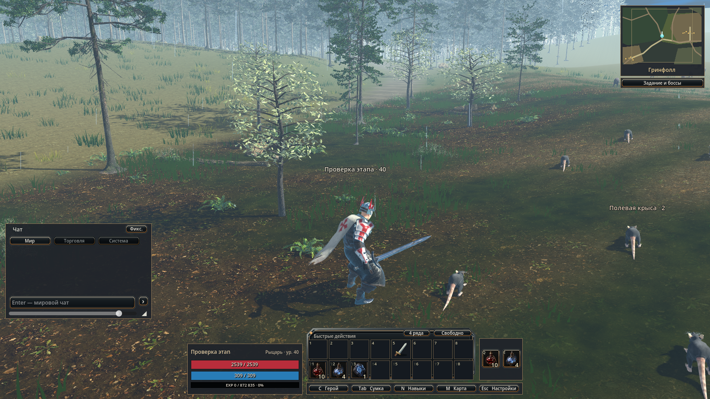
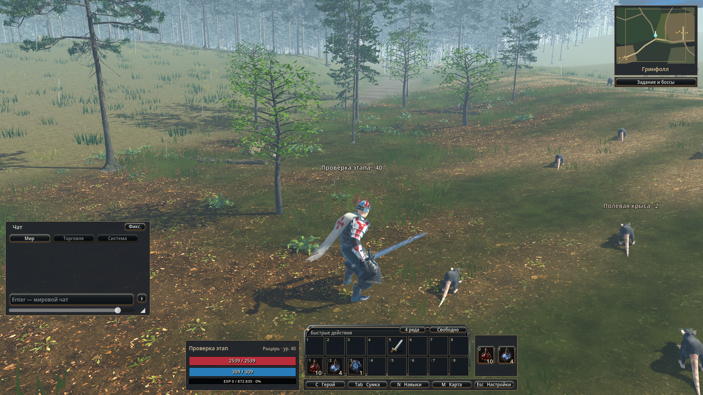
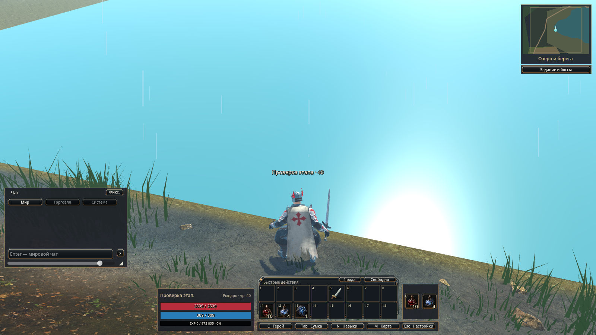
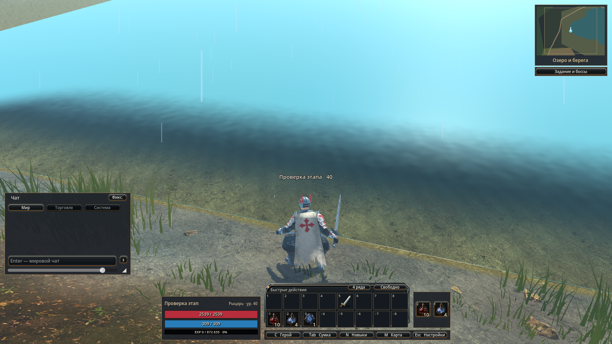

# P2 nature: настоящий мир, материалы и открытый runtime gate

12 сентября 2026. Геометрия/коллизия подключены в `7648404`. Материалы actual03 заметно убрали белёсость ближайшей ольхи и осветлили покров. Ведущий агент просмотрел лес и берег; **art gate OPEN**: тонкий прямой жёлтый урез и яркий голубой дальний пласт воды сохраняются. Глобальная форма/материал озера не менялись. **Runtime gate OPEN**: строгий покадровый проход выявил скачок отображаемого героя и медленные кадры в лесу. Следующий владелец CPU/clock-диагностики — ведущий агент; природа не объявляется готовой к релизу.

## Что реально изменено

`FinalWorld` и `gameplay_environment.gd` используют один collision.json только в starter-v3. Добавлены 63 круга и 3 box, высоты и safe прежние, полная текущая популяция 1151 сохранена; 150 новых стартовых точек и 659 исторических сегментов проверены текущей коллизией. NPC/фон не входят в это число. Малые декорации содержат только 18 травяных ячеек для существующих 24/45/80 м. Сервер/клиент меняют mapVersion согласованно; world.gd/main.gd здесь не редактировались.

После high baseline actual02 скорректированы только локальные материалы:

- shrub_04: копия существующего focus shader с матовой поверхностью, локальный множитель исходного цвета (.56,.73,.34), roughness .94; сосны сохраняют прежний (.70,.96,.72). Текстуры/UV/alpha прежние.
- Трава: вариация (.12,.16,.043)…(.21,.235,.075) по мировым координатам, roughness .94, меньшая подсветка обратной стороны. Нового рассаживания не было.
- Грунт: умеренно осветлены исходные CC0 litter/soil; мох (.095,.12,.038)…(.18,.21,.067), влажная кромка имеет неоднородную маску. Высота слоя осталась heightAt+8 мм.
- Вода: ещё один render-only MeshInstance использует **ту же** Lake_Level_40m mesh с +8 мм. Шейдер показывается только внутри старых shore bounds и до 10 м от исходного западного ребра; влажный осадок и мелкая рябь затухают в исходную воду. Форма/уровень/физика и базовый материал не заменяются. Пространственная маска выполнена shader discard; исходный lake AABB пока остаётся общим, дальнейшее уменьшение локальных bounds не выдаётся за уже сделанную оптимизацию.

Source/repro: геометрия воспроизводится прежними prepare/build_sample/export_runtime. Новые shader/GDScript-файлы — редактируемый источник native-материалов и не перезаписываются экспортом. Blender-мастер сохраняет прежнюю геометрию/материалы; native override не притворяется изменённым Blender-материалом. CREDITS.md дополняет прежние CC0/CC BY сведения. Все изображения ниже — настоящий исходный клиент, без замены света/погоды; дождь и дальняя голубая вода относятся к текущему миру.

## Прогоны и пределы результата

| Прогон | Покрытие | Выход Godot | Время | Значение |
|---|---:|---:|---:|---|
| actual01 | 34/37 | 2 | 66,219 с | Реальный маршрут выполнен; три ошибочных фиксированных порога 2 м за наблюдение. Общий runner принудительно включал half-resolution/no shadows; эти кадры не финальная оценка материалов |
| actual02 | 38/38 | 0 | 68,063 с | Обычный high profile, полный 3D scale, реальные тени. Server displacement проверяется по speed×serverDt; покадрового guard ещё не было |
| actual03 | **42/43** | **2** | 70,234 с | Исправленные материалы и отдельные wall/server/presentation traces. FAIL `nature_forest_render_step_bound` |
| cost01 | 16 технических условий | 0 | 60,265 с | Только диагностика. Actor.visible регулярно возвращался игровым update, акторная фаза не доказательна |
| cost02 | 16 технических условий | 0 | 59,735 с | Только диагностика. Реальное исключение actor geometry через layers=0. Это не прохождение маршрутов и не приёмка |

У всех пяти запусков нет crash/GDScript/shader errors/leak; известные user:// shader-cache и root certificate ошибки сохранены в receipt. Exit2 actual03 — провал проверки, не падение движка. Максимум процесса actual03: working set 2 099 081 216 байт, private 5 543 469 056 байт. Это данные одного source-run на NVIDIA RTX 3070 Laptop, не бюджет/замер packaged EXE или low GPU.

Во всех полных проходах герой прошёл подход 26,4 м, 43,8 м вверх и 43,8 м обратно обычными destination; перепад >2 м, возврат к высоте <10 см. Камера не вошла в коллизию, герой оставался в кадре, terrain root gap <3 см. Initial fixture только для героя, отдельно лес/берег; никаких перестановок деревьев/монстров, их HP/часов не было. Повтор fixture возвращает receipt без повторного лечения/переноса. Для high-кадров надета существующая стартовая экипировка; уровень40 — явно синтетический QA fixture, не баланс прохождения новым героем.

В actual03 лес: 114 наблюдённых кадров, p95 wall interval **439 мс**, максимум 1,076 с; самый большой нарисованный шаг **5,453 м** при wallDt .446 с и remote presentationDt .521 с. Generation прежний. Берег: 98 кадров, p95 **19 мс**, max wall .025 с, max excess относительно remote clock .094 м. Local hero использует `player_motion.render_pose(physics alpha)`, поэтому remote timeline не объявляется единственным правильным временем героя. Все три часовика и реальные позиции сохранены, скачок не скрыт. В route QA присутствуют PNG captures, поэтому его интервалы не подменяют отдельный benchmark; статическая cost-диагностика ниже тоже показывает медленные кадры без captures между фазами.

## Диагностика стоимости в одной лесной позиции

Каждая фаза cost02 длится около 3,5 с, high profile. Временно меняется только render visibility/layers, затем возвращается. Сервер продолжает жить; координаты, AI и анимационные clocks не сбрасываются.

| Фаза | Median draw calls | Median frame, мс | p95 frame, мс | Median TIME_PROCESS, мс |
|---|---:|---:|---:|---:|
| Полный мир | 2920 | 144 | 227 | 187,122 |
| Новый nature слой скрыт | 2624 | 123 | 150 | 142,713 |
| Геометрия акторов скрыта | 2395 | 141 | 165 | 137,412 |
| Оба слоя скрыты | 2099 | 148 | 193 | 127,309 |

Вывод ограничен: новый слой добавляет около296 draw calls в этой позиции, но удаление его отрисовки **не устраняет главный провал**. Даже обе скрытые геометрии оставляют >120 мс TIME_PROCESS. Скрытие не отключает CPU обработку поз/состояния. Не делается вывод, что акторы невиновны или стоимость nature нулевая. В сцене акторов639 GeometryInstance; 1151 — capacity всего серверного мира, а не число одновременно работающих полных ригов.

Микропроба1000 запросов height_at в лесу: без supports1,564 мс, с39 supports18,499 мс, checksum одинаковый. Проверка подтверждает накладные расходы поддержки пола; сама по себе не объясняет весь процесс130–190 мс. Ведущий агент отдельно измеряет CPU этапы и local hero clock. Новые произвольные комбинации и косметические прогоны остановлены; engine передан ему.

## Физически сохранённое подтверждение

`capture-native-evidence.mjs` копирует только stage/trace/PNG/receipt и отказывается заменять существующий evidence. Bootstrap/session tokens и SQLite в исходники не копируются. `evidence/index.json` содержит SHA каждого файла и исходные output paths; baseline high02 и изменённый03 сохранены рядом.

Node: 6 integration +3 city +4 fixture/destination PASS; последний изменённый helper повторно4/4 PASS после стартовой экипировки. TypeScript integration PASS. Полные тест-пакеты повторно не запускались. Исправление старого quest provenance выполнено отдельным владельцем через сохранённый history-архив, без изменения самих путей.
