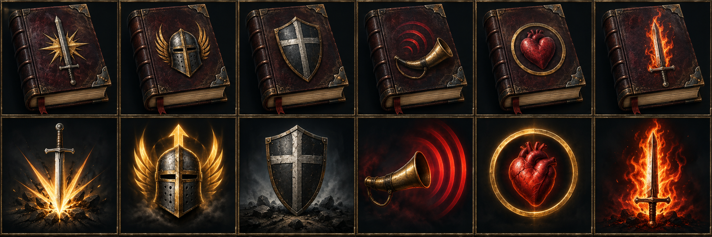
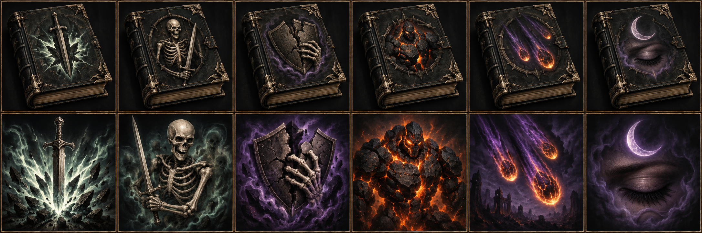
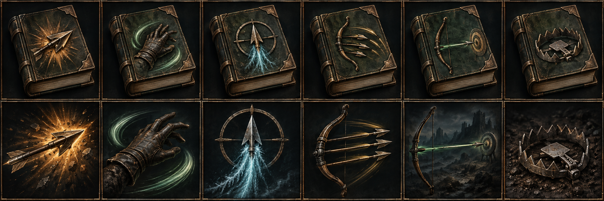
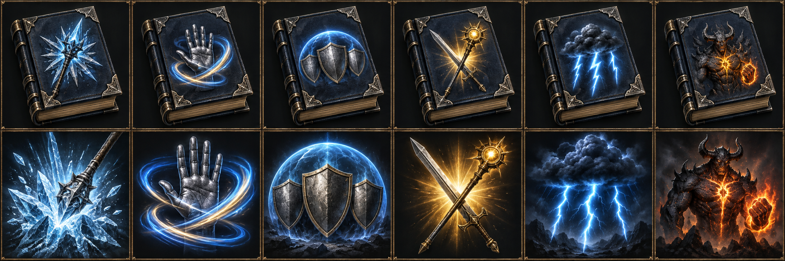
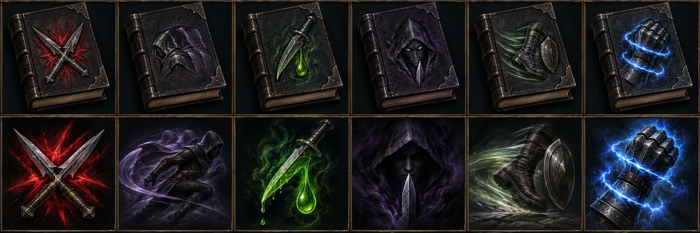
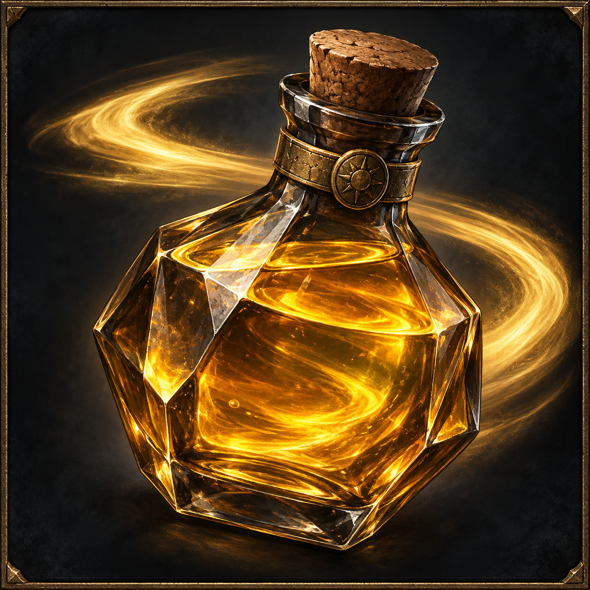

# VARENDOR — книги и значки умений, вариант 1

**Для визуального согласования.** Верхний ряд каждого листа — книги, нижний — соответствующие значки умений. Столбцы идут от 10+ до 60+. Пять листов содержат 30 обложек и 30 изображений умений; общий значок зелья скорости представлен отдельно. Это концепт-листы: финальная нарезка, прозрачность и игровые текстуры будут подготовлены после выбора.

[Интерактивная галерея](GALLERY.html) содержит увеличение, примеры при 32/40/44/64 px и макет очереди эффектов у карты. HTML следует открыть в браузере; GitHub показывает его исходный код. В галерее таймеры и карта демонстрационные, это не снимок готовой игры.

Зелье скорости всегда непосредственно у миникарты, независимо от класса и порядка применения. Остальные значки идут от карты в очереди применения. Обложка книги на панели и значок активного эффекта — разные изображения.

[Заданные владельцем эффекты](../../docs/content-expansion-v3/CLASS_SKILLS_OWNER_RU.md) сохранены без перебалансировки. [Промпты генерации](PROMPTS.json), [манифест](manifest.json). Использован встроенный image_gen; исходные изображения сохранены без перерисовки и изменения пикселей.

### Рыцарь

Слева направо: 10+ — Мощный удар; 20+ — Гордыня; 30+ — Стойка; 40+ — Зов; 50+ — Баланс; 60+ — Берсерк.

### Некромант

Слева направо: 10+ — Мощный удар; 20+ — Призыв; 30+ — Проклятие силой воли; 40+ — Призыв голема; 50+ — Удар забвения; 60+ — Сон.

### Рейнджер

Слева направо: 10+ — Мощный выстрел; 20+ — Трюкач; 30+ — Прицел; 40+ — Перезарядка; 50+ — Дальний воин; 60+ — Ловушка.

### Маг

Слева направо: 10+ — Мощный удар; 20+ — Мастерство; 30+ — Усиление; 40+ — Сильный воин; 50+ — Шторм; 60+ — Культ.

### Ассасин

Слева направо: 10+ — Критический урон; 20+ — Уклонение; 30+ — Яд; 40+ — Убийство; 50+ — Побег; 60+ — Ссора.

### Общее зелье скорости

