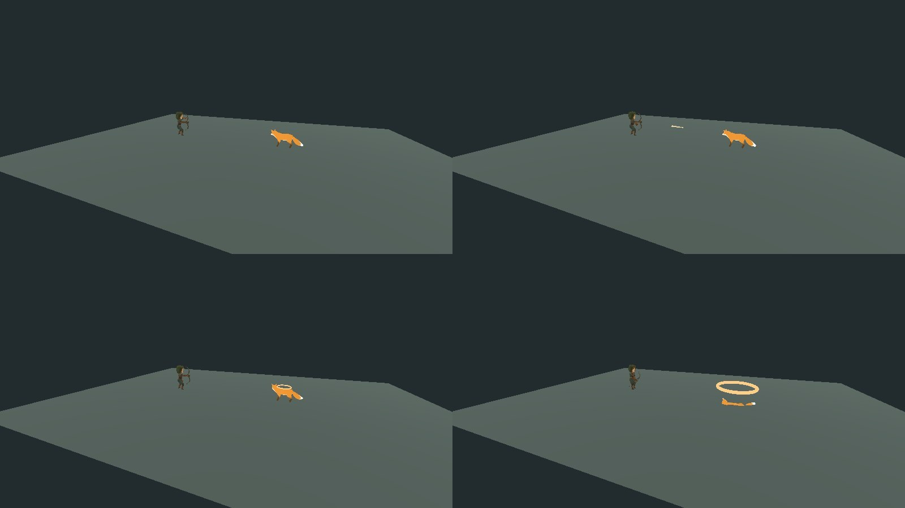

# Varendor — переработка основного игрового цикла

Дата: 7 сентября 2026 года. Ветка: `work/godot-p1-recovery`. Исходная версия для этого блока: `cd20570`.

## Статус и границы результата

Переработаны управление, камера, перемещение, прыжок, выбор цели, подход, атаки, AI, смерть и синхронизация анимаций. HUD, инвентарь, экономика, состав классов, предметов, монстров и карты в этом блоке не перерабатываются. R2 Online использована только как поведенческий ориентир; её код, материалы и контент не заимствованы.

Финальный серверный набор: **101 из 101 успешно**, включая новые сценарии основного игрового цикла. Дополнительный набор parity ранее подтвердил 96/96. `npm run typecheck` выполнен успешно. Это подтверждает перечисленные ниже алгоритмы и серверные переходы; субъективную отзывчивость и качество картинки эти результаты не устанавливают.

**Итоговая сборка для игрового теста опубликована. Результаты:**

| Проверка | Результат |
| --- | --- |
| Commit исходников итоговой сборки | [`888dd637bde8`](https://github.com/Pakka19941311/Pakka/commit/888dd637bde85ec9c892157728de34508c8545a6) |
| GitHub Actions: ссылка и результат | [34164347359](https://github.com/Pakka19941311/Pakka/actions/runs/34164347359) — **success**, Linux и Windows jobs успешны |
| Полный повторный Godot headless runtime | Успешно: Godot 4.6.3, `ok=true`, 109 успешных булевых проверок; 129 полей результатов; графика закономерно `native_render=false` |
| Linux Godot с графикой, X11/Mesa; 20 захватов мыши | **132/132 булевых проверок пройдено**, 149 полей отчёта; обычные захваты и модальное окно подтверждены |
| Четыре отрисованных стадии боя: подготовка, полёт, попадание, труп | Просмотрены реальные кадры Godot из тестовой сцены Ranger/Fox: снаряд виден в полёте, труп лежит после смерти |
| Windows EXE и сервер из поставляемого пакета | **120/120 проверок пройдено**, 140 полей; headless, без проверки Windows GUI/GPU |
| ZIP: URL, размер, SHA-256, проверка скачивания | [Скачать ZIP](https://github.com/Pakka19941311/Pakka/releases/download/godot-pc-preview-888dd637bde8/Varendor_Godot_PC_888dd637bde8.zip) — 296778603 байт; публичное скачивание, CRC и SHA-256 проверены |
| Приёмка управления и графики владельцем на игровом Windows-ПК | Требуется игровой тест |

Автоматические результаты подтверждают перечисленные сценарии. Субъективные и специфичные для Windows GUI пункты матрицы остаются ручной приёмкой; все 44 условия не объявлены безоговорочно закрытыми.

## 1. Найденные первопричины

Причины ошибки курсора установлены аудитом координат и жизненного цикла захвата. Исторический уход в (0,0) на исходном Windows-ПК в этой среде не воспроизводился; исправление реального ОС-курсора подтверждается только отдельным графическим тестом.

| Система | Причина | Изменение |
| --- | --- | --- |
| Захват ПКМ | Сохранение desktop-координат, последующее вычитание положения окна и ограничение результата смешивали разные системы координат. Повторное нажатие могло заменить исходную позицию захваченным курсором; отложенное восстановление не имело защиты от нового захвата. | Один владелец захвата, сохранение и восстановление в координатах того же viewport, идентификатор поколения захвата. Повторное нажатие, resize и потеря фокуса не восстанавливают устаревшую позицию. Открытие модального окна освобождает захват, чтобы окно не поглотило событие отпускания. |
| Камера | Ввод, параметры орбиты, следование и коллизии были распределены между UI и мировым скриптом. Проверка только конечного положения не описывала весь путь камеры у угла стены или холма. | Отдельный контроллер камеры; ограниченная орбита и zoom, короткие фильтры, проверка плеча и перемещения камеры между кадрами. |
| Локальное движение | Предсказание, получение снимка и отображение могли повторно изменять текущую позицию. Старая серверная позиция смешивалась с уже продвинувшимся локальным персонажем. | Физический шаг отдельно от отображения; история предсказания сравнивается со снимком того же серверного времени. Отображение читает готовую позу. |
| Прыжок | Обычная отмена управления, прекращение подхода или смерть цели вызывали полный `motor.reset()`, обнуляющий высоту. Серверная интеграция высоты и горизонтального пути зависела от разбиения временного шага. | Отмена горизонтального намерения отделена от полного сброса при переносе/возрождении. Применены аналитическая интеграция ускорения и баллистики, отдельные состояния взлёта, полёта, падения и приземления. |
| Анимация ходьбы | Состояние определялось запрошенным перемещением, даже если коллизия оставляла тело на месте. | Скорость вычисляется по фактическому разрешённому перемещению; темп походки связан с ней. |
| Подход и остановка | Порог завершения пути и порог входа в атаку расходились: путь уже считался пройденным, но персонаж ещё не переходил к атаке. Конечные точки преследования не выражали общий контракт расстояния и радиусов тел. | Общий расчёт расстояния остановки, учёт радиусов, согласованный допуск достижения; при перекрытии выстрела ищется доступная позиция с линией видимости. |
| Подготовка удара | Монстр мгновенно присваивал yaw цели и запускал таймер атаки. Призванный помощник наносил урон непосредственно при начале атаки. | Плавный поворот до начала windup; повторная проверка направления, расстояния и видимости при выпуске/контакте. Призыв использует ту же отложенную последовательность контакта. |
| AI | Цель заново выбиралась по ближайшему расстоянию каждый tick; индекс патруля менялся при входе в патруль. Отсутствовала ограниченная фаза поиска потерянной из виду цели. | Стабильный `targetId`, получение новой цели с LOS, последний видимый пункт, поиск и возврат. Следующий пункт выбирается после завершения/таймаута предыдущего. |
| Смерть | Состояние цели, ожидающие атаки, визуальная смерть и удаление тела не имели общего временного контракта. | При HP=0 немедленно отключаются AI/атаки/навигация/боевое тело; очищаются связанные намерения. Сервер передаёт точку смерти, `deathAt` и `corpseUntil`. |
| Сетевая визуализация боя | Последний снимок мог сразу показать HP=0 и награду, хотя события атаки и снаряда ещё ожидали отображения. Позднее событие могло повторно запустить полный срок полёта. | Единая шкала представления снимков и событий; HP, смерть и награды применяются в порядке серверного времени; опоздавший снаряд учитывает уже прошедшую часть полёта. |
| Риги и состояния анимации | Поиск по подстроке мог выбирать `Idle_Attacking`; у Fox отсутствуют отдельные клипы удара/смерти. Повторный снимок мог перезапускать атаку; общий ресурс Animation мог изменять соседний экземпляр. | Явный подбор реального клипа, независимые ресурсы экземпляров, состояние и фаза по общей шкале времени; непрерывная запасная поза там, где исходный клип отсутствует. |
| NPC и первый снимок | Общая интерполяция могла начинать новую сущность от начала координат; неподвижным NPC не нужна сетевая траектория. | Первая предыдущая и текущая позиции совпадают с полученной точкой; сервисные NPC сохраняют свои якоря и idle. Это не добавляет им новые маршруты. |

Первый графический прогон подтвердил 130 условий, включая 20 обычных циклов ПКМ и четыре стадии боя, но выявил два сбоя проверки возврата курсора при модальном окне. До передачи фокуса встроенному окну восстановление теперь выполняется синхронно. Проверка сопоставляет OS-координаты с OS-координатами; данные корневого viewport дополнительно проверяются после закрытия окна, когда он снова получает события. Первичный отчёт сохранён в `evidence/core-first-graphical.json`.

## 2. Архитектура после изменения

Сервер остаётся единственным владельцем игрового положения, проверки препятствий, дальностей, урона, cooldown, HP, награды, смерти и возрождения. Клиент передаёт намерения и предсказывает движение; результат атаки клиент не вычисляет.

| Ответственность | Реализация |
| --- | --- |
| Игровой ввод и отмена автоматического движения | `player_input.gd` |
| Захват/освобождение мыши и положение камеры | `camera_controller.gd` |
| Фиксированное локальное предсказание и сверка со снимком | `player_movement.gd` |
| Контакт движущихся тел | `actor_spacing.gd`, серверный `actor-spacing.ts` и ограниченное устранение уже существующих пересечений |
| Выбор сущности, поколения, LOS и текущих данных цели | `targeting.gd` |
| Упорядоченное представление сетевых снимков и событий | `snapshot_timeline.gd` |
| Поза рига, смешивание, темп движения, контакт удара, смерть | `animation_controller.gd` |
| Серверный мотор | `character-motor.ts` |
| Радиусы, точка подхода, готовность направления и сроки контакта существующих ригов | `combat-approach.ts` |
| Намерения и время жизни цели монстра | `monster-ai.ts` |
| Применение серверных намерений к миру, навигация, боевые транзакции | `world-simulation.ts` |

`world.gd` связывает эти контроллеры, сущности и существующие эффекты. `main.gd` сохраняет ответственность за UI. Полный серверный мотор не заменён независимой Godot-физикой: два несогласованных владельца одной позиции вернули бы прежний конфликт. Клиентский физический шаг выполняется отдельно от render tick, а анимация не двигает авторитетное тело.

Дополнения протокола обратносовместимы: `velocityX`, `velocityZ`, `verticalVelocity`, `locomotionState`, `combatState`, `hitAt`, `hitUntil`, `bodyRadius`, `attackRange`; для локального героя — оставшийся разрешённый `navigationPath`; для монстра — `targetId`, `deathAt`, `corpseUntil`. События передают сроки и поколения, начальную/конечную точку снаряда, авторитетные HP при попадании и точку смерти. Старое поле `action` сохранено.

## 3. Изменённые файлы

Перечень зафиксирован по рабочей копии при подготовке отчёта; итоговый commit и diff указаны в таблице статуса после сборки.

| Файл | Назначение изменения |
| --- | --- |
| `godot-pc/scripts/main.gd` | Подключение контроллера ввода и камеры, очистка жизненного цикла при смене героя, новый набор acceptance-проверок |
| `godot-pc/scripts/network.gd` | Номер намерения резервируется до предсказания; очередь и ACK используют тот же номер |
| `godot-pc/scripts/world.gd` | Удаление конфликтующих встроенных контроллеров, подключение движения, временной шкалы, таргетинга и анимации |
| `src/controls/character-motor.ts` | Независимая от частоты шага интеграция и состояния прыжка |
| `src/network/world-protocol.ts` | Дополнительные данные движения, боя и жизненного цикла |
| `src/server/world-simulation.ts` | Подход, фактическое движение, атаки, AI-интеграция, разделение тел, смерть |
| `src/world/monster-ai.ts` | Стабильная цель, LOS, поиск, патруль и возврат |
| `tests/combat-feedback.test.mjs` | Сценарии различают новый выбор через стену и потерю LOS после выбора; отдельно проверяют немедленный Dead, последующий Corpse и Despawn |
| `tests/monster-ai.test.mjs` | Регрессии AI и его переходов |
| `scripts/godot-pc-qa.mjs` | Достаточный срок 60-секундного наблюдения и сохранение настоящих кадров боевых стадий |
| `.github/workflows/godot-pc-preview.yml` | Выполнение проверок текущего блока и нативной проверки анимации при сборке |
| `packaging/windows/README_GODOT_PC_RU.txt` | Инструкция именно к текущему игровому тесту |
| `scripts/publish-godot-pc.mjs` | Описание релиза и ссылка на этот отчёт |
| `STATE.json` | Рабочий статус блока и следующая проверка; обновляется ответственным за сборку |

## 4. Добавленные файлы

- `src/combat/combat-approach.ts`
- `tests/core-gameplay-server.test.mjs`
- `godot-pc/scripts/player_input.gd`
- `godot-pc/scripts/player_movement.gd`
- `godot-pc/scripts/actor_spacing.gd`
- `godot-pc/scripts/camera_controller.gd`
- `godot-pc/scripts/targeting.gd`
- `godot-pc/scripts/snapshot_timeline.gd`
- `godot-pc/scripts/animation_controller.gd`
- `godot-pc/scripts/player_movement_qa.gd`
- `godot-pc/scripts/camera_qa.gd`
- `godot-pc/scripts/camera_integration_qa.gd`
- `godot-pc/scripts/snapshot_timeline_qa.gd`
- `godot-pc/scripts/network_intent_qa.gd`
- `godot-pc/scripts/animation_controller_qa.gd`
- `godot-pc/scripts/core_acceptance.gd`
- `godot-pc/scripts/player_input_qa.gd`
- `godot-pc/scripts/target_rejection_qa.gd`
- `docs/migration/pc/CORE_GAMEPLAY_REFACTOR.md`
- `docs/migration/pc/evidence/core-first-graphical.json`
- `docs/migration/pc/evidence/core-linux.json`
- `docs/migration/pc/evidence/core-windows.json`
- `docs/migration/pc/evidence/core-publish.json`
- `docs/migration/pc/evidence/core-combat-stages.jpg`

К новым `.gd` добавляются соответствующие `.gd.uid`, создаваемые Godot для устойчивой идентификации ресурса. Это служебные идентификаторы, а не новые игровые ассеты.

## 5. Удалённые старые участки

- Из `main.gd`: собственные расчёты направления движения, обработка относительного движения камеры, desktop-to-window восстановление курсора и старый тест ПКМ, который лишь вручную выставлял флаг захвата.
- Из `world.gd`: самостоятельное покадровое предсказание/перезапись позиции, интерполяция по времени прихода последнего пакета, непосредственное управление состояниями ригов и конкурирующая обработка цели/камеры. Эти обязанности переданы отдельным контроллерам.
- Из сервера: полный вертикальный сброс при обычной отмене, запуск атаки монстра с мгновенным присваиванием yaw, мгновенный урон призыва на cooldown tick, пересчёт ближайшей цели вместо удержания выбранной и смена точки при входе в патруль.
- Старый `godot-pc/scripts/gameplay_qa.gd` и его `.uid` заменены `core_acceptance.gd` и отдельными сценариями контроллеров. Производственные UI и инвентарь этим удалением не изменяются.

## 6. Добавленные регрессионные проверки

Новые серверные сценарии охватывают: 20 прыжков при 20/60/144 шагах в секунду; запрет повторного прыжка и сохранение траектории при отмене; одинаковую длину прямого/диагонального перемещения; фактическую остановку у стены; обход препятствия и отмену click-to-move; подход всех пяти существующих классов; видимость цели и смену позиции для выстрела; порядок атаки/полёта/урона/смерти/награды; удержание цели монстра; ограничение его возврата; разделение тел; 60 секунд симулируемого патруля; контакт атаки призыва после windup.

Godot-проверки отдельно испытывают мышь и камеру, локальный мотор, временную шкалу и настоящие импортированные риги. `core_acceptance.gd` добавляет 20 циклов прыжка на реальных physics ticks, выбор цели через проекцию камеры, последовательность Ranger→Fox в запущенной сцене и непрерывное 60-секундное наблюдение четырёх городских NPC. Для графического запуска предусмотрена запись четырёх реально отрисованных кадров боя. Headless запуск помечает отсутствующие GUI-результаты как пропущенные.

При потере связи и фокуса ручное предсказание останавливается без ожидания сетевого ACK, сохраняя прыжок. Отклонение атаки сервером очищает соответствующую цель, но ответ на прежнюю команду не может сбросить новую. Добавлены 6 проверок ввода и 5 проверок отклонённой цели; все прошли в Godot headless.

## 7. Выполненные команды и фактические результаты

Финальный CI-набор дал **101/101**:

```bash
node --experimental-strip-types --test tests/core-gameplay-server.test.mjs tests/combat-feedback.test.mjs tests/combat-obstruction.test.mjs tests/native-recovery.test.mjs tests/monster-ai.test.mjs tests/control-foundation.test.mjs
```

Дополнительная серверная команда, давшая **96/96**:

```bash
node --experimental-strip-types --test \
  tests/core-gameplay-server.test.mjs \
  tests/native-recovery.test.mjs \
  tests/server-combat-parity.test.mjs \
  tests/control-foundation.test.mjs \
  tests/monster-ai.test.mjs
npm run typecheck
```

Локальные журналы исполнения: `core-server-tests.log` и `core-typecheck.log` в рабочем scratch-каталоге. Пакеты и lock-файл для проверки типов не изменялись: уже установленный в среде `@types/node` подключён в локальный `node_modules`.

После уточнения контракта LOS и фаз трупа дополнительно выполнена `node --experimental-strip-types --test tests/combat-feedback.test.mjs`: **7/7 успешно**. Три сценария по-прежнему проверяют обход и дистанцию выстрела, но начинают с видимой выбранной цели; новый выбор через стену отдельно обязан быть отклонён. Проверка мгновенного Dead сохранена и дополнена Corpse/Despawn.

Отдельно выполнены **21 проверка временной шкалы, 10 проверок очереди намерений и 3 интеграционные проверки восстановления мира: 34/34 успешно** в Godot 4.6.3 `--headless`. Изолированный `player_movement_qa.gd` подтвердил 10 проверок локального мотора. Контроллер камеры подтвердил 13 проверок геометрии/отклика в headless; системный курсор этим не проверяется. Контроллер анимаций подтвердил **43/43** проверки на реально импортированных ригах, включая изменение поз костей между моментами времени; это не заменяет просмотр отрисованной анимации. Эти результаты проверяют код и состояния реально запущенного Godot, но не работу системного курсора или видимую плавность.

Первый полный headless прогон остановился на устаревшем допуске проверки разделения тел: тест требовал дополнительный зазор сверх общего серверного контракта радиусов. Допуск приведён к этому контракту; запрет пересечения тел сохранён. Повторный интегрированный запуск **Godot 4.6.3 завершился с exit 0, без runtime-ошибок, `ok=true`**: 129 полей результатов, 109 успешных булевых проверок. Единственный булев `false` — ожидаемое `native_render=false`, потому что использован headless renderer. Итоговый JSON: `qa/core-final/native-runtime.json` в рабочем каталоге; журнал: `core-final-native.log`.

В этом успешном запуске завершены 20 прыжков и 60.0 секунд непрерывного наблюдения NPC: 3461 process-кадр, 499 обновлений полученных снимков, максимальная измеренная скорость неподвижных NPC 0 м/с. Process-кадры headless не являются отрисованными кадрами; все GUI-строки таблицы статуса остаются отдельными проверками.


Воспроизводимые Godot-команды для отдельного запуска:

```bash
GODOT --headless --path godot-pc --editor --import
GODOT --headless --path godot-pc --script res://scripts/player_movement_qa.gd
GODOT --headless --path godot-pc --script res://scripts/snapshot_timeline_qa.gd
GODOT --headless --path godot-pc --script res://scripts/animation_controller_qa.gd
node --experimental-strip-types scripts/godot-pc-qa.mjs PATH_TO_EXPORTED_CLIENT QA_OUTPUT --graphical
```

`GODOT` и `PATH_TO_EXPORTED_CLIENT` здесь обозначают путь к установленному бинарному файлу. Последняя команда требует рабочего графического дисплея; наличие headless Godot не заменяет его.

Итоговый Linux/X11 runtime: **132 успешных булевых проверки**, 20 прыжков, NPC 60.009 секунды и 528 входящих снимков. До захвата, при открытом меню и после закрытия OS-координаты совпали точно: `(468, 385)`; исходные viewport-координаты также восстановлены. Ошибок исполнения Godot нет. Четыре кадра реально отрисованы и просмотрены; они подтверждают наличие фаз, но не заменяют оценку их плавности в интерактивной игре. Полный JSON: `evidence/core-linux.json`.

На высоком профиле программный Mesa показал медиану кадра 897.808 мс; функциональные проверки шли на низком профиле. Это CPU-рендер CI, а не результат на видеокарте владельца и не доказательство устранения всех FPS-просадок на игровом ПК.

Windows EXE и Node из поставляемого ZIP: **120 успешных проверок**, 20 прыжков, NPC 60.01 секунды и 565 снимков; Godot runtime без ошибок. Полный JSON: `evidence/core-windows.json`. Подтверждение публикации: `evidence/core-publish.json`. SHA-256 ZIP: `82f45fb57f65e5f82308c3a500e9a9a49350c4bb50359c8d7f4cfe7e568be379`.

Четыре стадии в порядке слева направо, сверху вниз: подготовка, полёт, попадание/начало смерти, труп. Это кадры работающего Godot, без генерации или дорисовки:



## 8. Матрица всех 44 условий приёмки

Обозначения: **S** — подтверждено серверными автоматическими тестами; **H** — подтверждено состояниями в успешном headless Godot runtime; **G** — графический Linux/X11 runtime и просмотр кадров; подтверждённые сценарии перечислены в результатах; **M** — ручная проверка ощущения и изображения на игровом ПК. Наличие S/H не превращает G/M в выполненную проверку.

| № | Условие владельца | Автоматическое доказательство и остающаяся проверка |
| --- | --- | --- |
| 1 | ПКМ нажать/отпустить 20 раз | G: `rmb_20_os_cursor_restores=true` в итоговом Linux/X11 runtime |
| 2 | Курсор ни разу не уходит в угол | G: восстановление исходной точки каждого цикла; M: Windows, DPI и используемые мониторы |
| 3 | Две оси вращения | H: преобразование yaw/pitch; G: `rmb_20_two_axis_relative_input` |
| 4 | Нет резких snap камеры | H: короткое сглаживание и непрерывность позы; G/M: резкие движения реальной мыши |
| 5 | Плавный zoom | H: ограничения и промежуточные значения; G/M: ощущение колеса |
| 6 | Камера не внутри героя | H: min zoom, зазор у стены и поиск верхней орбиты; G/M: проходы существующей карты |
| 7 | WASD во всех направлениях | S/H: восемь направлений, совпадение с вектором; M: клавиатурный тест |
| 8 | Диагональ не быстрее | S/H: одинаковые расстояния прямого и диагонального движения |
| 9 | Быстрые смены без teleport/snap | S/H: ограниченное перемещение и плавный yaw; M: характер разворота |
| 10 | Click-to-move | S: обход статического препятствия; H: выбор земли и движение по пути; M: маршруты карты |
| 11 | WASD отменяет click-to-move | S/H: намерение и путь очищены в обработке ввода |
| 12 | Правильная остановка | S/H: без overshoot, повторного вращения и остаточного движения |
| 13 | 20 прыжков | S: 20 циклов для каждой из 3 частот; H: 20 последовательных physics-циклов |
| 14 | Нет double jump | S/H: повторные команды в воздухе отклоняются |
| 15 | Нет ступенчатого прыжка | S: непрерывная аналитическая траектория; H: промежуточные высоты; G/M: видимая плавность |
| 16 | Нет зависания | S/H: ограниченное время полёта и обязательное приземление |
| 17 | Нет провала под землю | S/H: высота неотрицательна и возвращается в 0; M: неоднородный рельеф карты |
| 18 | Плавное приземление | S/H: land→ground, отсутствие второго отскока; G/M: поза и смешивание |
| 19 | LMB выбирает монстра | H: проекция живой модели, HP/generation/range, запрет выбора через стену; G/M: реальный клик |
| 20 | Melee подходит до range | S: рыцарь и ассасин, радиусы wolf/mini и факт серверного удара |
| 21 | Ranger держит ranged distance | S: остановка внутри неизменённой дальности, видимость и свободная позиция выстрела |
| 22 | Анимация атаки видна | H: реальный клип и изменяющиеся кости рига; G: отрисованные стадии; M: читаемость |
| 23 | Damage синхронен атаке | S: контакт/выпуск до hit; H: единая шкала событий; G/M: видимое совпадение |
| 24 | Monster показывает hit feedback | S: HP и событие hit; H: состояние и объект обратной связи; G/M: заметность реакции |
| 25 | Игрок не внутри монстра | S: дистанции тел всех классов; H: swept collision предсказания; успешный повтор подтвердил исправление первого неуспешного H |
| 26 | Idle монстра | S: FSM и паузы; H/G: состояние/отображение существующего рига |
| 27 | Patrol монстра | S: 60 секунд симулируемого движения с паузами и ограниченной скоростью |
| 28 | Aggro | S: обнаружение видимого игрока и сохранение ID |
| 29 | Chase | S: переход и сближение, сохранение цели при появлении более близкого игрока |
| 30 | Атака монстра соответствует damage | S: поворот→windup→release→hit; H/G/M: контакт на риге и восприятие удара |
| 31 | Leash | S: прекращение преследования вне допустимой области |
| 32 | Return | S: возвращение к home, снятие цели и возобновление спокойного поведения |
| 33 | Монстры не одной точкой | S: разделение пересекающихся тел, ограничение скорости исправления; G/M: группа в реальной местности |
| 34 | Убить monster | S: летальное попадание; H: Ranger→Fox; G/M: игровой бой |
| 35 | HP=0 сразу Dead | S/H: атомарное состояние и событие смерти в момент hit |
| 36 | AI сразу остановлен | S: терминальное состояние и снятие цели |
| 37 | Атака сразу остановлена | S/H: pending/намерение/визуальный lock прекращены |
| 38 | Death visual сразу | H: переключение контроллера и запуск падения; G/M: фактический кадр и читаемость |
| 39 | Corpse delay, затем despawn | S/H: серверный срок, скрытие трупа, новое поколение при respawn |
| 40 | Нет стоящего живого при HP=0 | H: Fox падает без отсутствующего клипа, поздний attack игнорируется; G/M: серия реальных кадров |
| 41 | NPC в городе минимум 60 секунд | H: реальное непрерывное время live-клиента; успешный повтор 60.0 с; G: повтор с графикой 60.009 с, 528 снимков |
| 42 | NPC не телепортируется | H: четыре якоря на каждом process-кадре; G/M: начало входа и наблюдение |
| 43 | NPC без сверхскорости | H: измерение перемещения/времени, в успешном повторе 0 м/с |
| 44 | Walk соответствует скорости NPC | Текущие четыре сервисных NPC неподвижны: H проверяет idle при нулевой скорости. Гипотетический новый walking-маршрут этим не подтверждается |

## 9. Что требует ручной проверки в запущенной игре

Нужен пользовательский тест итогового Windows ZIP: 20 захватов ПКМ с возвратом исходной точки, быстрые развороты и колесо, WASD/click-to-move на существующих дорогах и у препятствий, 20 прыжков, melee/ranged бой с несколькими монстрами, наблюдение удара и смерти, 60 секунд в городе. Отдельно оцениваются ощущение MMORPG, задержка ввода, разборчивость атак и плавность на конкретной видеокарте.

Автотест системного курсора под Linux/X11 подтвердил этот backend. Он не доказывает Windows-мышь при другом DPI, fullscreen, двух мониторах или драйвере. Показатели headless/программного Mesa не являются FPS на игровом Windows-ПК.

## 10. Известные ограничения и нерешённые вопросы

1. У имеющегося Fox нет отдельных клипов удара/смерти, у части героев нет полноценного исходного jump/fall/land. Применяется непрерывная запасная поза на существующей модели; новых ассетов нет. Автотест позы не гарантирует художественное качество её восприятия.
2. Текущие городские NPC выполняют неподвижную сервисную роль. Проверка подтверждает корректность этого поведения; новые прогулочные маршруты в задачу не добавлялись.
3. При полностью закрытом пространстве, где нет физически свободной точки камеры с требуемым зазором, контроллер отмечает `confined_space`. Нельзя одновременно обещать любой размер комнаты, любой zoom и отсутствие пересечения. Нужен проход существующих тесных мест карты.
4. При разрыве сети дольше 1000 мс шкала представления переходит к свежему авторитетному состоянию и удаляет исторические одноразовые эффекты. Это заменяет длительное догоняние старого боя. Следствием может быть одна корректировка позиции/камеры после восстановления соединения; обычный субсекундный jitter интерполируется. 21 проверка временной шкалы включает этот сценарий; ощущение восстановления соединения проверяется в игре.
5. Общая приёмка всех 44 требований и субъективная отзывчивость остаются открытыми до ручных результатов M из таблицы. Отсутствие GUI-проверки нельзя заменить заявлением об исправленном визуальном баге.
