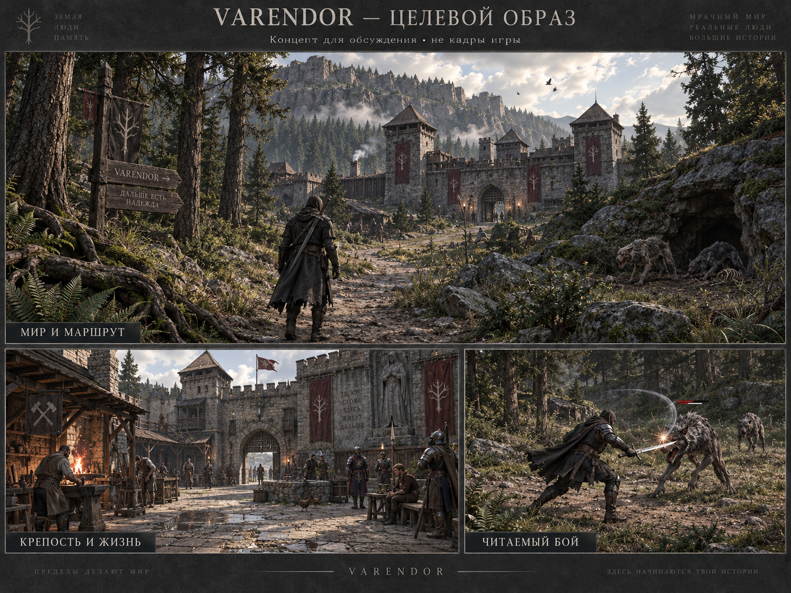
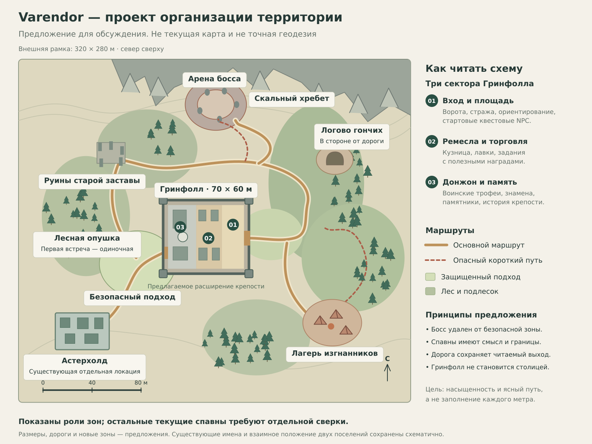
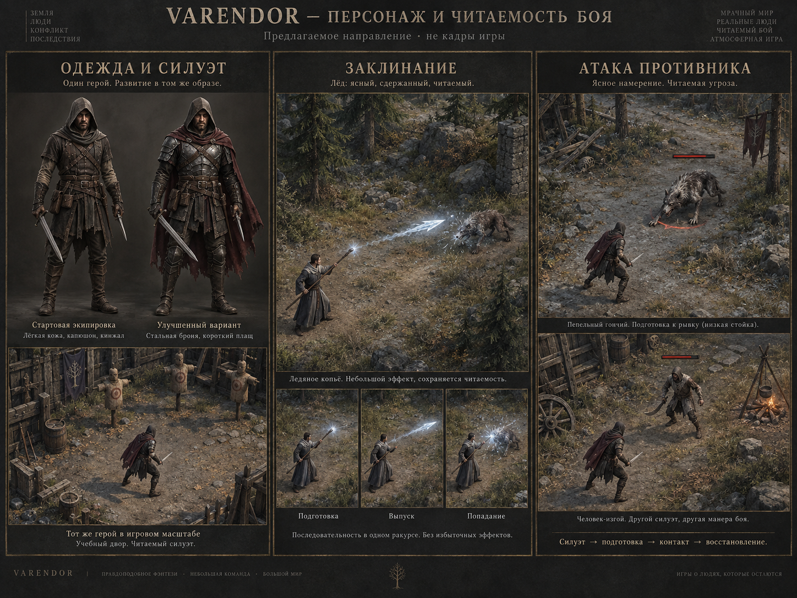

# VARENDOR

## ТЗ перехода на Godot native + Blender

**Редакция 2.0 · 07.09.2026 · Никита. Исполнение миграции не начато.**

| Часть | Что получаем |
|---|---|
| P0 — сохранение работы | Контрольная версия исходников, резервирование действующих сохранений, фиксация интерфейса и замеры лагов. |
| P1 — запуск и мир | Запуск Godot → прежний персонаж → управление, HUD, инвентарь и заточка → один законченный маршрут → вся территория, Гринфолл и окружение. |
| P2 — персонажи | Собственные герои, одежда, анимации, эффекты 20 умений, NPC. Полноценная модернизация создания персонажа. |
| P3 — противники | Десять видов, модели, анимации, места обитания, ИИ, боссы и проверка дропа. |
| P4 — аккаунты и квесты | Регистрация, вход, восстановление доступа, привязка старых героев и девять заданий. |
| P5 — мобильная доводка | Сенсорное управление, интерфейс, производительность, нагрев, возврат после сворачивания и общий персонаж между устройствами. |
| P6 — Steam | Тестовая сборка, материалы страницы, Playtest, обновления и подготовка выпуска. |

**Ранняя мобильная проверка — уже P1-05.** P5 отвечает за полноценную доводку. Полный редактор героя — P2-06. Схема аккаунтов учитывается при переносе, полный пользовательский поток — P4.

**Защита накопленной работы:** старый герой, itemUid, HUD, 32 назначения, инвентарь, заточка, серверные правила и сохранения входят в обязательный перенос. Ничего из этого не считается готовым по одному концепту или коммиту.

---

# Как читать и исполнять эту редакцию

Документ перестроен по частям P0–P6. Сводка находится на первой странице, далее идут исходные ограничения, затем каждая часть с задачами и связанными контрактами. В Word доступны заголовки в панели навигации; в текстовой версии можно искать точный taskId.

**50 исходных taskId сохранены.** Каждая задача раскрыта в четырёх подпунктах: всего 200 действий. У каждой есть вход, наблюдаемый результат, два сценария «дано → действие → ожидаем», состав сдачи и поведение при ошибке. Сценариев 100; они дополняют 119 исходных критериев, а не означают выполненные тесты.

**Статусы требований:** «принято» — решение владельца/сохранённое поведение; «факт baseline» — проверенный исходник/замер; «предлагается» — новая детализация этой редакции; «зависимость» — недостающий доступ/устройство; «проверено» — только результат исполнения с указанием сборки. Новые численные бюджеты и договорённости не становятся одобренными автоматически.

**Точность продолжения:** TASKS.json связывает задачи, зависимости, подпункты и критерии. STATE.json хранит текущую точку и разрешение исполнения. ACCEPTANCE.md содержит все 119 прежних критериев и 100 новых сценариев. REQUIREMENTS_TRACE.md показывает, где закрывается каждое замечание владельца.

**Правило закрытия:** сначала выполнено действие, затем техническая проверка, затем нужная пользовательская приёмка. Для каждого маленького файла новое разрешение не требуется. Художественный маршрут P1-14, весь мир P1-20, герои P2-06 и противники P3-04 предъявляются владельцу как отдельные результаты.

В этой выдаче выполнена только доработка ТЗ. Исходный код игры и личная база не изменялись. Формулировка «требуется» описывает будущее исполнение; статусы всех задач миграции остаются planned.

---

# Навигация по частям и контрольным точкам

- [P0 — сохранение работы](#P0)
- [P1 — запуск и мир](#P1)
- [P2 — персонажи](#P2)
- [P3 — противники](#P3)
- [P4 — аккаунты и квесты](#P4)
- [P5 — мобильная доводка](#P5)
- [P6 — Steam](#P6)

**Порядок внутри P1:** P1-01…05 — запуск/герой/ранние телефоны; P1-06…10 — старые функции; P1-11…14 — собственный образец мира; P1-15…20 — вся территория. Готовый персонаж нового художественного уровня не является входной зависимостью P1.

**Зависимости платформ:** P1-05 требует реального доступа к экспортам. Если Mac/iPhone недоступны, iOS остаётся blocked; можно продолжать независимые работы над ПК/миром после явной фиксации риска, но нельзя утверждать, что мобильный путь доказан. P5 не отменяет раннюю проверку.

**Аккаунты:** схема accountId/appearanceVersion проектируется при первом клиенте, а полноценная регистрация вводится в P4. Если для раннего закрытого теста требуется минимальная привязка аккаунта, перенести только этот технический подпункт с записью изменения в STATE; редактор внешности остаётся в P2.

**Steam:** подготовка медиа может идти после готового демонстрируемого объёма, не дожидаясь публикации телефонов. Публичный выпуск требует готового входа, совместимости и сопровождения. Steam не требует смены согласованного Godot на Unity.

**Точка начала сейчас:** P0-01 после согласования исполнения этой редакции. Переписка «продолжай» позднее обновляет разрешённый объём; новый чат не должен вновь запрашивать уже данное разрешение на ту же работу.

---

# Согласованные решения и обязательные цели

Последнее сообщение владельца является основанием следующих статусов. Согласование эталона определяет результат; детализация реализации не должна незаметно менять его.

| Раздел | Статус | Обязательство |
|---|---|---|
| Godot native + Blender | Согласовано | Нативный клиент; собственное производство 3D |
| Организация территории | Эталон принят | Сохранить связь зон, маршрутов и ориентиров |
| Рельеф и дороги | Эталон принят | Связная поверхность, композиция долины |
| Лес, трава, небо, жизнь | Эталон принят | Плотность по зонам, ветер, облака, живность |
| Гринфолл | Эталон принят | Крепость с сервисами, историей и проходами |
| Девять заданий | Эталон принят | Три содержательные необязательные цепочки |
| Игровая архитектура | Согласовано | Сохранить серверные правила и данные |
| Герой и бой | Эталон принят | Взрослые пропорции, читаемая экипировка |
| Анимация, эффекты, звук, UI | Согласовано | Контакт и эффекты по серверным событиям |
| Противники и обитание | Эталон принят | Сохранить игровые идентичности |
| ИИ, атаки, боссы | Согласовано | Различимые роли и проверяемое поведение |
| Дроп и экономика | Предварительно | Сначала сохранить текущие значения |
| iPhone, Android, Steam | Обязательные цели | Ранние сборки; отдельные публичные релизы |
| Создание персонажа | Требуется позднее | Полная модернизация после мира |

Не согласованы как готовые: сроки завершения, конкретные минимальные устройства, число игроков сервера, точные награды новых квестов и выпуск в магазинах. Эти вопросы не отменяют уже принятые художественные решения.

---

# Проверенная исходная точка

**Репозиторий:** https://github.com/Pakka19941311/Pakka. Это продолжение существующего проекта. Новый продукт с пустой экономикой не создаётся.

Проверенная рабочая копия: ветка `work/environment-test-delivered`, отслеживающая `origin/work/v06-commercial-rebuild`. HEAD: `88838a79c9b544a7918ac1064568d00ed4d57be4`. Промежуточная Windows-сборка: `9d1429e90213f1a575e883ab8c903d47b750f745`. Это состояние локальной копии на дату ТЗ; новый чат проверяет актуальный удалённый HEAD до изменений.

**В наличии по исходникам:** Babylon.js 8.26.1, TypeScript; отдельный Node-сервер; SQLite; 5 классов и 20 активных умений; 33 определения предметов, включая 20 предметов экипировки; 10 типов противников, 53 начальных экземпляра; 4 служебных NPC и 6 жителей. Есть новая земля, небо, природные модели и замок. Два новых дома, таверна и кузница из прежнего внешнего набора не получены; используются старые здания.

**Часть 1 старой работы не принята как законченная.** Текущий вид не соответствует новому эталону; отмечены растяжения текстур скал, проблемы камеры и плавности. Старые модели героев и монстров не считаются новым художественным результатом.

**Хранение Windows-беты:** `%LOCALAPPDATA%\Varendor\world-beta-v1\world.sqlite`. База находится вне распакованной папки игры. Браузер отдельно хранит токен, список персонажей, интерфейсные настройки и прежние локальные сохранения. Потеря браузерного профиля может оставить серверные данные без доступного способа входа.

Godot, Blender и Unity как доступные исполняемые программы в этой среде сейчас не обнаружены. Это не оценка возможностей твоего ПК. Первый технический подпункт должен подтвердить, где реально работают редакторы, рендер и экспорт.

Во время подготовки ТЗ код репозитория не изменялся. Изолированная диагностика сервера использовала временную базу; пользовательская база не читалась и не изменялась.

---

# Приоритет требований и защита от отката

**Порядок источников:** последнее прямое решение владельца → подтверждённые принятые изменения A–F и их точные таблицы → это ТЗ в согласованной части → старый GDD и исторические предложения. Новый чат не должен применять старое правило лишь потому, что файл назван MASTER.

В старом GDD остаются фундаментальные цели: пять классов, максимум 100 уровней, отсутствие требований уровня у экипировки и цветовых рангов редкости, ценность предмета через происхождение и параметры. PvP от 30 уровня и последующее расширение регионов — будущие обязательства, а не уже реализованные функции текущего сервера.

**Найденное расхождение заточки.** Ранняя общая фраза «безопасно до +3» устарела для доспехов. Действующий V2: оружие до +3; обычный доспешный свиток до +1; улучшенный до +2. Перенос следует действующим 60 вероятностям. Старую фразу нельзя превращать в неявный перебаланс.

**Камера.** Сохраняется фактическое управление от третьего лица с вращением ПКМ и зумом. Согласованная высокая композиция 3/4 не означает возврат к неподвижной изометрии или принудительный вид из-за плеча. Принцип управления и конкретная художественная дистанция оцениваются вместе.

**Браузер.** Godot native выбран целевым направлением. Существующая браузерная сборка сохраняется как рабочий контроль. Обязательный Web-экспорт нового клиента и срок прекращения поддержки браузера отдельно не утверждены. Проблемы мобильного экспорта не дают основания молча исключить телефоны.

**Формулы и дефекты.** Ошибку, обнаруженную при переносе, записываем отдельно от сохранённого поведения. Исправление потери предметов или дубля не является новым балансом; изменение шанса, урона, стоимости или способа распределения добычи требует видимого решения. Концепт не подтверждает наличие осад, интерьеров, торговли между игроками или PvP.

---

# Матрица функций, которые нельзя потерять

Каждый пункт получает соответствующий сценарий в реестре приёмки. Отсутствие функции в первом техническом запуске допускается только с явным статусом незавершённости; P1 не принимается без переносимых старых функций.

| Объект | Сохраняем | Способ подтверждения |
|---|---|---|
| Персонаж | ID, имя, класс, XP, уровень, золото, состояние | Сравнение записи до/после |
| Предметы | UID, ID, +N, количество, место, экипировка | Поэкземплярное сравнение |
| HUD | Ресурсы, цель, эффекты, миникарта, журнал | Парные кадры и действия |
| Быстрые панели | 32 назначения, 2/4 ряда, клавиши | Перенос профиля и повторный вход |
| Инвентарь | 42 ячейки, 12 слотов, Tab, tooltip, drag | Полный набор предметных сценариев |
| Заточка | 4 свитка, вероятности, уничтожение, один расход | Таблица V2 и квитанция команды |
| Бой | 5 классов, 20 навыков, отмена/подход/контакт | Сравнение серверных событий |
| Мир | Сроки, безопасность, NPC, спавны, старый прогресс | Серверная проверка после перезапуска |
| Настройки | Привязки, размеры, звук, доступные параметры | Перенос с понятным отображением различий |

Визуальные материалы, иконки и утверждённые размеры старого UI сохраняются как исходные ориентиры. HTML/CSS нельзя непосредственно считать интерфейсом Godot: его предстоит построить на Control-узлах, контейнерах, темах и собственной логике ввода.

Сохранённые игровые факты не подменяются вычисленными значениями по умолчанию. Производные характеристики пересчитываются теми же правилами; повышение максимума HP/MP при смене предмета не лечит персонажа. Прогресс и имущество не сбрасываются ради удобства теста.

---

# Общая архитектура: сохраняемый сервер и новый клиент

**Сервер:** сохраняем TypeScript-правила, симуляцию и предметные транзакции. **Клиент:** Godot, типизированный GDScript, представление состояния и ввода. **Производство:** Blender, исходные модели, запекание, анимация; в игру идут подготовленные GLB и текстуры. Версии Godot/Blender/экспортных шаблонов фиксируются после первого успешного цикла.

Предлагаемая структура в том же репозитории: `client-godot/`, общие определения/контракты, существующий сервер, исходники 3D, игровые производные, описание мира и документы сдачи. Это целевая структура; папки игры этим ТЗ ещё не созданы.

**Разделение обязанностей:** сервер решает владение, урон, попадания, стоимость, дроп, квестовые награды и сроки. Клиент предсказывает локальное движение, сглаживает другие сущности, показывает анимацию и интерфейс. Клиентская физика не получает права самовольно телепортировать героя или заявлять о попадании.

**Каталог предметов и навыков:** стабильные ID и версии, единый экспорт для клиента, контрольная сумма. Нельзя перепечатать формулы вручную в GDScript и получить вторую расходящуюся экономику. UI может показывать серверный расчёт и локальные подсказки из того же каталога; результат операции остаётся серверным.

**Карта:** одна версия описывает геометрию движения, опорную высоту, препятствия, проходы, безопасные зоны, NPC, точки входа и обитания. Отдельные декоративные меши не определяют скрытые серверные стены. Несовместимая версия карты не допускается к сессии.

**Без большого переписывания:** сначала адаптер к существующему протоколу, затем перенесённый интерфейс, затем художественная сцена. Серверная оптимизация, полная авторизация и новые квесты вводятся отдельными изменениями. Перенос клиента не является причиной одномоментно менять БД, сетевой формат и баланс.

---

# Границы приёмки и работа с замечаниями

**G0 — база защищена:** подтверждены актуальные исходники, есть согласованная читаемая копия реальных данных и доступный контрольный запуск. Если данных нет в доступном окружении, P0-02 остаётся blocked, а не «сделано со слов».

**G1 — старые функции работают:** персонаж с прежним ID входит, двигается, открывает HUD/сумку, экипируется, применяет одну заточку и возвращается после reconnect. Временные модели перечислены; имущество и правила сохранены.

**G2 — образец мира принят:** маршрут P1-14 соответствует принятой картинке по обычной камере и в движении, измерен на согласованных устройствах. Тиражируется именно проверенная система ресурсов/света.

**G3 — мир принят:** P1-20 содержит всю согласованную территорию, доступные сервисы и старые функции. **G4 — герои приняты:** P2-06 закрывает персонажей/одежду/20 умений/редактор. **G5 — противники приняты:** P3-04 закрывает виды, встречи и дроп без потери baseline.

**G6 — пользовательский доступ и квесты:** P4-06 подтверждает восстановление старого героя и однократную сдачу. **G7 — телефоны:** P5-04 даёт подтверждённые устройства и тестовые обновления. **G8 — выпуск:** P6-05 имеет отдельное разрешение публикации и рабочую инфраструктуру.

**При замечании:** сохранить taskId, build/commit, устройство, шаги, ожидаемое/фактическое, изображение/видео и серьёзность. Потеря/дубль вещи, чужой доступ, непроходимый обязательный путь и системный фриз — блокирующие дефекты. Несоответствие художественному эталону оставляет соответствующую художественную сдачу открытой.

Исправление идёт в том же блоке. Проверяется изменённый сценарий и затронутые связи. Полная будущая матрица не запускается после каждого ассета. В отчёте явно указываются ещё не выполненные проверки и причины; один passed-тест не означает accepted-часть.

---

# P0 — сохранение работы

**Что получаем:** контрольную версию исходников, резервирование действующих сохранений, фиксацию интерфейса и замеры лагов.

**Вход:** разрешён объём подготовки/миграции. Направление Godot + Blender уже выбрано; художественные решения не пересматриваются.

**Задачи:** P0-01 — источники и ветка; P0-02 — реальные данные и восстановление; P0-03 — UI-эталон; P0-04 — профиль клиента/сервера/сети; P0-05 — рабочие инструменты и устройства. Подпункты раскрыты далее.

**Зависимости:** доступ к действующей пользовательской SQLite и браузерному профилю; точный репозиторий; доступные инструменты, GPU и Mac/iPhone. Эти зависимости описываются по факту, без вымышленных «сохранённых копий».

**Выходная сборка:** прежняя контрольная игра остаётся запускаемой. Новый художественный мир на этом этапе не обещается.

**Необходимые доказательства:** commit исходной точки; список исходников/ресурсов; реально открытая резервная копия; сравнение персонажей/предметов/квитанций; эталонные кадры интерфейса; исходные замеры с устройством; матрица доступности экспортов.

**Переход дальше:** создание клиента возможно после сохранения нужной исходной работы. Реальную миграцию единственной пользовательской базы начинать без проверенной копии нельзя. Подготовка документации и независимых технических образцов может продолжаться при честно записанной блокировке.

---

## P0-01 · Проверить текущий Git HEAD и создать отдельную контрольную ветку

**Вход:** Текущая рабочая копия, удалённая ветка, BASELINE.json и доступные сборки. Контрольный HEAD v1 — 88838a79c9b544a7918ac1064568d00ed4d57be4; это наблюдение, не команда отката.

**Результат:** Однозначно установлено, от какого кода и ресурсов продолжается работа. Прежняя версия остаётся доступной для сравнения и запуска.

- **P0-01.1** · Сверить локальный/удалённый commit, незакоммиченные изменения, ветку и версии зависимостей; отдельно отметить различие кода и выданного ZIP.

- **P0-01.2** · Прочитать действующие решения и сопоставить их с ТЗ; при конфликте сохранять последнее явное решение владельца.

- **P0-01.3** · Создать отдельную ветку миграции от выбранной актуальной точки. Не применять reset, force push и автоматическое слияние в main.

- **P0-01.4** · Проверить доступность внешних ресурсов, Git LFS и исходников моделей, если они используются; наличие ссылки не считать наличием файла.

**SC-P0-01-01.** Дано: Есть локальные изменения поверх известного HEAD. Действие: Провести инвентаризацию и подготовить отдельную ветку. Ожидаем: Изменения присутствуют в сохранённой рабочей точке; ни один файл не исчез.

**SC-P0-01-02.** Дано: Один внешний GLB недоступен. Действие: Проверить зависимость запуска и записать результат. Ожидаем: Ресурс помечен отсутствующим; сборка с ним не объявлена воспроизводимой; остальная инвентаризация продолжается.

**Сдача:** BASELINE с точными commit/веткой/хешами; список отсутствующих ресурсов; инструкция запуска контрольной сборки.

**При ошибке:** При несовпадении версий сначала описать разницу и сохранить найденные изменения. Не подменять актуальную работу старым архивом.

---

## P0-02 · Резервировать реальные игровые данные и проверить копию

**Вход:** Действующая SQLite пользователя, WAL при наличии, браузерный профиль и незавершённые предметные операции. Серверная база и локальное сохранение могут содержать разные стадии одного героя.

**Результат:** Получена согласованная копия данных и доказано восстановление в отдельном каталоге без записи в оригинал.

- **P0-02.1** · Определить, какой процесс и профиль используются игроком; учесть Windows-путь %LOCALAPPDATA%\Varendor\world-beta-v1\world.sqlite.

- **P0-02.2** · Снять SQLite-копию штатным backup-механизмом либо после корректной остановки писателя. Не копировать один .sqlite из активного WAL-набора вслепую.

- **P0-02.3** · Выгрузить необходимые UI-настройки и сведения о профилях; секреты хранить отдельно от общего пакета ТЗ и Git.

- **P0-02.4** · Открыть копию изолированно; сравнить characterId, itemUid, +N, количество, место, валюту, прогресс, квитанции и одноразовые выдачи.

**SC-P0-02-01.** Дано: Сервер продолжает писать WAL. Действие: Получить согласованную копию и открыть отдельно. Ожидаем: Копия читается и содержит подтверждённые операции; оригинал не изменён проверкой.

**SC-P0-02-02.** Дано: В браузере есть pending-заточка. Действие: Сохранить pending и запросить прежнюю квитанцию при восстановлении. Ожидаем: Операция не повторяется с новым commandId; исход неизвестен до ответа сервера.

**Сдача:** Отчёт восстановления, контрольные суммы, расположение защищённой копии и команда обратного запуска. Саму личную базу не вкладывать в публичный пакет.

**При ошибке:** Неизвестная схема, недоступный оригинал или нечитаемая копия блокируют миграцию реальных данных. Пустую базу нельзя выдавать за восстановленную.

---

## P0-03 · Закрепить эталон HUD/сумки/заточки и UI-профиль

**Вход:** Принятая старая сборка, HUD_QA, INVENTORY_QA, ENHANCEMENT_QA и реальный профиль игрока.

**Результат:** Есть эталон поведения и вида интерфейса, который можно сравнить с Godot без субъективного восстановления по памяти.

- **P0-03.1** · Снять одинаковые кадры: HUD, две/четыре строки панели, сумка, экипировка, длинная подсказка и режим выбора заточки.

- **P0-03.2** · Записать Tab/I/C/Esc, Q/E, WASD, мышь, drag, двойной клик, конфликт клавиш и правила блокировки ввода текстовым полем.

- **P0-03.3** · Сохранить размеры/положение окон и UI-scale при доступных разрешениях; отсутствующий режим отметить, не симулировать измерение.

- **P0-03.4** · Зафиксировать предметы для сравнения: полная сумка, парные кольца, усиленная вещь, четыре свитка и последняя единица расходника.

**SC-P0-03-01.** Дано: Открыта сумка и игрок бежит. Действие: Нажать Tab один раз, затем повторить после закрытия. Ожидаем: На один нажим приходится одно переключение; бег и серверное время не останавливаются.

**SC-P0-03-02.** Дано: Две привязки претендуют на Q. Действие: Изменить назначение и повторно войти. Ожидаем: Принятое правило разрешения конфликта воспроизведено; сохранённое назначение не теряется.

**Сдача:** Набор reference-кадров с версией/разрешением; UI_PROFILE_SCHEMA; список принятых действий и специальных состояний.

**При ошибке:** Если нужный старый сценарий сейчас сломан, отметить дефект отдельно. Не объявлять случайное текущее нарушение новым требованием.

---

## P0-04 · Измерить исходные клиент, сервер и коррекции на реальном маршруте

**Вход:** Контрольная сборка, маршрут 60–90 секунд, характеристики ПК и видео с рывками. Ранее выполненный серверный микрозамер остаётся отдельным ограниченным наблюдением.

**Результат:** Разделены клиентский кадр, серверный тик, доставка состояния и коррекция движения; известен первый подтверждённый источник дорогой работы.

- **P0-04.1** · Зафиксировать CPU/GPU/драйвер, версии, разрешение вывода и внутреннего рендера, профиль графики; сначала измерить без записи видео.

- **P0-04.2** · Пройти один маршрут с поворотами, открытым Tab и боем; разделить холодный запуск и прогретый повтор.

- **P0-04.3** · Снять frame-time p50/p95/p99, CPU/GPU, память; на сервере — ожидание тика, simulation, JSON/clone, БД и очередь.

- **P0-04.4** · Сопоставить RTT, jitter, возраст snapshot и величину коррекций с моментом рывка по согласованной временной шкале.

**SC-P0-04-01.** Дано: На экране рывок при стабильном серверном тике. Действие: Сопоставить CPU/GPU-кадр и возраст snapshot. Ожидаем: Причина не объявлена серверной только по внешнему виду рывка.

**SC-P0-04-02.** Дано: Включение записи ухудшает кадр. Действие: Повторить маршрут без записи при том же профиле. Ожидаем: В отчёте отдельно показана стоимость записи; улучшение не приписано изменению игры.

**Сдача:** PERF_BASELINE с условиями, сырыми замерами, графиком событий и выводом: подтверждено / гипотеза / ещё не измерено.

**При ошибке:** Нет доступа к игровому устройству — нельзя приписывать видео серверу или обещать FPS. Локальный синтетический тест не заменяет профиль пользователя.

---

## P0-05 · Подтвердить доступные Godot/Blender, GPU и мобильные экспорты

**Вход:** Доступное окружение сборки, ПК пользователя, сведения об Android/iPhone и доступ к Mac. Покупка оборудования не подразумевается.

**Результат:** Подтверждён воспроизводимый путь Blender → GLB → Godot → запускаемая сборка, либо конкретно записано, какая часть пути недоступна.

- **P0-05.1** · Зафиксировать точные версии Godot, Blender, export templates и язык typed GDScript; проверить запуск редактора и реальный рендер.

- **P0-05.2** · На отдельном техническом образце проверить материал, UV, коллизию, масштаб и импорт анимации; не строить этим тестом согласованный мир.

- **P0-05.3** · Проверить SDK/JDK Android, разрешение сети, подпись тестовой сборки и установку на устройство.

- **P0-05.4** · Для iOS проверить macOS/Xcode, профиль подписи и доступ к физическому iPhone. Отсутствие Mac записать как зависимость, а не успех экспорта.

**SC-P0-05-01.** Дано: GLB открывается в Blender, но материал отсутствует в Godot. Действие: Проследить пути/экспорт текстур и повторить импорт. Ожидаем: Причина устранена или шаг помечен blocked; картинка из Blender не закрывает проверку.

**SC-P0-05-02.** Дано: Доступ к Mac не подтверждён. Действие: Проверить доступные средства iOS-сборки. Ожидаем: iOS остаётся обязательной незакрытой зависимостью; Windows/Android не выдаются за проверку iPhone.

**Сдача:** TOOLCHAIN.md, DEVICE_MATRIX, пример импортированного GLB и доказательство доступных экспортов. Пароли и ключи подписи в отчёт не входят.

**При ошибке:** При программном рендере не заявлять производительность игровой GPU. Недоступность одной платформы не разрешает исключить её из проекта.

---

# C-DATA · Сохранения и источники данных

**Два источника.** Серверная SQLite хранит мир, персонажей, хеши токенов, квитанции предметных команд и историю бета-импорта. Браузерный профиль хранит токены и UI; старые ключи `varendor_reborn_v03`/`varendor_reborn_v02` могут содержать ещё не перенесённого героя. Их нельзя путать и импортировать обе копии как два независимых имущества.

**Последовательность переноса:** инвентаризация источников → проверенная резервная копия → чтение схемы → пробная миграция на копии → сравнение полей → запуск тем же героем → обратная проверка. Запись исходной базы до успешной проверки не перезаписывается.

Сохранять ID персонажа и предметов, их +N/количество/расположение, валюту, XP/уровень, состояния смерти, ресурсы, сроки эффектов и cooldown, старый квестовый прогресс, счётчики, lootBuffer и историю однократных выдач. Сессии и пароли в публичный архив или Git не помещать.

**UI-профиль:** выгрузить назначения панели, клавиши, масштаб, положение окон и звук отдельно от собственности. Общие настройки переводятся в Godot один раз. Платформенные параметры, например графический профиль телефона, могут отличаться; они не должны сбрасывать общие назначения или данные героя.

**Активные операции:** перед переключением клиента запросить незавершённую предметную квитанцию тем же commandId. Если сервер уже провёл заточку, новый клиент получает тот же исход. Не разрешать другой клиентской копии повторить действие с новым ID «для восстановления».

**Ограничение:** текущий локальный бета-импорт — доверенная процедура владельца, не открытый способ принести произвольный JSON в публичную экономику. Старый офлайн-герой переносится только в предназначенную бета-среду; будущая коммерческая политика переноса имущества обсуждается отдельно.

---

# C-ROLLBACK · Резервирование и возврат версии

**P0 обязателен до миграции.** Проверить существующую ветку, коммиты, локальные изменения и доступность файлов ресурсов. Создать отдельную ветку миграции от актуальной контрольной точки; не применять reset/force push и не изменять main. Старые исходники и запускаемая сборка остаются доступными.

**База:** получить согласованную по состоянию SQLite-копию через штатное резервирование либо после корректной остановки процесса. Простое копирование одного `.sqlite` во время записи с WAL может пропустить подтверждённые изменения. Проверить чтение копии, количество персонажей, предметные UID и квитанции. В пользовательском файле отчёта достаточно контрольной суммы и итогов, без секретов.

**Смену схем делать версионно.** Добавить schemaVersion/mapVersion/contentVersion и журнал миграций. Сначала поддерживать чтение прежней схемы, затем переводить копию и проверять. Резервная копия и обратимый запуск прежнего клиента — разные задачи: старый клиент не обязан понимать новую схему.

**Точка возврата:** версия кода + версия ресурсов + карта/коллизии + совместимая копия БД + версии инструментов + инструкция запуска. Возврат кода без подходящих данных не объявляется безопасным. После начала записи новых данных нельзя молча восстановить старую БД и стереть прогресс; нужен контролируемый обратный перенос или окно обслуживания с явным решением владельца.

**Перестройка карты:** старые координаты сохраняются в миграционном журнале. Допустимую новую позицию определяет таблица соответствия зон и опорных поверхностей; при попадании внутрь новой стены — ближайшая разрешённая безопасная точка. Нельзя отправить героя к боссу или сбросить квест вследствие изменения геометрии.

**Готовность DATA-01…DATA-08:** восстановление на отдельной копии реально выполнено; повтор миграции не дублирует героя/награду; неизвестная схема останавливается с сохранением исходника; ошибка на середине не оставляет частично перенесённую собственность.

---

# C-DATA · Поля, журнал миграции и доказательство сохранности

**Персонаж:** characterId, имя/classId, level/xp/gold, текущие HP/MP и серверные сроки, dead, позиция/опора, cooldowns/buffs, quest/legacyProgress, kills/bossKills и betaScrollGrant. Новый accountId добавляет владельца, не заменяет идентичность героя.

**Предметный экземпляр:** itemUid, itemId, +N, count, контейнер/ячейка/слот; UID внутри сумки, экипировки и lootBuffer должен встречаться в допустимом единственном месте. Набор определений itemId и набор экземпляров UID — разные данные. Производные характеристики пересчитываются по прежним формулам; XP/имущество не заменяются defaults.

**Предлагаемый журнал миграции:** migrationId, from/toSchema, from/toMapVersion, backupRef, sourceChecksum, startedAt, completedAt, status, countsBefore/After, mappingRef и перечень конфликтов. Секреты/личное содержимое БД остаются вне общего отчёта.

**Порядок записи:** проверить входную схему → сформировать преобразование на копии → проверить инварианты → зафиксировать версию атомарно → повторно открыть результат. Повтор с тем же migrationId не создаёт второй импорт, награду или нового персонажа.

**Сопоставление до/после:** отдельно сравнить множества UID/ID и значения полей, затем разложить разрешённые различия: новые account/appearance поля, координаты по явной таблице, версия данных. Непредусмотренное расхождение блокирует принятие миграции.

**Возврат:** до новых игровых записей — совместимая контрольная версия плюс её копия данных. После начала нового прогресса — обратная миграция или управляемое обслуживание с явным решением; простая подстановка старой базы потеряет более поздние действия. Архив ТЗ этого резервирования не выполняет.

---

# P1 — запуск и мир

**Что получаем:** запуск Godot → появление прежнего персонажа → управление, HUD, инвентарь и заточка → один законченный маршрут → вся территория, Гринфолл и окружение.

**P1.1 / P1-01…05:** технический клиент, понятный запуск, серверный вход старым героем, камера/движение и ранний запуск того же участка на Windows/Android/iPhone.

**P1.2 / P1-06…10:** знакомый HUD и 32 назначения, компактная сумка/12 слотов, предметные команды/заточка, настройки/смерть/reconnect, старый бой и NPC-сервисы на временных моделях.

**P1.3 / P1-11…14:** собственные образцы Blender, законченный маршрут, свет/AA/качество, проверка плавности и художественная приёмка образца. Отсутствующая скачиваемая таверна не является основанием остановить маршрут.

**P1.4 / P1-15…20:** координаты и версия карты, общий с сервером рельеф/проходы/безопасность, весь Гринфолл, природа и жизнь, прежние сущности на новых местах, Windows test и приёмка всего мира.

**Входит в первую часть:** сохранение функций, доступные пути и сервисы, рабочая карта около 320×280 м. **Поздние части:** новый художественный герой/полный редактор, новая постановка всех монстров, полная регистрация и девять новых заданий.

**Выходная точка:** P1-20. Владелец получает одну запускаемую сборку и видит весь принятый объём; перечисленные временные модели не скрывают незаконченные функции. После принятия мира начинается художественный P2.

---

# C-BOOT · Экран запуска и переходы состояния

| Состояние | Что видит игрок | Условие перехода |
|---|---|---|
| Проверка | Название игры, понятный этап | Ресурсы/версии читаются |
| Подключение | Состояние соединения, повтор | Сервер доступен и совместим |
| Возврат героя | Выбор/восстановление профиля | Владение подтверждено |
| Загрузка мира | Реальный ход загрузки | Сектор и опора героя готовы |
| Готовность | Герой, HUD и управление | Получен актуальный snapshot |
| Reconnect | Соединение потеряно, повтор | Состояние и receipts восстановлены |
| Ошибка | Причина и доступное действие | Повтор/обновление/выход |

Предлагаемые технические состояния не требуют показывать игроку внутренние названия. Ошибка DNS/сети, недействительный доступ и несовместимая сборка имеют разные действия. Таймаут не создаёт нового героя.

Каждая попытка загрузки получает локальный generationId. Запоздалый ответ отменённой попытки не может включить ввод, добавить вторую сцену или перезаписать новый профиль. UI остаётся отзывчивым во время сети/загрузки.

При reconnect клиент сохраняет последний видимый мир, но ясно показывает потерю связи; изменяющие предметные действия закрыты до разрешения pending. Сервер продолжает время/бой. Смерть во время отсутствия связи отображается после восстановления, а не отменяется клиентом.

Численные сетевые таймауты/backoff фиксируются в CONFIG после измерения соединения; бесконечное молчаливое ожидание запрещено независимо от выбранного значения.

---

## P1-01 · Создать Godot-клиент и зафиксировать инструменты

**Вход:** Закрытые задачи защиты данных P0, доступная цепочка инструментов и существующий сервер. Имена новых каталогов ниже — проектируемая структура.

**Результат:** Минимальный Godot-клиент собирается повторяемо и отделяет представление игры от серверных правил.

- **P1-01.1** · Создать client-godot в прежнем репозитории; оформить app/bootstrap, net, world, actors, ui, settings и tests без копирования всей экономики в GDScript.

- **P1-01.2** · Зафиксировать InputMap, единицы измерения, базовую камеру, import/export presets и выбранные рендереры ПК/телефона.

- **P1-01.3** · Согласовать форматы каталогов предметов/умений и проверку contentVersion; клиент отображает серверные результаты.

- **P1-01.4** · Описать чистую сборку и исключить временные кеши, секреты, пользовательскую БД и ключи подписи из Git.

**SC-P1-01-01.** Дано: Есть только исходники и зафиксированные инструменты. Действие: Собрать клиент в чистом каталоге. Ожидаем: Получается запускаемый пакет без ручного поиска файлов.

**SC-P1-01-02.** Дано: Каталог предметов имеет другую версию. Действие: Попытаться подключиться. Ожидаем: Появляется понятное сообщение несовместимости; игра не работает с произвольными параметрами.

**Сдача:** project.godot, сцена запуска, экспортируемый Windows-пакет и BUILD.md с точной версией инструментов.

**При ошибке:** Отсутствующая серверная функция не заменяется скрытым клиентским расчётом. Старый браузерный клиент сохраняется контрольной версией.

---

## P1-02 · Состояния запуска, загрузки и ошибок

**Вход:** Bootstrap Godot, адрес тестового сервера и контракт состояний запуска C-BOOT. Полная регистрация относится к P4.

**Результат:** Игрок понимает, что загружается, может повторить подключение и никогда не получает пустой экран вместо результата.

- **P1-02.1** · Реализовать состояния старт, проверка ресурсов, подключение, восстановление сессии, загрузка мира, готовность, reconnect и ошибка.

- **P1-02.2** · Разделить сетевой отказ, истёкший доступ, несовместимую версию и отсутствующий ресурс; показать короткое действие для каждого.

- **P1-02.3** · Отменять устаревший запрос по generationId при повторе/возврате в меню, чтобы поздний ответ не открыл второй мир.

- **P1-02.4** · Разрешать управление только после получения совместимого состояния героя и готовой опорной поверхности.

**SC-P1-02-01.** Дано: Сервер отвечает с задержкой. Действие: Нажать повтор и дождаться обоих ответов. Ожидаем: Открывается одна актуальная сцена и один герой; старый ответ игнорируется.

**SC-P1-02-02.** Дано: Сервер недоступен. Действие: Запустить клиент. Ожидаем: Загрузка заканчивается понятным состоянием с повтором/выходом, а не бесконечным индикатором.

**Сдача:** Сцены запуска/ошибок, таблица переходов, проверяемый повтор подключения и запись короткого полного запуска.

**При ошибке:** Таймаут не создаёт нового героя автоматически. Пользовательские экраны не показывают stack trace, токен или внутренний путь.

---

## P1-03 · Протокол и восстановление прежнего героя

**Вход:** Текущий world-protocol v1, HTTP-команды/SSE, квитанции предметов и действующий способ подтверждения владения старым героем.

**Результат:** Новый клиент входит тем же characterId и получает прежнее имущество; транспорт не меняет смысл команд.

- **P1-03.1** · Сделать отдельный адаптер session/resume/stream/input/command. Сначала сопоставить реальные поля v1; новые поля C-NET вводить только версионно.

- **P1-03.2** · Разбирать поток по границам событий, включая UTF-8 и JSON, разделённые между сетевыми чанками; ограничить буфер и очередь.

- **P1-03.3** · Хранить sequence/epoch и незавершённые команды; поздний snapshot не откатывает более новое состояние.

- **P1-03.4** · При reconnect сначала получить состояние и квитанции pending-операций, затем открыть новые изменяющие действия.

**SC-P1-03-01.** Дано: Событие SSE разделено посреди многобайтного имени. Действие: Доставить его несколькими чанками. Ожидаем: Получено одно корректное событие без повреждения имени или второго героя.

**SC-P1-03-02.** Дано: Сервер провёл команду, ответ потерян. Действие: Переподключить клиента и запросить тот же commandId. Ожидаем: Возвращается прежний результат; второй расход или бросок не происходит.

**Сдача:** Адаптер Godot, таблица соответствия протокола, запись входа старым героем и проверка неизменности идентификаторов.

**При ошибке:** Нельзя считать Godot RPC совместимым с существующим сервером автоматически; разрыв сети не разрешает повторный импорт или выдачу тестовых вещей.

---

## P1-04 · Появление, опора, камера и движение

**Вход:** Полученный старый герой, тестовая поверхность, серверная коллизия и принятая камера с вращением ПКМ/зумом.

**Результат:** Герой появляется на земле, предсказуемо движется и остаётся видимым при поворотах камеры; новый художественный герой пока не требуется.

- **P1-04.1** · Согласовать метры, оси, угол поворота, высоту опоры и радиус тела; проверить две точки с известным расстоянием.

- **P1-04.2** · Перенести WASD, click-to-move и прыжок. Ручное движение отменяет автоподход по прежнему правилу.

- **P1-04.3** · Разделить симуляционную позицию и визуальную интерполяцию; воспроизводить только ещё не подтверждённый ввод.

- **P1-04.4** · Ограничить камеру геометрией, проверить ворота/склон/поворот; teleport и respawn обрабатывать отдельными событиями.

**SC-P1-04-01.** Дано: Сервер подтверждает часть очереди движения. Действие: Применить snapshot и оставшийся ввод. Ожидаем: Уже подтверждённый шаг не исполняется повторно; скорость не удваивается.

**SC-P1-04-02.** Дано: Герой стоит у ворот и камера поворачивается. Действие: Пройти проём и изменить зум. Ожидаем: Камера не застревает в стене и не теряет героя; сервер разрешает тот же проход.

**Сдача:** Контроллер, камера, карта соответствия координат и маршрут движения с диагностикой ошибок позиции.

**При ошибке:** Падение в пустоту, рывок через стену и вход внутри коллизии — дефекты; их нельзя маскировать бесконечным сглаживанием.

---

## P1-05 · Минимальный участок на Windows/Android/iPhone

**Вход:** Одна минимальная сетевая сцена с героем, материалом, коллизией и камерой. Матрица устройств из P0.

**Результат:** Та же сцена реально установлена и запущена на Windows, Android и iPhone; зафиксированы ограничения каждого пути.

- **P1-05.1** · Собрать три экспорта с одинаковым contentVersion; записать версии ОС/устройства/рендерера, а не только название платформы.

- **P1-05.2** · Добавить минимальное сенсорное движение/камеру для проверки; полный мобильный HUD ещё не требуется.

- **P1-05.3** · Проверить соединение с доступным тестовым адресом, TLS и сетевые разрешения. localhost телефона не обозначает компьютер с сервером.

- **P1-05.4** · Войти тем же героем, пройти участок, свернуть и восстановить приложение; проверить данные после возврата.

**SC-P1-05-01.** Дано: Android-сборка установлена. Действие: Подключить её к тестовому серверу и пройти участок. Ожидаем: Сеть работает, герой тот же, материал/камера видимы; список экспортов не является единственным доказательством.

**SC-P1-05-02.** Дано: iPhone-приложение свернули во время соединения. Действие: Вернуть его на экран. Ожидаем: Восстанавливается одна сессия; прежние запросы не создают вторую сцену или персонажа.

**Сдача:** DEVICE_MATRIX со статусами по платформам, пакетами, версиями и записью физического запуска; blocked вместо фиктивного pass.

**При ошибке:** Работа на ПК или в симуляторе не закрывает тест памяти/нагрева реального телефона. iOS-зависимость не переносится молча за окончание мира.

---

# C-NET · Действующий протокол и движение

Текущий протокол v1 использует HTTP-команды и SSE-снимки мира. Godot SceneMultiplayer не подключается к нему автоматически. В P1 нужен отдельный адаптер: session/resume, stream, input, command, disconnect. Сначала сохранить семантику существующих сообщений. [Godot: SceneMultiplayer](https://docs.godotengine.org/en/stable/classes/class_scenemultiplayer.html).

**Намерения:** direction, destination, attack с entityId/skill, jump, cancel. **Команды:** equip, unequip, reorder, enhance, use, sell, buy, teleport, respawn, quest, collect. У предметной команды — устойчивый ID, у ввода — последовательность; у сущности — ID и generation; у событий — sequence, серверное время и фаза.

**Собственный герой:** учитывать неподтверждённые команды движения и последнее принятое сервером число. Для серверной коррекции повторно применять только ещё не учтённый ввод. Большие перемещения после телепорта/возрождения отделять от обычного исправления ошибки. Не скрывать длительное расхождение бесконечно мягким подтягиванием.

**Другие сущности:** интерполировать по временной шкале снимков с небольшим управляемым буфером, а не мгновенно ставить меш в каждую новую точку. Серверные сроки и локальные монотонные часы согласуются; системное время телефона не определяет скорость боя. Буфер/предсказание ограничены при потере сети.

**Надёжность:** повторные/устаревшие пакеты отбрасываются; события не играются дважды; неполный кадр потока собирается с пределом размера; медленное соединение не копит безграничную очередь. Возврат сначала восстанавливает состояние и предметные квитанции, затем разрешает новые действия.

Если для нативных клиентов выбран WebSocket, переход выполняется как отдельный протокол v2 с согласованным периодом совместимости и тестами. Наличие WebSocket само по себе не устраняет рывки. Не повышать частоту сервера до 60 Гц без профиля нагрузки.

---

# C-NET · Сопоставление форматов и надёжность доставки

**Факт v1:** WorldSnapshot содержит protocol/time/revision/character/heroes/monsters/summons/events. WorldCharacter имеет lastInputSequence и generation; WorldEvent — sequence/at/kind и параметры воздействия. Receipt содержит id/ok/reason/at/outcome. Основание — src/network/world-protocol.ts на baseline HEAD.

**Предлагаемые расширения:** отдельные epoch сервера, content/mapVersion, sequence подтверждённого события, версионные поля account/appearance/supportLayer. Они не объявляются уже существующими. Для каждого нового поля фиксируются тип, единица, nullability, источник истины, default старой записи и реакция старого клиента.

**Команды и ввод:** направление/цель — намерения; equip/enhance/buy/quest — операции. CommandId устойчив между повторами. Повтор одного ID с другим содержимым отклоняется. Время/цена/урон/бросок клиента не используются как доказательство результата.

**Поток:** отделить соединение SSE от коротких командных запросов. HTTPClient допускает чтение частями; parser собирает границы события и UTF-8, проверяет размер, порядок и поколения. Нужен тест 1 событие в нескольких чанках и несколько событий в одном. [Godot: HTTPClient](https://docs.godotengine.org/en/stable/classes/class_httpclient.html).

**Два режима сохранности:** частые состояния движения можно заменять более свежими, но результат расхода/награды и квитанция не должны пропасть при таком сокращении очереди. Если event-window пропущен, восстановить состояние и долгоживущие receipts; не воспроизводить догадки об ударах.

**Расширение сети:** область интереса, компактные обновления и WebSocket рассматриваются после профиля как отдельная версия протокола. Само наличие WebSocket не доказывает устранение рывков; сохранение семантики и совместимость проверяются отдельно.

---

# C-MOVE · Предсказание, коррекции и опорные поверхности

**Единицы:** координаты мира — согласованные метры, время событий — серверные значения с определёнными единицами. Axis/handedness и yaw преобразуются одним адаптером. Ни скорость анимации, ни частота дисплея не меняют серверное перемещение.

**Свой герой:** хранить последовательность локального ввода; на snapshot удалить подтверждённую часть, применить серверное положение/опору и воспроизвести только остаток. Визуальное сглаживание отдельно от авторитетной позиции. Если поверхность/поколение изменились, старый ввод не продолжать на новой опоре вслепую.

**Чужие сущности:** интерполяция по временной шкале снимков с ограниченным буфером. При недостатке данных — ограниченное предсказание с пределом, затем ясное состояние потери связи. Бесконечный бег моба по последнему вектору недопустим.

**Teleport/respawn:** отдельное событие поколения/позиции; очистить устаревшие траектории, камеру мягко вернуть к герою без пролёта сквозь всю карту. Обычная коррекция не маскирует неверную карту. Порог жёсткой коррекции исходного клиента — наблюдение baseline, а не навсегда заданный параметр нового контроллера.

**Два яруса:** x/z недостаточно, если можно находиться под мостом и на нём. Нужен идентификатор опоры и явные переходы. Стрельба, навигация и safe-зона должны учитывать соответствующую поверхность; проверять это только клиентской физикой нельзя.

**Диагностика:** inputSequence/ack, serverTime/snapshotAge, величина correction, surfaceId и причина смены позиции пишутся в технический отчёт без пользовательских секретов. Цель исправления — подтверждённая причина ошибки, а не максимально длинное сглаживание.

---

# Оценка сервера: установленное и гипотезы

**Видео:** на проверенных кадрах 13–18 FPS, p95 кадра около 104–124 мс; рендер 1821×1034. Видимые фризы при беге — подтверждённый дефект ощущений. Эти данные относятся к кадру клиента. Они не измеряют время серверного тика или ping.

**Сервер по коду:** отдельный процесс; номинальный шаг 50 мс, то есть 20 Гц; выдача снимков примерно каждые 100 мс. SQLite WAL с синхронными операциями. Полное состояние сохраняется примерно раз в секунду и при предметных командах. Защита от повторного исполнения предметных команд уже существует.

**Конкретные риски:** каждому подписчику клонируется и сериализуется полный набор героев, 53 исходных монстров и призывов; нет отбора по близости. Размер и стоимость рассылки растут с числом игроков. Синхронное чтение статических ресурсов через readFileSync происходит в том же серверном процессе; при загрузках это потенциально задерживает его цикл. Полная JSON-запись БД — ещё одна точка возможных задержек. Это кандидаты измерения, не доказанные причины данного видео.

**На клиенте:** направление отправляется примерно раз в 100 мс, есть локальное движение и коррекция по серверу. Ошибка более 3,5 м приводит к жёсткой перестановке; обычная коррекция использует сглаживание. Уже применяются ограничение очереди SSE и выбор свежего состояния, поэтому их нельзя предлагать как отсутствующие решения.

**Оценка зрелости:** пригодная основа локального сетевого теста; промышленная производительность и внешнее размещение не доказаны. Регистрация, восстановление доступа, публичные учётные записи и большой онлайн отсутствуют. Причину рывков следует разделить на CPU/GPU-кадр, задержку серверного цикла, сетевую доставку и рассогласование движения.

---

# Ограниченный замер существующего серверного ядра

Для ТЗ выполнен отдельный синхронный микрозамер существующего ядра на временной SQLite-базе. Реальная карта/коллизии и 53 монстра; 1, 10 и 30 синтетических неподвижных героев. По 400 измеренных шагов после прогрева, 200 полных сериализаций рассылки. Узел: Xeon Platinum 8573C, Node v24.19.0.

| Героев | p95 шага, мс | p95 подготовки всей рассылки, мс | Расчётный исходящий объём, МБ/с |
|---|---|---|---|
| 1 | 0.88 | 0.49 | 0.25 |
| 10 | 0.83 | 4.30 | 2.84 |
| 30 | 1.75 | 16.83 | 10.75 |

МБ — десятичные мегабайты. Объём рассчитан как размер последнего полного JSON-набора × 10 выдач/с, суммарно всем адресатам. Это не измерение сетевого трафика; HTTP/TLS-накладные расходы и сжатие не включены.

**Вывод:** в таком ограниченном сценарии само ядро не показало задержек порядка 100 мс. Уже видна существенная стоимость полного состояния: при 30 адресатах около 10,75 МБ/с расчётной суммарной выдачи, при одном — около 0,25 МБ/с. Приоритет развития — область интереса, компактные обновления и измерение сериализации.

**Пределы:** время симуляции двигалось искусственно, выполнение шло без ожидания реальных 50 мс; нет HTTP/SSE-сокетов, реальных клиентов, массового боя, jitter, аппаратного рендера или диска твоего компьютера. Эти числа не подтверждают поддерживаемый онлайн, SLA, отсутствие серверных лагов у тебя или причину записи. Они не являются нагрузочным тестом сервиса.

Материалы воспроизведения включены в evidence пакета. Пользовательские сохранения не использованы. Следующая необходимая проверка — одновременная временная шкала клиента и сервера во время того самого маршрута с бегом.

---

# План локализации фризов

**PERF-01 · Зафиксировать воспроизведение.** ПК/GPU/драйвер, версии клиента/сервера, карта, разрешение вывода и рендера, профиль, маршрут 60–90 секунд. Сначала без записи видео, затем с записью. Холодную загрузку и прогретый повтор учитывать отдельно.

**PERF-02 · Клиент.** Время основного потока, GPU, кадра; p50/p95/p99 и число кадров длиннее 50/100 мс. Дополнительно память, видимые объекты, draw calls, прозрачность травы/крон, тени, компиляция шейдеров и загрузка ресурсов. Проверять не только средний FPS.

**PERF-03 · Сервер.** Длительность тика, опоздание таймера, очередь команд, JSON/клон снимка, размер выдачи, запись БД и event-loop delay. Измерять временные метки одним монотонным источником; wall-clock использовать отдельно для долговременных сроков. [Node: инструменты измерения](https://nodejs.org/api/perf_hooks.html).

**PERF-04 · Сеть и движение.** RTT, jitter, возраст принятого снимка, потери/переподключения, величина коррекции позиции, несоответствие версий коллизий. Если кадр ровный, а герой отскакивает, проверять коррекцию и серверные столкновения. Если замирают камера и UI, начинать с клиентского кадра, не объявляя причину доказанной по одному признаку.

**Порядок исправления:** наиболее дорогой подтверждённый участок → одно изменение → тот же сценарий. Вынести раздачу крупных файлов из критического серверного цикла при подтверждении задержек; сократить полные рассылки; избежать тяжёлых аллокаций на каждом кадре; согласовать навигацию и предсказание. Не отключать надёжность предметных транзакций ради быстрого теста.

**Приёмка:** приложить до/после с одинаковыми условиями, распределение кадра и коррекций, список оставшихся выбросов. Проверять 1/2 реальных клиента и возрастающую синтетическую нагрузку отдельно. Утверждение «оптимизировано» без условий и чисел не закрывает задачу.

---

# C-PERF · Условия измерения и решение об оптимизации

**Паспорт замера:** commit/build, map/contentVersion, CPU/GPU/RAM/драйвер/ОС, сервер/сеть, output/render resolution, AA/render-scale/профиль, число героев/мобов, маршрут, длительность и состояние холодный/прогретый. Без этих полей сравнение «стало быстрее» не принимается.

**Кадр:** p50/p95/p99 в мс, количество/длительность кадров >50 и >100 мс, CPU/GPU и память. Для телефона добавить 20–30 минут прогрева и повтор участка. Запись экрана измеряется отдельно; один средний FPS не описывает рывки.

**Сервер:** измерять отдельно simulation, подготовку выдачи, фактическую запись/очередь транспорта, DB commit и опоздание таймера. Синхронные clone/JSON/readFileSync и SQLite — кандидаты, а не доказанная причина именно этого видео. Не ослаблять транзакции предметов ради красивой цифры.

**Сеть/движение:** RTT/jitter, snapshot age, reconnect, рассогласование опоры и коррекции. Ровный кадр с отскоком героя требует проверки доставки/коллизий. Замирание одновременно камеры и UI требует проверки клиентского кадра.

**Лестница испытаний:** один реальный клиент → два разных героя → синтетическая нагрузка 10/30/50 при доступной инфраструктуре. Каждая ступень имеет собственный результат; число синтетических героев не является обещанным онлайном.

**Порядок исправления:** подтвердить дорогой участок → одно локализованное изменение → тот же маршрут/данные → сравнить распределение → записать побочные эффекты. Увеличение tickrate с 20 до 60 Гц, глобальная смена БД и полный переписанный сервер не являются первым шагом без доказательств.

---

## P1-06 · Перенести HUD и быстрые панели

**Вход:** Эталон HUD из P0-03, серверное состояние ресурсов/цели, 32 сохранённых назначения и принятые режимы двух/четырёх рядов.

**Результат:** На обычной игровой камере доступен знакомый HUD; новые компоненты воспроизводят назначение, размеры и правила ввода старых.

- **P1-06.1** · Собрать HP/ресурс/XP, цель, статусы, миникарту, журнал и быстрые действия через Godot Control с масштабированием.

- **P1-06.2** · Перенести раскладку слотов, Q/E, режим редактирования и сохранение привязок. Сначала показывать действительный профиль, не шаблон по умолчанию.

- **P1-06.3** · Разделить иконку, доступность, стоимость, cooldown и оставшееся количество; серверное время не зависит от открытого окна.

- **P1-06.4** · Настроить приоритет UI-ввода: текстовое поле, модальный выбор, обычная панель, затем мир; клик не дублируется между слоями.

**SC-P1-06-01.** Дано: В последнем расходнике осталась одна единица. Действие: Использовать её и получить серверный ответ. Ожидаем: Количество согласовано в сумке и панели; ярлык не запускает недоступную вторую единицу.

**SC-P1-06-02.** Дано: Открыто текстовое поле поверх мира. Действие: Ввести символы, совпадающие с быстрыми клавишами. Ожидаем: Ни атака, ни зелье, ни движение не запускаются текстовым вводом.

**Сдача:** HUD-сцены/тема, импорт профиля и парные кадры 1080p/1440p/4K при доступных режимах.

**При ошибке:** Замена иконки без проверки действия не закрывает перенос. Потерянная привязка, неверный cooldown и действие сквозь UI — блокирующие дефекты.

---

## P1-07 · Перенести инвентарь и сравнение

**Вход:** Серверный список предметов, UID, 42 ячейки, 12 слотов, эталон подсказок и положение окна.

**Результат:** Сумка открывается одним Tab, остаётся компактной и позволяет выполнять принятые действия без потери предмета или ошибочного сравнения.

- **P1-07.1** · Собрать шесть колонок, три видимых ряда с прокруткой; экипировку, параметры и сумку связать общим выбранным героем.

- **P1-07.2** · Ввести единый resolver подходящего слота для tooltip и equip; два кольца/серьги сравниваются с тем же слотом, куда пойдёт предмет.

- **P1-07.3** · Показать базу, добавку +N, итог и разницу с надетым; длинную подсказку удерживать в пределах экрана.

- **P1-07.4** · Разделить single click, double click и drag; перенос переставляет UID, а не копирует вещь или использует её.

**SC-P1-07-01.** Дано: Оба кольца надеты, сумка заполнена. Действие: Надеть новое кольцо двойным кликом. Ожидаем: Выполняется разрешённый обмен 1:1 в выбранный по правилу слот; все UID сохранены.

**SC-P1-07-02.** Дано: Предмет перемещён сервером, пока открыта подсказка. Действие: Навести на прежнюю ячейку и начать drag. Ожидаем: Клиент не действует по старой ссылке; показывает актуальный предмет или отказ.

**Сдача:** Инвентарь Godot, сценарии полной сумки и набор парных кадров с контрольными предметами.

**При ошибке:** Нельзя временно удалить вещь из модели до подтверждения сервера без возможности точного восстановления; устаревшая подсказка закрывается.

---

## P1-08 · Предметные команды и заточка

**Вход:** Четыре действующих свитка, точная таблица +1…+15, серверные транзакции/receipts и перенесённый инвентарь.

**Результат:** Экипировка, расходники, сортировка и заточка выполняются сервером с одним результатом на одну принятую команду.

- **P1-08.1** · Создать устойчивый commandId до отправки; повтор передачи использует прежний ID и тот же payload, а не новый бросок.

- **P1-08.2** · Перенести выбор свитка двойным кликом и подходящего предмета одним кликом; показать фактический шанс и риск уничтожения.

- **P1-08.3** · В состоянии отправки заблокировать повтор той же изменяющей операции, сохранив просмотр инвентаря и движение мира.

- **P1-08.4** · Отобразить успех/провал/отказ только по квитанции; восстановить её после потери ответа или перезапуска.

**SC-P1-08-01.** Дано: Сервер уничтожил предмет при неудаче, ответ потерялся. Действие: Повторить доставку с тем же commandId. Ожидаем: Возвращается та же квитанция; дополнительный свиток и другой предмет не исчезают.

**SC-P1-08-02.** Дано: Герой умер до принятия предметной команды. Действие: Отправить выбранную попытку. Ожидаем: Сервер отклоняет действие по принятому правилу; UI не показывает ложный успех и не расходует вещи.

**Сдача:** Предметный command gateway, таблица соответствия 60 шансов и запись успешной/неуспешной/прерванной операции.

**При ошибке:** Улучшенный свиток не становится страховкой; предел +15, нелинейные прибавки и архив старых свитков сохраняются. Отказ не расходует предметы.

---

## P1-09 · UI-профиль, смерть и reconnect

**Вход:** Перенесённые окна, UI-профиль, предметные операции и серверные правила смерти/отключения.

**Результат:** Повторный вход, смерть и смена настроек сохраняют прежнего героя и интерфейс без лечения, сброса cooldown и дублирования операций.

- **P1-09.1** · Версионировать настройки панели, размеров и положения окон; при меньшем экране возвращать окно в доступную область.

- **P1-09.2** · Хранить профиль представления отдельно от собственности; сброс графики не сбрасывает персонажа, вещи или раскладку без отдельного действия.

- **P1-09.3** · При смерти разрешать просмотр, но запрещать изменение экипировки/заточку по серверным правилам; мир продолжает работать.

- **P1-09.4** · При reconnect восстанавливать героя, актуальные сроки и pending-команды; сохранить 30 секунд уязвимости после аварийного отключения.

**SC-P1-09-01.** Дано: У героя неполное здоровье и новый предмет повышает максимум. Действие: Надеть вещь и повторно войти. Ожидаем: Текущее здоровье меняется только по действующим правилам; бесплатного полного лечения нет.

**SC-P1-09-02.** Дано: Окно сохранено за пределами нового разрешения. Действие: Запустить в меньшем окне. Ожидаем: Инвентарь доступен; вещи и назначения не сброшены вместе с координатами окна.

**Сдача:** Мигратор UI-профиля, матрица состояний жив/мёртв/нет связи и проверка повторного запуска.

**При ошибке:** Рост максимального HP/MP от вещи не лечит героя. Повреждённая настройка исправляется локально с сохранением остального профиля.

---

## P1-10 · Существующий бой и NPC на временных моделях

**Вход:** Старые определения пяти классов/20 умений, четыре NPC-сервиса, временные доступные модели и новый сетевой клиент.

**Результат:** Существует короткий полный игровой цикл старой игры в Godot до изготовления нового художественного мира.

- **P1-10.1** · Подключить выбор цели, автоподход, ручную отмену, атаку/навык и фактический серверный результат.

- **P1-10.2** · Сохранить стоимость, cooldown, попадание/промах, статус и смерть; временная анимация не добавляет новых атакующих эффектов.

- **P1-10.3** · Вернуть услуги Роэна, Брана, Эльзы и Каэля: только реально существующие диалоги/операции/переходы.

- **P1-10.4** · Пройти цикл вход → охота → получение предмета → сумка → экипировка/заточка → возврат и повторный вход.

**SC-P1-10-01.** Дано: Противник выбран, герой автоматически подходит. Действие: Нажать ручное движение в другую сторону. Ожидаем: Подход отменяется по исходному правилу; клиент не возвращает героя скрытым старым намерением.

**SC-P1-10-02.** Дано: Два клиента видят один удар. Действие: Сопоставить HP цели и событие результата. Ожидаем: Оба видят один серверный исход; анимация не наносит второй локальный урон.

**Сдача:** Техническая сборка сохранённых механик; перечень временных моделей и оставшихся визуальных дефектов.

**При ошибке:** Отсутствие финального героя допустимо с пометкой. Отсутствие работающей заточки, NPC-сервиса или принятого ввода не позволяет назвать перенос функций завершённым.

---

# C-UI · Принятый HUD и управление

**HUD-PC.** Сохранить расположение и назначение HP/ресурса/XP, рамки цели, состояний, миникарты, журнала и дока быстрых действий. Перенести принятую палитру тёмной стали и приглушённой бронзы, размеры и отступы с реальных контрольных кадров. Новый фон мира не разрешает самовольно заменить знакомую раскладку интерфейса.

**Быстрые действия.** 32 настраиваемых слота; принятые режимы двух/четырёх рядов; изменение назначения; сохранение раскладки и привязок. Q/E и действующие сочетания не сбрасываются. Конфликт клавиш объясняется до сохранения. Последний расходник исчезает согласованно в сумке и панели; появление нового стака снова делает действие доступным.

**Ввод.** WASD относительно камеры, ЛКМ по земле — движение, ЛКМ по противнику — принятая target-атака, ПКМ — вращение, колесо — приближение, Space — прыжок. Ручное движение прекращает автоматический подход. Выбранная цель и намерение атаковать — разные состояния. Без запроса игрока не выбирать ближайшего врага и не запускать новую атаку.

**Окна.** Tab открывает/закрывает компактный инвентарь один раз на нажатие; I/C приводят к тому же окну; Esc закрывает верхнее окно или отменяет текущий режим. Фокус текстового поля блокирует игровые сочетания. Нажатие внутри UI не проходит в мир; снаружи окна мир остаётся доступным.

**Непрерывность.** UI, смерть, журнал, настройки и подтверждения не останавливают сервер, cooldown, атаки и возрождение. Погибший может смотреть и закрывать сумку, но не менять вещи или усиливать их.

**Приёмка UI-01…UI-08:** одинаковая сцена до/после; 1920×1080, 2560×1440, 3840×2160; UI 80/100/125/150%; открытая сумка при движении; смена фокуса; режим редактирования панели; повторный вход. На маленьком экране обеспечивается достижимость всех элементов.

---

# C-INV · Инвентарь и экипировка

**Компоновка:** компактное перемещаемое окно справа рядом с персонажем, характеристики слева, экипировка справа, сумка снизу. Шесть колонок, три видимых ряда со скроллом до всех 42 ячеек. Мир не затемняется на весь экран. Положение сохраняется; при изменении разрешения окно возвращается в доступную область.

**12 слотов:** head, neck, chest, gloves, weapon, offhand, ring1, ring2, ear1, ear2, belt, boots. Парные слоты используют одинаковую логику при сравнении и надевании: явно выбранный совместимый → первый свободный → первый из пары. При двух занятых показываются обе замены и выбранная.

**Предметная подсказка:** название, категория, происхождение, +N, все действующие параметры; база, добавка и итог для усиливаемых показателей; разница с надетым. Не добавлять вымышленные вес, редкость, классовые или уровневые ограничения. Подсказка не выходит за экран, длинный текст доступен, после удаления вещи не остаётся прежняя карточка.

**Действия:** двойной клик надевает/снимает/использует ровно один раз. Drag и сортировка не меняют UID. Полная сумка допускает корректный обмен 1:1 через освобождённую ячейку; снятие без места полностью отклоняется. Нет промежуточного исчезновения вещи. Завершение перетаскивания не превращается в использование.

**Состояние:** сохраняются инвентарь, экипировка, lootBuffer, прежние архивные свитки и отметка однократной бета-выдачи. Повторный запуск не выдаёт по 100 свитков заново. Неподдерживаемый ID не удаляется автоматически: запись сохраняется, действие объясняет причину недоступности.

**Приёмка INV-01…INV-10:** полная сумка, один свободный слот, парные кольца, удалённая ссылка, смерть, потеря связи, смена максимума ресурсов, сохранение/загрузка, усиленный предмет в экипировке и в сумке. Пользовательская оценка сходства обязательна отдельно от теста логики.

---

# C-ENH · Все 60 действующих вероятностей заточки

Двойной клик по свитку включает выбор подходящего предмета. Один клик по предмету отправляет одну команду. Повторное событие, задержка сети или повтор запроса не создают второй бросок. Улучшенный свиток не страхует от уничтожения.

| +N | Оружие обычный, % | Оружие улучшенный, % | Доспехи обычный, % | Доспехи улучшенный, % |
|---|---|---|---|---|
| 1 | 100 | 100 | 100 | 100 |
| 2 | 100 | 100 | 65 | 100 |
| 3 | 100 | 100 | 50 | 70 |
| 4 | 50 | 75 | 40 | 58 |
| 5 | 38 | 56 | 30 | 46 |
| 6 | 29 | 41 | 22 | 34 |
| 7 | 22 | 31 | 15 | 24 |
| 8 | 17 | 23 | 9 | 15 |
| 9 | 13 | 17 | 5 | 9 |
| 10 | 10 | 14 | 2 | 4 |
| 11 | 8 | 11 | 1 | 2 |
| 12 | 6 | 9 | 0,5 | 1 |
| 13 | 5 | 8 | 0,2 | 0,5 |
| 14 | 4 | 6 | 0,1 | 0,25 |
| 15 | 3 | 5 | 0,05 | 0,1 |

Источник: действующие `enhancement-v2.ts` и `ENHANCEMENT_BALANCE_V2.json` на контрольном HEAD. Доспешная категория включает соответствующие украшения, щит и фокус по существующей карте слотов.

Исходная вещь уничтожается при провале небезопасной попытки; при успехе +N увеличивается на единицу; один свиток расходуется только при принятой операции. +15 — предел. При несовместимости, смерти, устаревшей ссылке или ошибке хранения новая попытка не проводится.

Нелинейные прибавки характеристик переносятся из действующего item-progression; вероятность успеха и прибавка характеристики — разные таблицы. UI показывает реальные рассчитанные значения. Архив старых универсальных свитков сохраняется без автоматического обмена.

---

# C-INPUT · Конфликты ввода и состояния предметной операции

**Приоритет ввода:** активное текстовое поле → подтверждение/режим выбора предмета → окно/панель → мир. Обработанное UI-событие не проходит в игровой мир. Esc закрывает верхнее окно или отменяет текущий режим по принятому поведению; одно нажатие не выполняет цепочку скрытых закрытий.

**Мышь:** single click выбирает, double click выполняет одно принятое действие, drag перемещает после распознавания жеста. Начатое перемещение не превращается в использование после отпускания. Наведение/tooltip и equip используют единый resolver парных слотов.

**Заточка:** idle → scroll_selected → target_selected → pending → receipt_success / receipt_failure / rejected. В pending нельзя начать вторую попытку тем же жестом. Успех/разрушение определяет квитанция; анимация ожидания не выбирает исход. Смена окна не отменяет уже принятую сервером операцию.

**Нет связи:** просмотр доступен по последнему состоянию с ясной пометкой; новый расход закрыт до восстановления. Pending сохраняется с исходным commandId/payload. Неизвестный исход не превращается в «неудачу», возврат свитка или новый бросок по таймауту.

**Смерть:** параметры/сумку можно смотреть, изменяющие действия ограничены сервером. Мир, сроки усилений и возрождение продолжаются. Если максимум HP увеличился, текущий HP не заполняется сам собой.

**Телефон:** идентичные операции имеют другую раскладку/жесты; случайный tap не заменяет выбор вещи. Общие 32 назначения сохраняются, но показываются страницами/раскрытием. Нельзя ломать принятый ПК-ввод ради общей сцены UI.

---

## P1-11 · Собственные образцы архитектуры, природы и поверхности

**Вход:** Утверждённые визуальные эталоны, реальная камера/масштаб героя и доступный Blender→Godot pipeline.

**Результат:** Получен собственный воспроизводимый набор образцов, на котором можно доказать достижение согласованного изображения.

- **P1-11.1** · Изготовить прямую стену, угол/ворота, каменный блок/валун, сосну и небольшой набор травы; размеры связать с героем и проходами.

- **P1-11.2** · Создать материалы земли, камня и древесины с правильным масштабом фактуры; подготовить UV и карты, пригодные игровому рендеру.

- **P1-11.3** · Сделать простую коллизию и LOD; ствол/корни закрепить, маску ветра ограничить ветвями и травой.

- **P1-11.4** · Сохранить .blend/исходные текстуры, настройки генерации и GLB; дать каждому образцу assetId и версию.

**SC-P1-11-01.** Дано: Стена повторяется четырежды и имеет угол. Действие: Посмотреть швы при боковом свете и пройти рядом. Ожидаем: Нет растянутого рисунка/разрывов; модуль стыкуется и имеет ожидаемую коллизию.

**SC-P1-11-02.** Дано: Сосна показана группой при беге и ветре. Действие: Приблизить/отдалить камеру. Ожидаем: Корни неподвижны, крона сохраняется на LOD, прозрачность не даёт неприемлемого мерцания.

**Сдача:** Каталог исходников/производных, карточки ассетов и три игровых ракурса каждого образца; бесплатные источники с происхождением.

**При ошибке:** Случайный скачанный ресурс не заменяет принятый силуэт. Красивый Blender-render без работающего экспорта не закрывает образец.

---

## P1-12 · Первый маршрут по утверждённому образу

**Вход:** Принятые образцы материалов/геометрии, визуальный эталон мира и функциональная схема территории.

**Результат:** Доступен законченный игровой маршрут двор → ворота → дорога → сосновая опушка → охотничья поляна → возврат.

- **P1-12.1** · Задать три контрольных ракурса и обычную игровую камеру; сравнивать геометрию, плотность, свет и масштаб при одинаковом времени суток.

- **P1-12.2** · Собрать крупный рельеф, линию дороги и силуэт ворот; затем средние камни, группы деревьев и мелкий грунтовый слой.

- **P1-12.3** · Разместить одного старого противника и доступный путь; трава и свет не скрывают цель, телеграф и предметные подсказки.

- **P1-12.4** · Проверить путь в обе стороны, поворот камеры, остановку и открытый инвентарь; сохранить версию уровня.

**SC-P1-12-01.** Дано: Маршрут выглядит хорошо у ворот. Действие: Пройти его в обратную сторону со штатной камерой. Ожидаем: Композиция остаётся связной; тыльные стороны и переходы поверхности закончены.

**SC-P1-12-02.** Дано: Открыты HUD и сумка, начался бой у опушки. Действие: Пройти и атаковать цель. Ожидаем: Цель/путь/интерфейс читаются; окружение не блокирует принятые действия.

**Сдача:** Запускаемый маршрут, сопоставление эталон/игра, запись 60–90 секунд и список конкретных визуальных расхождений.

**При ошибке:** Не расширять карту, пока образец системно расходится с эталоном. Один постановочный ракурс не оправдывает пустоту или дефекты с обратной стороны.

---

## P1-13 · Сглаживание, освещение и профили качества

**Вход:** Первый маршрут, исходный профиль производительности, целевые режимы 1080p/1440p/3840×2160 и доступные рендереры.

**Результат:** Игрок получает управляемую современную картинку: свет, материалы, сглаживание и честно обозначенное внутреннее разрешение.

- **P1-13.1** · Настроить единое солнце/небо, контакт с землёй, тени и тональное соответствие материалов; не прятать дефекты туманом/blur.

- **P1-13.2** · Сравнить допустимые варианты AA на движущейся траве, кроне, оружии и тонких деталях; записать стоимость и артефакты каждого.

- **P1-13.3** · Ввести отдельные настройки теней, растительности, эффектов, дальности, AA, render-scale, UI-scale, VSync и FPS-limit.

- **P1-13.4** · Смена опасного видеорежима предлагает подтверждение и возвращает прежний режим при отсутствии ответа; список режимов берётся у устройства.

**SC-P1-13-01.** Дано: Выбран 3840×2160 и render-scale ниже 100%. Действие: Открыть настройки и снять диагностический кадр. Ожидаем: Видны обе величины; результат не подписан как нативный 4K.

**SC-P1-13-02.** Дано: Новый полноэкранный режим не подтверждён. Действие: Дождаться срока возврата. Ожидаем: Восстановлен прежний работоспособный режим; настройки героя и UI-панели сохранены.

**Сдача:** GRAPHICS_PROFILES с параметрами, парные кадры и измерения на названном GPU; сведения о native/scaled render.

**При ошибке:** 4K-окно не считается нативным 4K-рендером. Low не удаляет врагов, препятствия и предупреждения атак; Ultra не означает максимум каждого переключателя.

---

## P1-14 · Пробежка и мобильная проверка первого маршрута

**Вход:** Один законченный маршрут с графическими профилями, прежними механиками и ранними мобильными экспортами.

**Результат:** Проверены вид и плавность образца; получено решение о тиражировании его системы на всю карту.

- **P1-14.1** · Воспроизвести исходный маршрут без записи и с записью; приложить p50/p95/p99 кадра, длинные кадры, память и коррекции.

- **P1-14.2** · На телефонах измерить тот же участок и доступное сенсорное управление; не сравнивать пустую сцену с полноценной ПК-сценой.

- **P1-14.3** · Отдельно проверить бой у травы, поворот у ворот, открытую сумку и повторный вход; менять только подтверждённый источник дорогой работы.

- **P1-14.4** · Предъявить образец владельцу с версиями и расхождениями. При замечании исправить этот маршрут, не подменять художественный эталон.

**SC-P1-14-01.** Дано: Средний FPS приемлем, но на повороте есть длинные кадры. Действие: Проверить p95/p99 и события загрузки/шейдеров. Ожидаем: Проблема фиксируется отдельно; среднее значение не закрывает дефект.

**SC-P1-14-02.** Дано: Владелец отклонил крону и камень образца. Действие: Обновить замечания и STATE. Ожидаем: Массовое производство этих ресурсов не начинается; следующий шаг — исправление образца.

**Сдача:** Отчёт ROUTE_REVIEW, Windows test ZIP, записи устройства/профиля и решение владельца по образцу.

**При ошибке:** Плохой профиль или непринятый вид оставляют P1.3 открытым. Техническая проверка и художественная приёмка имеют разные статусы.

---

# Утверждённый визуальный эталон мира

---

# C-GRAPHICS · Современная графика и разрешения

**Вывод изображения:** предусмотреть 1920×1080, 2560×1440 и 3840×2160, а также режимы, доступные на мониторе. Под «2K» здесь используем привычное игровое QHD 2560×1440; стандартное UHD 4K — 3840×2160. Указанное владельцем «3920» не заменяем выдуманным стандартом: если монитор предлагает особый режим, он определяется по фактическим возможностям.

Полный экран, окно без рамки, оконный режим; выбор монитора, разрешения, VSync и лимита FPS. После изменения потенциально опасного режима — короткое подтверждение и автоматический возврат при отсутствии ответа. UI масштабируется независимо и остаётся читаемым в 4K.

**Разрешение вывода, внутренний рендер и текстуры — три разных параметра.** 4K-окно может показывать увеличенный кадр меньшего разрешения. Настройки должны честно показывать выбранный способ, масштаб и фактическое внутреннее разрешение. Динамическое снижение — доступный режим, не скрытое постоянное размытие. [Godot: масштабирование 3D](https://docs.godotengine.org/en/stable/tutorials/3d/resolution_scaling.html).

**Сглаживание:** для ПК проверить MSAA 2×/4×, TAA и FSR2 в совместимом Forward+; для Mobile — доступные лёгкие варианты. TAA/FSR2 зависят от рендера. Выбор делается по чёткости движущейся листвы, краёв оружия и следам за персонажем; включение всех методов одновременно не является целью. [Godot: сглаживание](https://docs.godotengine.org/en/stable/tutorials/3d/3d_antialiasing.html).

**Качество изображения:** PBR-материалы, корректный масштаб фактуры, mipmaps/фильтрация, согласованное освещение, контакт с землёй, устойчивые тени, отсутствие мерцающей травы и растянутых скал. 4K само по себе не исправляет бедную геометрию и несогласованный стиль. Размытие движения и глубину резкости по умолчанию не использовать для маскировки дефектов.

---

# C-BUDGET · Профили качества и плавности

Численные ориентиры ниже — предлагаемые критерии для ещё не выбранных целевых устройств. Перед приёмкой записываются модели CPU/GPU/телефонов. Обещания «4K на любом ПК» и «60 FPS на каждом iPhone» не допускаются.

| Профиль | Ориентир | Критерий прогретого маршрута |
|---|---|---|
| ПК базовый | 1080p, 60 FPS | p95 ≤20 мс, p99 ≤33,3 мс |
| ПК качественный | 1440p, 60 FPS | Те же сроки на согласованном GPU |
| ПК 4K | 2160p, 60 либо 30 FPS | Явный профиль и способ масштабирования |
| Телефон базовый | 30 FPS | p95 ≤36 мс, p99 ≤50 мс |
| Телефон повышенный | 60 FPS | Дополнительный профиль после нагрева |

Это критерии плавности с допустимыми редкими отклонениями, а не утверждение о каждом кадре. После прогрева отдельные рывки >100 мс должны иметь объяснённую причину и задачу исправления. Изменение качества не удаляет опасного противника, предупреждение атаки или состояние персонажа.

**Раздельные настройки:** текстуры, тени/дальность, трава и декоративная растительность, эффекты, дальность геометрии, сглаживание, масштаб рендера, UI, звук. Пресеты Low/Medium/High/Ultra задают комбинации; ручная правка делает профиль пользовательским. Ultra — реально проверенные возможности, не максимальные значения всех переключателей.

**Материалы:** базовый набор — 2K-текстуры повторяемых поверхностей, 4K только для крупных близких уникальных объектов при измеренной необходимости; мобильные производные меньше. LOD, instancing и секторы должны сохранять силуэт, а не оголять сосны при обычной дистанции.

**Серверный ориентир для первичной беты:** сохранить шаг 50 мс; p95 работы тика с обязательным обслуживанием ≤25 мс и p99 <50 мс при явно указанной нагрузке. 10/30/50 клиентов — ступени испытания, не обещанный онлайн. Предел определяется профилированием реального хостинга и массового боя.

---

# C-ART · Производство собственных ассетов

**Стартовый набор изготовления:** 12–16 каменных модулей, 10–14 деревянных элементов, 8–12 базовых форм рельефа/камня, сосны трёх возрастов с 2–3 силуэтами, 8–12 форм подлеска/травы, 6–8 семейств поверхностей и 16–24 единицы крепостного реквизита. Это предлагаемый бюджет производства, уточняемый после принятого образца.

**Архитектура:** общий метрический шаг и pivot; прямой/угловой модуль, проём/ворота, башня, опора, лестница/настил, кровля. Проверить углы и тыльные стороны. Крупные повреждения — геометрия; повторяемые мелкие детали — normal/trim/материал при сохранении читаемого силуэта.

**Природа:** крупная авторская форма рельефа и камня, затем контролируемые вариации. У сосны — ствол, характер ветвления, возраст и массы кроны; повторяемый генератор хранит параметры/seed. Маска ветра не двигает корень. Трава размещается по смыслу местности, а не одинаковым шумом.

**Полный цикл:** референс → blockout в масштабе героя → утверждение формы в игре → UV/материал → LOD/коллизия → GLB → сцена Godot → движение/группа объектов → коррекция → сохранённый исходник. Изменение материала не считается достаточным, если форма неверна.

**Идентичность ресурса:** assetId/version, source author/license, .blend/текстуры, export preset, GLB, bounding box/pivot, material IDs, triangle counts per LOD, collision type, wind mask, memory/cost measurement и кадр конкретной сборки. Game runtime получает производные; редактируемые исходники остаются доступными.

**Повторный экспорт:** переимпорт не стирает вручную настроенный игровой collider/socket/поведение; игровые настройки хранить в отдельной сцене/слое. Такой цикл проверить до тиражирования всех зданий.

---

# C-ART · Критерии формы, материала и оптимизации

**Форма и масштаб:** сопоставить три штатных ракурса с эталоном; герой задаёт человеческий масштаб дверей/ступеней/оружия. Проверять силуэт на обычной игровой дистанции, а не только крупный красивый кадр. Нет плавания над землёй, зияющих стыков и случайных тонких скал-«шторок».

**Материал:** единая плотность фактуры у соседних модулей, корректные normal/roughness/metallic, отсутствие запечённого света, спорящего с солнцем. Мипы и фильтрация проверяются на беге. Базовые повторяемые поверхности — ориентир 2K; 4K используется по экранной потребности, не на каждой травинке.

**LOD:** указать расстояние/экранный критерий перехода и отличие треугольников; сначала сохранить крупный силуэт, затем уменьшать детали. Проверять близкий объект и группу. Бюджет не утверждается одним универсальным числом полигонов для дерева, героя и стены.

**Нагрузка:** видимые треугольники, material slots/draw calls, прозрачные слои, стоимость теней, память текстур и стабильность кадра. Instancing и отсечение проверяются на реальном профиле. Исчезновение объекта перед камерой не считается допустимой оптимизацией.

**Органика:** лицо/анатомия/скининг/одежда/анимация — наиболее неопределённая часть самостоятельного производства. Один законченный герой и враг подтверждают способность повторить процесс. Скрипт генерации модели не гарантирует художественное качество; при провале образца пересматриваются работа и трудоёмкость, а не молча снижается эталон.

**Граница бесплатности:** не покупать ассеты/плагины. Подходящие свободные исходники допустимы после проверки происхождения и условий использования; собственные модели создаются по принятому образу. Отсутствие идеального скачиваемого замка не блокирует модульное производство.

---

## P1-15 · Развернуть схему территории и mapVersion

**Вход:** Принятый маршрут, схема территории около 320×280 м, старые координаты сущностей и версия коллизии.

**Результат:** Утверждённая организация территории превращена в однозначные данные уровня без десятикратного растяжения старой карты.

- **P1-15.1** · Задать координаты/высоты ключевых узлов, границы биомов, маршруты, точки входа и опасный короткий путь.

- **P1-15.2** · Разделить видимую декоративную границу и игровую непроходимость; дальние горы могут быть фоном с ясной границей.

- **P1-15.3** · Ввести mapVersion и таблицу переноса прежних позиций по зонам/опорным поверхностям, сохранив старые координаты в журнале.

- **P1-15.4** · Составить список секторов и порядок загрузки; подготовить проверку отсутствующего/несовместимого сектора до включения ввода.

**SC-P1-15-01.** Дано: Старая позиция совпала с новой стеной. Действие: Применить перенос на копии. Ожидаем: Герой получает ближайшую разрешённую безопасную опору по таблице; ID/имущество/прогресс сохраняются.

**SC-P1-15-02.** Дано: Клиент загрузил прежний mapVersion. Действие: Попытаться войти на обновлённый сервер. Ожидаем: Вход в несовместимую геометрию остановлен до движения; показано обновление/ошибка.

**Сдача:** WORLD_LAYOUT, версия карты, список маршрутов/ориентиров и пробный отчёт переноса на копии данных.

**При ошибке:** Нельзя отправлять героя в произвольную точку, к боссу или в новый старт с потерей квестов. Расширение крепости не означает увеличение всего мира одним scale.

---

## P1-16 · Согласовать проходы/высоты/safe-зоны с сервером

**Вход:** Новый layout, серверная топология, лестницы/мосты/стены и прежние safe-зоны/переходы.

**Результат:** Клиент и сервер одинаково понимают землю, проходы, этажи и безопасные области.

- **P1-16.1** · Для доступных ярусов задать surfaceId/supportLayer и разрешённые переходы. Одного y=f(x,z) недостаточно для прохода под мостом и по нему.

- **P1-16.2** · Согласовать границы лестниц, наклоны, радиус героя, двери/проёмы и линии видимости; декоративную траву исключить из блокирующей коллизии.

- **P1-16.3** · Обновить safe-зоны вместе с расширенным двором, координаты NPC, магазинов и телепортов; убрать оставшиеся старые фиксированные круги там, где они неверны.

- **P1-16.4** · Проверить пути героя, моба и камеры отдельно; новый открытый ярус включать только после серверной поддержки.

**SC-P1-16-01.** Дано: Один герой под мостом, другой на мосту. Действие: Двигать обоих в одинаковых X/Z. Ожидаем: Опорные поверхности не смешиваются; нет прыжка на чужой ярус и удара через перекрытие.

**SC-P1-16-02.** Дано: Двор расширен за прежний радиус 20,5 м. Действие: Проверить вход, выход и атаку на границе. Ожидаем: Безопасность соответствует новой области и одинаково применяется сервером/клиентом.

**Сдача:** Версионная топология, набор контрольных переходов, схема safe-зон и двухклиентская запись проходов.

**При ошибке:** Визуально доступный путь с серверным запретом не считается готовым. Временно недоступный ярус закрывается в композиции явно.

---

## P1-17 · Построить Гринфолл и сервисы

**Вход:** Согласованный Гринфолл: внешняя территория около 70×60 м, двор около 35×25 м; собственный модульный набор и рабочая топология.

**Результат:** Крепость имеет понятные функции, историю, доступные сервисы и связные проходы.

- **P1-17.1** · Собрать вход/караул/площадь, ремесло и рынок, донжон и память; связать зоны короткими читаемыми маршрутами.

- **P1-17.2** · Разместить кузницу Брана, лавку Эльзы, склад, тренировочный двор, оружейные стенды, знамёна и мемориал без блокировки движения.

- **P1-17.3** · Проверить основные проходы 4–6 м и служебные 3–4 м в контексте камеры/масштаба; это ориентиры, уточняемые реальным проходом.

- **P1-17.4** · Сделать фасады/кровли/тыльные стороны, разную степень износа и ручную композицию реквизита. Таверна может сохранять временный фасад до своего изготовления.

**SC-P1-17-01.** Дано: Два игрока одновременно входят через ворота. Действие: Разойтись, открыть сумку и обратиться к NPC. Ожидаем: Нет застревания/потери камеры; сервис достижим и UI работает.

**SC-P1-17-02.** Дано: Квестовый NPC стоит у реквизита. Действие: Подойти с разных сторон и повернуть камеру. Ожидаем: Объекты не закрывают цель и диалог; взаимодействие не проходит сквозь стену.

**Сдача:** Гринфолл в игровой сборке, схема сервисов, кадры трёх зон и маршрут двух персонажей через основные проходы.

**При ошибке:** Здание без доступного сервиса не закрывает NPC-функцию. Пустой интерьер за открытой дверью либо дорабатывается, либо дверь обозначается закрытой.

---

## P1-18 · Окружение и жизнь всех основных зон

**Вход:** Рабочие сектора карты, принятые сосны/трава/камни, профили графики и единая система света.

**Результат:** Лес, рельеф, дороги, небо и декоративная жизнь образуют согласованную среду на всей доступной территории.

- **P1-18.1** · Распределить лес пятнами возраста/плотности, оформить опушки, поляны, влажные низины и следы поваленных деревьев.

- **P1-18.2** · Расставить траву масками по уклону, влажности, дороге и месту боя; исключить растения из дверей, камня и сильных склонов.

- **P1-18.3** · Связать ветер крон/травы/знамён, облачность, солнце и дальний план; применять упрощения по профилю с сохранением силуэта.

- **P1-18.4** · Добавить 2–3 законченных вида декоративной жизни с ожиданием, движением, реакцией и уходом; они не участвуют в экономике без отдельного контракта.

**SC-P1-18-01.** Дано: Герой выходит с дороги в лес и на поляну. Действие: Пройти маршрут при двух профилях качества. Ожидаем: Плотность/переходы читаются; низкий профиль сохраняет бой и ориентиры.

**SC-P1-18-02.** Дано: Декоративная птица пересекает стену/землю. Действие: Воспроизвести её цикл. Ожидаем: Маршрут или поведение исправлены; живность не засчитывается как законченная по одному неподвижному кадру.

**Сдача:** Сектора окружения, маски размещения, настройки ветра/неба, каталог живности и маршрут между биомами.

**При ошибке:** Случайный noise не заменяет композицию. Плавающие камни, сетка одинаковых деревьев, мерцание травы и исчезновение крон перед камерой исправляются по месту.

---

## P1-19 · Разместить прежних NPC/монстров без смены ID

**Вход:** 53 исходных противника, 10 типов, четыре служебных NPC, шесть жителей и новая карта.

**Результат:** Старые сущности перенесены в новые допустимые места с сохранением идентичности, правил и возможности пройти игровой цикл.

- **P1-19.1** · Создать таблицу oldSpawnId → newRegion/surface/position; разделить идентичность вида, точку возрождения и экземпляр встречи.

- **P1-19.2** · Разместить группы по роли/обитанию, проверить подходы игрока, опасный короткий путь и отсутствие агрессии в безопасном дворе.

- **P1-19.3** · Перенести NPC-сервисы и точки возврата; старые временные модели перечислить в отчёте, не считать их новым искусством.

- **P1-19.4** · Сравнить исходные уровни, урон, XP/дроп и численность; новое размещение проверить на изменение доступной добычи за время маршрута.

**SC-P1-19-01.** Дано: Старая точка босса перекрыта новой скалой. Действие: Перенести точку по региональной таблице и перезапустить мир. Ожидаем: Босс возрождается в допустимой области с прежним видом/наградами, а не исчезает.

**SC-P1-19-02.** Дано: NPC стоит у новой safe-границы. Действие: Проверить диалог, торговлю и возврат после выхода. Ожидаем: Все старые услуги доступны; смена координат не сбрасывает связанные данные.

**Сдача:** SPAWN_MAP, карта NPC-сервисов, сравнение численности/ID и запись охоты/возврата в крепость.

**При ошибке:** Перестройка карты не разрешает скрытый ребаланс или замену десяти видов четырьмя доступными моделями. Неизвестная старая запись сохраняется для разбора.

---

## P1-20 · Проверить всю территорию и выдать Windows test

**Вход:** Законченные сектора территории, перенесённые функции и записи проверок P1-01…P1-19.

**Результат:** Владелец получает запускаемый мир целиком в согласованном первом объёме и может продолжать прежнюю игру.

- **P1-20.1** · Пройти основные маршруты, безопасный и опасный путь, ворота, склон, разрешённые ярусы и точки возврата.

- **P1-20.2** · Повторить связанные проверки HUD/сумки/заточки/сохранения на финальном commit мира; не запускать все будущие P2–P6 проверки.

- **P1-20.3** · Снять профиль полного маршрута и приложить известные ограничения, временные модели, версии карты/ресурсов и команды запуска.

- **P1-20.4** · Собрать Windows test ZIP с контрольной суммой и прямым скачиванием; обновить STATE и получить приёмку художественной части мира.

**SC-P1-20-01.** Дано: Пакет скачан в новый каталог. Действие: Запустить и войти прежним героем. Ожидаем: Запуск понятен, данные сохранены, указанные маршруты доступны; не требуется собирать файлы из переписки.

**SC-P1-20-02.** Дано: Владелец нашёл дефект ворот в сдаваемой сборке. Действие: Записать замечание с commit и исправить текущую часть. Ожидаем: P1 остаётся на доработке; художественная часть героев не подменяет исправление мира.

**Сдача:** Windows test, WORLD_ACCEPTANCE, совместимая контрольная точка возврата и свежий пакет продолжения.

**При ошибке:** Потеря предметов, непроходимый обязательный путь, отсутствующий NPC-сервис и системные фризы блокируют сдачу. Поздний редактор внешности не задерживает мир.

---

# Утверждённая организация территории

Основа — существующий масштаб порядка 320×280 м. Повышаем качество и смысл пространства; не растягиваем карту в десять раз. Гринфолл расширяется компактно, Астерхолд сохраняет назначение отдельной столицы. Дороги, лагерь, логова, руины, лес и шахтный подход образуют связный маршрут.

**WORLD-01:** после выхода из ворот видны безопасная дорога, ближайший охотничий участок, следующий ориентир и путь возврата. Опасный короткий путь читается по устройству мира. Технические координаты, высоты и конкретные точки каждого вида фиксируются при переводе схемы в уровень.

Границы функциональных пятен на схеме не являются жёсткими стенами. Главные проходы и расстояния проверяются на игровой скорости, с камерой и двумя персонажами.

---

# C-WORLD · Рельеф, дороги и многоуровневость

**Крупная форма:** единая долина, приподнятая крепость, спуск к дороге, складки лесного грунта, дальний хребет. Предусмотреть передний, средний и дальний планы с обычной камеры. Дальние горы могут быть недоступным фоном с ясно читаемой границей; видимая вершина не обещает возможность подняться на неё.

**Средняя форма:** скальные выходы продолжают геологическое направление склона; осыпь и следы стока связывают их с землёй. Не допускаются тонкие скальные «шторки», изнанка меша, разрывы и растяжения фактуры. Крупное изменение масштаба требует нового UV/материального масштаба.

**Мелкая форма:** колеи, обочины, корни, вытаптывание, редкие камни. Декали/нормали используются там, где реальная геометрия не меняет проходимость. Трава не является невидимым препятствием. Дороги строятся по авторским изогнутым осям, расширяются у ворот и перекрёстков, переходят от мощения к грунту.

**WORLD-02:** высота персонажа совпадает с видимой поверхностью на всём маршруте; склон имеет явный предел проходимости; уступ — читаемый обход. Одна и та же версия поверхности и препятствий используется сервером и клиентом.

**WORLD-03:** лестницы, настилы, мосты и доступные стены замка получают отдельные опорные поверхности и связи перехода. Существующая модель высоты y=f(x,z) не описывает автоматически два прохода один над другим. До включения такого участка нужен серверный supportLayer/surfaceId или эквивалентный контракт, навигационные переходы и одинаковые ограничения движения.

Если многоуровневый проход ещё не работает на сервере, он остаётся визуально закрытым и не считается принятой доступной частью. Полный лабиринт интерьеров в первый объём не добавляется.

---

# C-ENV · Лес, трава, небо и жизнь окружения

**Лес:** группы сосен разных возрастов/силуэтов, опушки, прогалины, редкий подлесок и следы поваленных деревьев. Использовать композиционные пятна и ограничения по склону/влажности; избегать равномерной сетки, одинаковых поворотов и пустой зелёной плоскости под каждым деревом.

**Трава:** низкая сухая у дороги, более высокая на опушке, папоротники в тени, оголённая земля у лагеря. Расстановка по маскам вытаптывания и проходимости. Участки боя не закрывают стопы, сигналы опасности и предметы. Размер травинок проверяется относительно человека.

**Ветер:** единое направление и плавные порывы для травы, тонких ветвей и знамён. Корни закреплены, ствол почти неподвижен, вариации фазы убирают синхронное качание. На дальних LOD применяется упрощение; физика каждой травинки не нужна.

**Небо:** читаемый дневной свет, медленно движущиеся слои облачности, согласованное направление ветра, объём солнца/теней и глубина дальнего плана. Туман не съедает ближний контраст. Сложная объёмная погода, сезонность и полный суточный цикл остаются поздними отдельными системами.

**Жизнь:** сначала простые птицы/вороны и дворовая живность, затем небольшие законченные животные тихих зон. У каждого — ожидание/кормление/реакция/уход. Недоступность скачиваемой модели решается собственным производством и очередью, не молчаливой заменой вида. Декоративные сущности не дают лут; охота требует отдельного серверного контракта.

**ENV-01…ENV-07:** вид со штатной камеры, пробежка через опушку, ветер вблизи/вдали, отсутствие мерцания крон и резкого исчезновения, правильный контакт с грунтом, профиль прозрачности/теней. Увеличение количества деревьев не заменяет художественной композиции.

---

# C-CASTLE · Гринфолл с назначением

**Принятый ориентир:** внешняя территория около 70×60 м, внутренний двор около 35×25 м; главные проходы 4–6 м, служебные 3–4 м. Эти размеры уточняются внутри утверждённого образа по камере, навигации и масштабу карты, а не равномерным увеличением текущего замка.

**Вход:** внешний подход, читаемые ворота, караульная точка, доска поручений. Стража смотрит на дорогу; короткие маршруты не блокируют проём. Игрок видит ближайшее назначение места сразу после входа.

**Ремесло/рынок:** кузница Брана, склад, лавка Эльзы, разгрузка материалов, понятная связь сервисов. Бран открывает принятую механику сумки/заточки. Дымоход, рабочий стол, металл и навес обосновывают ремесленную зону. Таверна получает собственный фасад в очереди, но не блокирует ранний тест.

**Командование/память:** донжон, тренировочный двор, памятная стена, оружейные стенды, знамёна, трофеи. Декор выражает конкретную историю — ремонт кладки после осады, щит со следами удара, знак отряда. Новые уникальные имена/гербы не становятся каноном по случайной детали генерации.

**Модульный набор:** прямые стены, углы, ворота, башня, опоры, лестницы, настил, крыши, дверные/оконные элементы и навесы. Общие высоты, толщина, шаг кладки; согласованные камень, дерево и металл. Проёмы ведут в доступное пространство или явно закрыты.

**CASTLE-01…CASTLE-06:** камера проходит ворота; персонажи расходятся; NPC доступны; точки возврата безопасны; серверная safe-зона покрывает принятый двор; маршруты не ведут через стену. Старый круг радиусом 20,5 м не оставлять по привычке после расширения крепости. Доступные ярусы проверяются по многоуровневому контракту.

---

# C-WORLD · Паспорт зоны и маршрут проверки

Каждая зона имеет zoneId, роль, границу/опоры, соседние зоны, вход/выход, главный ориентир, безопасный путь, опасный обход, NPC/spawn ссылки, маски растительности и контрольные ракурсы. Это проектируемая карточка уровня; точные координаты закрепляются после привязки утверждённой схемы к реальной топологии.

**Двор Гринфолла:** безопасные сервисы и короткие связи. **Дорога/опушка:** обучение чтению пространства, первый доступный бой и возврат. **Логово/лагерь:** различимые групповые угрозы. **Руины/низина:** свои силуэты, видимость и путь обхода. **Шахтный подход/арена:** постепенное предупреждение о более опасной встрече. Астерхолд сохраняет назначение отдельной столицы существующей схемы.

**Маршрут R-01:** spawn → HUD/Tab → NPC-сервис → ворота → дорога → опушка → бой → добыча/сумка → возврат → выход/вход. **R-02:** опасный короткий путь с обходом. **R-03:** допустимые лестница/настил/ярус с обратным проходом. Все маршруты фиксируются стартом, точками и версией карты; точка не выбирается заново при каждом замере.

**Камера:** проверить поворот к воротам, движение спиной к стене, максимальный/минимальный согласованный зум и склон. Коллизия камеры и путь героя решают разные задачи; прозрачная крыша не означает проходимую стену.

**Сохранность карты:** смена mapVersion включает одновременно серверные высоты/препятствия, safe-зоны, магазины/телепорты, spawn и перенос прежних позиций. Нельзя обновить только красивую землю и оставить серверные точки внутри новых стен.

**Отложенные системы:** все интерьеры, осады, новые регионы до уровня 100, торговая экономика и полный суточный цикл не включаются скрыто в срок P1. Для них сохраняется отдельный backlog с явной связью с исходным GDD.

---

# P2 — персонажи

**Что получаем:** собственных героев, одежду, анимации, эффекты 20 умений, NPC и полноценную модернизацию создания персонажа.

**Вход:** принят мир P1-20; технический прежний герой и механики уже работают. P2 улучшает художественное представление и редактор, сохраняя classId, skillId, itemId и серверные правила.

**Последовательность:** P2-01 — гуманоидные основы/риг; P2-02 — движения/контакт; P2-03 — десять комплектов; P2-04 — 20 навыков/эффекты/звук; P2-05 — NPC/жители; P2-06 — полный редактор и сохранение внешности.

**Доказательный образец:** до размножения на все классы один герой должен пройти бег/поворот/атаку/смерть с одеждой в реальной сцене. Неудачный скиннинг или лицо сначала исправляются на этом образце.

**Приёмка:** реальные кадры и движение, комплект на допустимых телосложениях, эффекты hit/miss/cancel, NPC-сервисы, старый герой без внешности и повторное создание с потерей ответа. Цифры урона, расхода и заточки не пересогласовываются вместе с картинкой.

**Выход:** художественная сборка P2 и сохранённые редактируемые исходники. Полный редактор не возвращается в начальный этап мира; отсутствие современного меню в P1 было явно временным состоянием.

---

# Утверждённый образ героя и боя

---

## P2-01 · Гуманоидные основы и риг

**Вход:** Принятый мир P1, эталон героя/боя, камера и масштаб. Мужская/женская основа и три умеренных телосложения относятся к будущему редактору.

**Результат:** Есть одна согласованная система тела и рига, пригодная для одежды, оружия, движения и последующего редактора.

- **P2-01.1** · Сначала сделать одного полноценно работающего гуманоидного образца: взрослые пропорции, читаемое лицо, руки и стопы.

- **P2-01.2** · Подготовить topology/UV/material, общий naming скелета, bind pose, зоны деформации плеча/таза/локтя/колена и точки оружия.

- **P2-01.3** · Проверить исходник в крайних рабочих позах и на камере игры; затем получить совместимую вторую основу и допустимые варианты тела.

- **P2-01.4** · Настроить скрытие тела под одеждой и каталоги bodyPreset/skinPalette; различие пола/телосложения не меняет боевой радиус и параметры само по себе.

**SC-P2-01-01.** Дано: Герой поднимает руки, поворачивается и приседает в рабочей анимации. Действие: Осмотреть плечи, пах, кисти и шею. Ожидаем: Нет разрывов и грубого схлопывания; silhouette соответствует эталону.

**SC-P2-01-02.** Дано: Выбрана другая допустимая основа тела. Действие: Загрузить тот же комплект анимаций. Ожидаем: Кости и крепления совместимы; персонаж не получает иную дальность атаки из-за размера модели.

**Сдача:** Исходник .blend, GLB, схема костей/socket, параметры внешности и контрольные кадры/позы.

**При ошибке:** Плохую деформацию нельзя размножать на пять классов. Если собственная органическая модель не достигает образа, дорабатывается образец и пересчитывается трудоёмкость.

---

## P2-02 · Базовые движения и контакт

**Вход:** Согласованный риг, фактические скорость/поворот/прыжок из старой механики и рабочий контроллер Godot.

**Результат:** Движение героя имеет вес, устойчивый контакт с поверхностью и не спорит с серверной позицией.

- **P2-02.1** · Изготовить idle, walk/run, start/stop, повороты, jump/fall/land, hit и death; для оружия определить необходимые стойки.

- **P2-02.2** · Настроить переходы/смешивание, фазу шага и скорость воспроизведения; визуальный root motion не переписывает серверное движение.

- **P2-02.3** · Увязать стопы со склоном и высотой опоры, ограничить коррекцию тела на ступенях; камера не наследует анимационные рывки.

- **P2-02.4** · Проверить прерывания: бег→удар→смерть, прыжок→потеря сети, stop→смена цели; защитные мгновенные навыки не получают искусственную задержку.

**SC-P2-02-01.** Дано: Герой бежит с постоянной серверной скоростью. Действие: Пройти ровную дорогу и плавный склон. Ожидаем: Стопы не скользят системно, корпус не прыгает от каждой детали поверхности.

**SC-P2-02-02.** Дано: Во время атаки получена серверная смерть. Действие: Применить событие и затем позднее событие клипа. Ожидаем: Смерть остаётся актуальным состоянием; поздняя анимация не возвращает героя к атаке.

**Сдача:** Набор клипов, таблица переходов/событий, запись движения на дороге/склоне/ступенях.

**При ошибке:** Красивый клип отдельно не закрывает переходы в игре. Нельзя ускорить героя или поменять окно попадания ради совпадения с анимацией.

---

## P2-03 · Десять комплектов и привязка к предметам

**Вход:** Пять классов, существующие 20 определений экипировки, принятые силуэты одежды и совместимый риг.

**Результат:** Десять конструктивно различных визуальных комплектов связываются с реальными предметами и корректно работают на допустимых телах.

- **P2-03.1** · Для каждого класса описать базовый и усиленный по образу комплект: крупные формы, слой ткани/кожи/металла, аксессуары и оружие.

- **P2-03.2** · Сделать явный каталог itemId→visualParts/socket/bodyHide; десять художественных комплектов не создают автоматически новые боевые предметы.

- **P2-03.3** · Проверить смешанные комбинации слотов, снятие вещи, +N, оружие/щит/фокус и сохранённые старые предметы.

- **P2-03.4** · Обеспечить деформацию и скрытие тела на двух основах и трёх допустимых телосложениях; цветовая замена не считается вторым конструктивным комплектом.

**SC-P2-03-01.** Дано: Сняли нагрудник, надели пояс и сменили оружие. Действие: Открыть сумку и продолжить движение. Ожидаем: Модель соответствует занятым слотам; старые части не остаются висеть и тело не пропадает целиком.

**SC-P2-03-02.** Дано: Один комплект надет на крайний допустимый bodyPreset. Действие: Выполнить бег и атаку. Ожидаем: Нет системных пробоев одежды; при дефекте дорабатывается геометрия/скининг, а не скрывается вариант редактора.

**Сдача:** Каталог комплектов, исходники, связи с предметами, матрица совместимости и кадры экипировки в движении.

**При ошибке:** Нет visualId — применяется указанное совместимое представление с сохранением itemUid; вещь не удаляется и не получает другие характеристики.

---

## P2-04 · Двадцать навыков с эффектами и звуком

**Вход:** Все 20 действующих умений с исходными параметрами, клипы героя и событийный контракт C-COMBAT. Карточки по классам приведены в приложении.

**Результат:** Каждое умение имеет различимые подготовку, выпуск, воздействие, статус и завершение, синхронные реальному исходу боя.

- **P2-04.1** · Для каждого skillId заполнить постановочную карточку: источник, поза, длительность/момент события, траектория, hit/miss, звук и очистка.

- **P2-04.2** · Привязать эффект к socket оружия/кисти и жизненному циклу события; отмена до выпуска удаляет подготовку, после выпуска следует судьбе снаряда.

- **P2-04.3** · Сохранить фактическую механику: название «ледяное» не добавляет заморозку, «в спину» — позиционный бонус, визуальный круг — дополнительный урон.

- **P2-04.4** · Ввести лимиты декоративных частиц/звуков, приоритет близкого боя и доступный телеграф на Low; серверные сроки не меняются от LOD эффекта.

**SC-P2-04-01.** Дано: Умение промахнулось или встретило препятствие. Действие: Сравнить событие сервера с визуальным контактом. Ожидаем: Нет ложного попадания, HP-эффекта и дополнительной цели.

**SC-P2-04-02.** Дано: Несколько игроков применили умения, один переподключился. Действие: Повторно доставить уже увиденное событие. Ожидаем: VFX/звук не воспроизводятся дважды; существенные сигналы боя сохраняются при ограничении декора.

**Сдача:** 20 карточек/эффектов, звуковой каталог с происхождением, запись четырёх умений каждого класса и связанные проверки.

**При ошибке:** Генерация красивой картинки навыка не заменяет анимацию/шейдер/звук. Один повторно раскрашенный эффект не закрывает все 20 постановок.

---

## P2-05 · Четыре служебных NPC и шесть жителей

**Вход:** Роэн, Бран, Эльза, Каэль, шесть жителей, рабочие сервисы и функциональные зоны Гринфолла.

**Результат:** NPC узнаваемы по роли, живут в пространстве крепости и сохраняют прежнюю полезность игроку.

- **P2-05.1** · Создать одежду/реквизит по профессии и масштабу героя; сервисные NPC получают отличимый силуэт, но не гигантский рост ради заметности.

- **P2-05.2** · Настроить idle/работу/поворот к игроку, ограниченные маршруты жителей и реакцию на обращение.

- **P2-05.3** · Сохранить доступность сервисной точки: расписание/декоративный уход не делает кузницу недоступной без согласованного правила.

- **P2-05.4** · Проверить дистанцию диалога, препятствия, обращение двух игроков и закрытие окна при смерти/потере доступа.

**SC-P2-05-01.** Дано: Два игрока одновременно обращаются к Брану. Действие: Открыть сервис и выполнить независимые операции. Ожидаем: Каждый видит свои предметы и результат; один диалог не блокирует второго.

**SC-P2-05-02.** Дано: Житель проходит рядом со служебным NPC. Действие: Пройти к сервису и повернуть камеру. Ожидаем: Маршрут не запирает проход и не заслоняет диалог постоянной толпой.

**Сдача:** Десять размещённых NPC/жителей с исходниками и поведением; карта сервисов и записи взаимодействия.

**При ошибке:** Новая одежда не разрешает менять цену/услугу. Жителей нельзя автоматически превратить в шесть новых квестодателей без отдельной роли.

---

## P2-06 · Полный редактор внешности и сохранение

**Вход:** Готовые основы/волосы/одежда, модель внешности и действующие старые персонажи. Полный редактор отложен до этой задачи, как просил владелец.

**Результат:** Создание героя выглядит законченно и сохраняет выбранную внешность; существующий герой выбирается без пересоздания.

- **P2-06.1** · Собрать выбор героя → создать → класс → внешность → имя → обзор → подтверждение; разрешить возврат без потери черновика.

- **P2-06.2** · Дать реально работающие варианты основы, лица, волос/бороды, тона кожи и трёх умеренных телосложений; камера имеет поворот/зум/сброс.

- **P2-06.3** · Валидировать разрешённые варианты и имя сервером; одно подтверждение с устойчивым requestId не создаёт двух персонажей.

- **P2-06.4** · Мигрировать героя без appearanceVersion на совместимый базовый вид, сохранив characterId/класс/предметы; новое меню не заставляет начинать заново.

**SC-P2-06-01.** Дано: Подтверждение создания отправлено дважды из-за задержки. Действие: Дождаться ответов и открыть список. Ожидаем: Создан один персонаж с выбранной внешностью и одним устойчивым ID.

**SC-P2-06-02.** Дано: Старый герой не имеет полей внешности. Действие: Выбрать его в новом меню и войти. Ожидаем: Он получает совместимое представление; уровень, имя и имущество сохранены.

**Сдача:** Редактор, appearance schema/catalog, обработка старых героев и сборка художественной части P2 для приёмки.

**При ошибке:** Недоступный ресурс внешности получает описанный fallback, а не удаление героя. Кнопка удаления персонажа отделена от сброса внешности и защищена подтверждением.

---

# C-CHAR · Поздняя модернизация создания персонажа

Полный редактор не входит в первый этап строительства мира. Однако схема внешности проектируется в P1, чтобы P2 не требовал потерять персонажа или сменить его идентичность.

**Будущий поток:** выбор персонажа → создать → класс → внешность → имя → проверка → подтверждение → появление в мире. Существующего героя можно выбрать без повторного создания. Предлагаемое число слотов аккаунта фиксируется перед P4; текущее наличие нескольких локальных профилей не обрезать до одного.

**Пять классов:** рыцарь, маг, ассасин, рейнджер, некромант. Показывать стиль боя, ресурс и существующие четыре умения без обещания новых расовых бонусов. Человек доступен всем; ранее согласованные эльфийские/некромантские визуальные черты не вводят самостоятельную расовую экономику.

**Внешность:** мужская/женская основа; лицо, волосы, борода, оттенок кожи; три умеренных телосложения. Поворот/зум, возврат к исходным параметрам, сохранение черновика. Только реально работающие варианты, а не ползунки без влияния на модель. Одежда не меняет лицо и личность героя.

**Данные:** version, bodyPreset, facePreset, hairId, beardId, skinPaletteId и допустимые варианты класса; устойчивые ID ресурсов. При обновлении каталога отсутствующий вариант получает совместимую визуальную замену с сохранённым исходным выбором; персонаж не удаляется. Сервер проверяет разрешённые сочетания.

**Имя и создание:** валидация длины/символов, понятная занятость имени, защита от двойного подтверждения. Предлагаемая уникальность и правила переименования уточняются как продуктовое решение; они не должны самовольно переименовать старых героев.

**CHAR-01…CHAR-06:** создание/повтор запроса/возврат, все основы и комплекты, сохранение внешности между платформами, восстановление старого героя без настроек внешности. Удаление героя — отдельное защищённое действие; кнопка сброса графики не удаляет прогресс.

---

# C-COMBAT · События, анимация, звук и видимый результат

**Намерение** выбирает цель/навык. **Подготовка** показывает стойку/напряжение/заряд. **Выпуск** создаёт снаряд или подтверждённую атакующую фазу. **Hit/miss** показывает действительный контакт/промах. **Статус** длится по серверному сроку. **Завершение** очищает временные визуальные/звуковые объекты.

У эффекта есть actorId, generation, skillId/eventSequence, источник/socket, start/end и политика отмены. Старое событие предыдущей жизни не применяется к возродившейся сущности. Повтор snapshot не воспроизводит уже услышанный удар.

**Ближний бой:** правильный вес/перенос тела, контакт оружия и короткий след по траектории; эффект не создаёт непредусмотренную ударную волну. **Магия:** источник в руке/фокусе, понятная траектория, контакт и остаточное воздействие; цвет не является единственным различием. **Дистанционный бой:** стрела/болт сохраняют физическую читаемость и серверный исход.

**Звук:** шаг зависит от поверхности, удар — от события контакта, магия имеет подготовку/выпуск/попадание. Ограничить одинаковые одновременные голоса, приоритет близкой опасности и отдельные громкости master/music/effects/UI. Для каждого стороннего файла сохраняется происхождение; отсутствие платного набора не оправдывает тишину у принятой атаки.

**Интерфейс боя:** выбранная цель, HP/ресурс, cooldown, недоступность и причина отказа различимы. Неподтверждённый расход не становится окончательным. Декоративная яркость не скрывает моба, проход или зону атаки.

Далее сохранены все 20 исходных карточек навыков. Их числа берутся из существующей реализации; художественное название не разрешает добавлять отсутствующий эффект.

---

# Приложение · Рыцарь — knight, текущая модель Warrior, ресурс «Ярость»

**`knight[0]` — «Сокрушающий удар».** Расход 12, перезарядка 5 с, ×1,8, одна цель. Рецепт: устойчивый перенос веса, короткий верхний замах, удар по подтверждённой цели, восстановление стойки. След клинка короткий, стальной; искры или пыль возникают в месте попадания. Не добавлять землетрясение, подбрасывание или ударную волну: такой механики нет.

**`knight[1]` — «Удар щитом».** Расход 18, перезарядка 9 с, ×1,2; оглушение основной выжившей цели на 2 с. Рецепт: прикрыть корпус щитом, резко подать его вперёд, показать сжатую вспышку контакта и краткое нарушение равновесия врага. Индикация заканчивается по серверному статусу. Нужен согласованный вид щита: перекраска мечевой анимации не передаёт действие. Новое требование обязательно надеть щит не вводится.

**`knight[2]` — «Рассекающий удар».** Расход 28, перезарядка 12 с, ×1,45; область 4 м вокруг выбранной цели. Вторичные цели получают ×0,72 от расчётного удара. Рецепт: широкий боковой взмах, отчётливый изгиб корпуса, сдержанный след клинка, индивидуальные контакты поражённых врагов. Область сейчас не проверяется как сектор перед героем: нельзя изображать обязательный узкий конус и обещать другую геометрию попадания.

**`knight[3]` — «Последний рубеж».** Расход 40, перезарядка 28 с; защитный статус на 7 с вдвое уменьшает текущий входящий урон монстров. Рецепт: короткая постановка защитной стойки и тонкий янтарный контур брони; при ударе локальная вспышка. Не показывать непробиваемый купол и не обещать неуязвимость. Это мгновенное применение: новый жест не должен задерживать получение защиты.

---

# Приложение · Маг — mage, текущая модель Wizard, ресурс «Мана»

**`mage[0]` — «Огненная стрела».** Расход 22, перезарядка 3,5 с, ×1,75. Рецепт: угольное свечение у руки или наконечника посоха, вытянутый огненный снаряд с коротким шлейфом, компактный жаровой контакт. Сохраняется существующий полёт 280 мс. Никаких оставленных огненных луж, горения во времени или дополнительного взрыва по соседям.

**`mage[1]` — «Ледяное копьё».** Расход 32, перезарядка 7 с, ×1,5; замедление основной выжившей цели на 3 с, её скорость становится 45% исходной. Рецепт: собрать тонкий ледяной наконечник, выпустить его, расколоть при контакте. Небольшой иней на ногах обозначает замедление. Цель продолжает действовать: полная ледяная статуя ошибочно обещала бы заморозку или оглушение.

**`mage[2]` — «Цепная молния».** Расход 48, перезарядка 12 с, ×1,35; до 5 целей, радиус следующего скачка 6,5 м, коэффициент каждого следующего звена 0,76. Рецепт: короткое напряжение руки, основной разряд и последовательно читаемые более слабые звенья. Показывать только подтверждённые связи; препятствие или промах прекращает продолжение по текущим правилам. Косметическая задержка не переносит серверный момент урона.

**`mage[3]` — «Морозное кольцо».** Расход 60, перезарядка 22 с, ×1,1; область 5 м вокруг выбранной цели, вторичный множитель ×0,72. Рецепт: доставка ледяного импульса и тонкое расходящееся кольцо в точке цели, локальные осколки попаданий. Несмотря на название, код не добавляет этому умению замедление или заморозку. Кольцо не должно ошибочно возникать вокруг самого мага.

---

# Приложение · Ассасин — assassin, текущая модель Rogue, ресурс «Энергия»

**`assassin[0]` — «Удар из тени».** Расход 24, перезарядка 5 с, ×2. Рецепт: низкая подготовка, быстрый выпад клинком, приглушённый фиолетовый след и чёткий металлический контакт. Тело остаётся в подтверждённой позиции. Телепортация за спину, рывок через препятствия и дополнительные кадры неуязвимости отсутствуют; нельзя дорисовать их как уже работающий навык.

**`assassin[1]` — «Отравленный клинок».** Расход 30, перезарядка 9 с, ×1,35; статус периодического урона на 5 с основной выжившей цели. Рецепт: тонкая зелёная плёнка по кромке, короткий режущий контакт, небольшие пульсации заражения на противнике по его актуальному статусу. Не создавать газовое облако с предполагаемой областью поражения и не переносить яд на соседние цели визуально.

**`assassin[2]` — «Удар в спину».** Расход 45, перезарядка 13 с, ×2,65. Рецепт: акцентированный парный удар, узнаваемое движение плеч и короткая перекрёстная отметка контакта. В реализации нет проверки положения за спиной и позиционного бонуса. Умение должно сохранять текущую доступность; требование зайти за противника — отдельное продуктовое изменение, а не «починка анимации».

**`assassin[3]` — «Исчезновение».** Расход 55, перезарядка 25 с; статус на 4 с исключает героя из выбора целей монстрами и делает их ожидающие атаки недействительными. Рецепт: компактное рассеивание силуэта; для самого игрока остаются читаемые полупрозрачные контуры и положение ног. Не обещать иммунитет ко всему урону или работающую PvP-невидимость: такой системы сейчас нет.

---

# Приложение · Рейнджер — ranger, текущая модель Ranger, ресурс «Концентрация»

**`ranger[0]` — «Точный выстрел».** Расход 18, перезарядка 4 с, ×1,8. Рецепт: правильный хват лука, натяжение тетивы, короткая фиксация прицела, отпускание и отдача плеча. Стрела отделяется на событии выпуска, попадает через текущие 280 мс. Название не добавляет отдельного бонуса точности: в коде используется общий расчёт попадания.

**`ranger[1]` — «Ядовитая стрела».** Расход 28, перезарядка 8 с, ×1,25; периодический урон на 5 с основной выжившей цели. Рецепт: стрела сохраняет физическую форму, наконечник и редкий след показывают яд; заражение читается на противнике. Не превращать выстрел в зелёный шар, бесконечный луч или взрыв ядовитой жидкости: важна идентичность оружия.

**`ranger[2]` — «Отбрасывающая стрела».** Расход 34, перезарядка 11 с, ×1,5; перемещение основной выжившей цели до 3 м с обработкой препятствий. Рецепт: тяжёлый наконечник, сильнее выраженное натяжение, плотный контакт и реакция врага в направлении фактического перемещения. Стена может остановить отбрасывание. Не добавлять полёт в воздухе, падение или прохождение сквозь геометрию.

**`ranger[3]` — «Град стрел».** Расход 55, перезарядка 21 с, ×1,15; область 6 м вокруг цели, вторичные попадания ×0,72. Рецепт: короткий залп и несколько согласованных траекторий к подтверждённой области, раздельные контакты. В коде один расчёт области, а не длительный многократный урон. Косметические стрелы не должны выглядеть дополнительными пропущенными игровыми тиками.

---

# Приложение · Некромант — necro, текущая модель Monk, ресурс «Эссенция»

**`necro[0]` — «Костяное копьё».** Расход 20, перезарядка 4 с, ×1,7. Рецепт: короткое собирание светлых костяных фрагментов, вытянутый органический снаряд и сухой скол в месте попадания. Палитра кости и тёмного нефрита отличает класс от огня мага. Сквозное пробивание ряда противников и второй удар осколками отсутствуют.

**`necro[1]` — «Похищение жизни».** Расход 34, перезарядка 9 с, ×1,35; лечение героя в размере 55% расчётного удара при выполнении серверных условий. Рецепт: атакующий импульс к цели, затем тонкие частицы возвращения к герою только после подтверждённого успешного воздействия. Это не поддерживаемый луч. Визуальное лечение не должно срабатывать на промахе или выдавать собственную прибавку HP.

**`necro[2]` — «Проклятие слабости».** Расход 45, перезарядка 14 с, ×0,9; периодический урон на 7 с. Рецепт: краткий знак у цели, тёмная дымка вокруг корпуса и редкие импульсы подтверждённого повреждения. Реального снижения атаки/защиты врага в коде нет. Не выводить значок «атака снижена»; несоответствие названия механике выносится на обсуждение отдельно.

**`necro[3]` — «Призыв скелета».** Расход 70, перезарядка 30 с; сервер создаёт скелета на 20 с в ближайшей свободной точке. Рецепт: краткий знак проявления, сборка/подъём уже существующего серверного слуги, завершение без остаточного тела после истечения срока. Нельзя добавлять задержку его вступления в бой ради длинной сцены. ИИ подчинения владельцу и анти-AFK требуют отдельной проверки; новая модель их не исправляет.

---

# Приложение · Общая карточка производства и приёмки

Событийный контракт: намерение → серверная подготовка → выпуск → подтверждённое попадание/промах → восстановление. Мгновенные защитные навыки и призыв сохраняют мгновенное применение. Источники эффекта крепятся к руке/оружию, а не условному центру тела. Для каждого навыка отдельно фиксируются поза, силуэт, звук, траектория, контакт, статус, завершение и вид на обычном расстоянии камеры.

Отмена до выпуска убирает подготовку без «фальшивого попадания». После выпуска клиент следует серверной судьбе снаряда; смерть героя не отменяет его автоматически. Погибшая/возродившаяся цель проверяется по поколению сущности. События переподключения не воспроизводят одну вспышку повторно. Статус заканчивается по серверным срокам, графика не продлевает его.

Начальные **предлагаемые**, ещё не измеренные ограничения: один основной шлейф и один контакт на простое попадание; без обязательного динамического света у обычных ударов; общий лимит до двух кратких источников света рядом с камерой; эффекты и материалы переиспользуются. Число частиц и допустимый GPU-бюджет определяются на реальном устройстве после профилирования. При перегрузке сначала сокращаются декоративные частицы; телеграф, траектория и подтверждение контакта сохраняются. Приёмка каждого класса — четыре умения на одной сцене с врагом, препятствием, промахом, смертью цели и одинаковой камерой; никаких изменений шансов, радиусов, задержек, расхода и дропа под видом улучшения визуала.

---

# P3 — противники

**Что получаем:** десять видов, модели, анимации, места обитания, ИИ, боссы и проверку дропа.

**Вход:** принятый P2, рабочая новая карта и серверные сущности с прежними идентичностями. Начальный состав baseline — 51 обычный противник и 2 босса; количество видов и количество экземпляров различаются.

**Последовательность:** P3-01 — один законченный противник; P3-02 — два разных поведения; P3-03 — все обычные виды/ареалы; P3-04 — боссы, временные призывы, дроп и приёмка.

**Карточка вида:** визуальный образ/анатомия, масштаб, клипы, роль, область обитания, допустимая опора, обнаружение/видимость, подготовка атаки, hit/miss, статус, возврат, смерть/respawn и очистка временных существ.

**Сохраняем:** ID, исходные параметры и таблицы наград, пока отдельно не принят ребаланс. Карта меняет доступность охоты, поэтому темп добычи измеряется после нового размещения. Точная новая экономика не выводится из впечатления «слишком легко» без условий.

**Выход:** художественная сборка всех видов и двух боссов, карта ареалов, проверенные сценарии стены/склона/двух игроков/смерти/возврата, повторные встречи без накопления призывов. Декоративные животные не подменяют противников с лутом.

---

## P3-01 · Один законченный противник

**Вход:** Принятый P2, бестиарий со стабильными ID, ареал первого врага и действующие серверные параметры.

**Результат:** Один противник изготовлен целиком: модель, риг, материалы, движение, подготовка/атака, получение удара и смерть.

- **P3-01.1** · Выбрать обычного врага из действующих видов; записать высоту, длину, опору, силуэт и отличия от героя в масштабе камеры.

- **P3-01.2** · Сделать собственную модель/риг и полный короткий цикл состояний; для зверя использовать подходящую анатомию, не человеческий бег.

- **P3-01.3** · Синхронизировать визуальную атаку с серверным windup/release/impact; коллизия и дальность не выводятся из длины декоративного когтя.

- **P3-01.4** · Проверить группу экземпляров, LOD, склон, тень, смерть и respawn; подготовить повторяемую карточку производства следующих видов.

**SC-P3-01-01.** Дано: Враг атакует и игрок выходит из допустимой области. Действие: Сопоставить проверку сервера и контакт. Ожидаем: Коготь/эффект не заявляют гарантированное попадание независимо от серверного исхода.

**SC-P3-01-02.** Дано: Враг умер и позже возродился. Действие: Повторить встречу несколько раз. Ожидаем: Новый жизненный цикл отделён generation; старый death/VFX не убивает новый экземпляр.

**Сдача:** Один полный enemy asset package, карточка поведения и запись встречи на штатной камере.

**При ошибке:** Одной idle-модели недостаточно. Изменение внешнего вида не меняет XP/дроп/урон без отдельного решения.

---

## P3-02 · Два разных поведения

**Вход:** Готовый обычный враг, два действующих типа с различными ролями, топология/видимость и старые боевые параметры.

**Результат:** Ближний и дистанционный/дозорный противники различаются тактикой и имеют устойчивые переходы состояний.

- **P3-02.1** · Зафиксировать наблюдаемую роль: обнаружение, дистанция решения, преследование, подготовка, удар, восстановление, возврат.

- **P3-02.2** · Согласовать выбор цели/память угрозы, помощь соседей, предел преследования и доступный путь; новые числа вынести в таблицу предлагаемых параметров.

- **P3-02.3** · Для дистанционного врага предусмотреть проверку видимости и допустимую позицию; не стрелять сквозь стены при сохранённой цели.

- **P3-02.4** · Проверить двух игроков, смерть цели, safe-зону, недоступный склон и возврат после потери цели.

**SC-P3-02-01.** Дано: Два игрока меняют расстояние до врага. Действие: Провоцировать без нанесения нового урона. Ожидаем: Цель меняется по записанному правилу, а не дрожит на каждом тике.

**SC-P3-02-02.** Дано: Цель ушла за стену и в безопасную область. Действие: Продолжить наблюдение врага. Ожидаем: Атака отклоняется/перестраивается по правилу; враг возвращается без урона сквозь стену.

**Сдача:** Две карточки AI, таблица переходов с причинами и запись одинаковых сценариев на двух ролях.

**При ошибке:** Постоянное переключение цели, бесконечное застревание и атака через препятствие не скрываются анимацией. Новый AI не отменяет 30 секунд уязвимости disconnect.

---

## P3-03 · Остальные идентичности и области обитания

**Вход:** Принятые производственные образцы, десять исходных ID видов, ареалы и исходная численность/награды.

**Результат:** Все обычные виды узнаваемы, а их размещение объясняется устройством территории.

- **P3-03.1** · Заполнить карточку каждого вида: рост/силуэт, скелет, клипы, оружие, роль, поверхность/укрытие, маршрут и точка возвращения.

- **P3-03.2** · Сохранить wolf/exile/spider/undead/bat/cultist/miner/wraith и соответствие текущим именам; внутренний spider не переименовывать без миграции.

- **P3-03.3** · Разместить стаи/дозоры/ритуальные группы/шахтные угрозы в связанных зонах, оставив читаемые окна обхода и безопасный возврат.

- **P3-03.4** · Проверить разнообразие не только цветом: анатомия, поза, темп, подготовка и характер атаки; повторно измерить стоимость группы.

**SC-P3-03-01.** Дано: Игрок входит в низину, руины и шахтный подход. Действие: Сравнить три встречи. Ожидаем: Виды, поведение и окружение различимы; нет случайной равномерной рассыпки всех монстров.

**SC-P3-03-02.** Дано: Клиент обновлён, старое сохранение содержит spider. Действие: Загрузить сущность и её награды. Ожидаем: Сохраняется исходный вид по mapping; запись не теряется из-за художественного имени.

**Сдача:** Каталог восьми обычных видов, карта ареалов, spawn mapping и записи характерных встреч.

**При ошибке:** Замена недоступного вида удобным скачанным троллем не закрывает требование. Рост плотности не должен скрыто умножать темп золота/XP.

---

## P3-04 · Боссы, очистка призывов и дроп

**Вход:** Кровавый Оборотень и Хозяин Гнилого Леса, исходные пороги фаз 65%/30%, таблицы дропа и правила временных призывов.

**Результат:** Две законченные встречи босса читаются, корректно завершаются и не оставляют бесконечно растущую популяцию.

- **P3-04.1** · Изготовить отличимые модели/анимации и арены; задать предупреждение, область/момент воздействия и окно восстановления атак.

- **P3-04.2** · Отделить смену фазы от повторной доставки события; смертельный урон/смерть цели/возврат имеют определённый приоритет.

- **P3-04.3** · Ввести для временных существ owner/encounterId/expiry и очистку при завершении встречи; слуга некроманта не становится обычным бесконечным spawn.

- **P3-04.4** · Сверить дроп/квитанции, владение добычей, полную сумку и несколько повторных встреч; показать художественную часть P3 владельцу.

**SC-P3-04-01.** Дано: Босс пересёк порог фазы и клиент переподключился. Действие: Восстановить snapshot и журнал событий. Ожидаем: Фаза согласована; её призывы/награды не создаются повторно.

**SC-P3-04-02.** Дано: Пять встреч завершились смертью/возвратом босса. Действие: Сравнить временные сущности и добычу. Ожидаем: Временные существа очищены по правилам; нет нарастающего населения или повторной выдачи.

**Сдача:** Две арены/босса, журнал фаз/призывов, сравнение популяции до/после и отчёт дропа на точной сборке.

**При ошибке:** Повторная награда, повторный spawn одной фазы, накопление призывов и невидимый телеграф на Low блокируют сдачу.

---

# C-BESTIARY · Идентичности, уровни и места обитания

Начальная численность старой карты — 51 обычный противник и 2 босса. Изменение мест не должно незаметно умножить золото/XP за час. Сохраняются устойчивые ID, уровни, начальные характеристики и дроп, пока отдельно не принят перебаланс.

| Вид / ID | Уровень | Принятый образ и место |
|---|---|---|
| Пепельный гончий / wolf | 1 | Приземистый зверь, стая у логова |
| Проклятый изгнанник / exile | 2 | Истощённый человек, лагерь/дозор |
| Теневой слизень / spider | 3 | Органическая болотная масса, низины |
| Безымянный мертвец / undead | 4 | Повреждённая экипировка, руины |
| Пещерный кровопийца / bat | 5 | Летучий хищник у тёмного укрытия |
| Сектант Пепла / cultist | 6 | Ритуальная одежда, дистанционная роль |
| Одержимый рудокоп / miner | 7 | Инструмент и грузная пластика, шахта |
| Болотный призрак / wraith | 8 | Разорванный силуэт, болотные руины |
| Кровавый Оборотень / mini | 10 | Самостоятельная анатомия и арена |
| Хозяин Гнилого Леса / big | 14 | Особый силуэт, читаемые фазы |

Исторический ID spider сохраняется даже при текущем имени «слизень»; переименование ID — только через явное соответствие. Все виды нельзя заменить четырьмя доступными троллями/големами. Отдельная модель скелета-слуги некроманта не является новым диким видом с самостоятельным respawn.

**P3-01…P3-04:** один законченный враг → два различных поведения → остальные виды → боссы и временные призывы. Каждая модель получает рост, скелет, движения, атаку, смерть, материалы, LOD и контрольный кадр. Отсутствующий внешний исходник переводит вид в очередь собственного изготовления.

---

# C-AI · Переходы, атаки, боссы и возвращение

**Состояния:** ожидание, патруль, обнаружение, преследование, подготовка, выпуск, восстановление, возврат, смерть, ожидание возрождения. Причина перехода должна воспроизводиться сервером. Прерывание подготовки и уже выпущенное воздействие различаются.

**Роли:** короткий ближний бой стаи; дозорный лагеря; маневрирующий застрельщик; дистанционный кастер; медленный территориальный тяжёлый враг. Для каждой задаются область агрессии, линия видимости, ограничение помощи, цель, дальность, время подготовки, разворот, восстановление и допустимый путь. Новые численные параметры калибруются отдельно; старые значения не меняются случайно вместе с моделью.

**Устойчивая цель:** память угрозы и правило переключения, прекращение преследования при смерти/невалидности, контроль возвращения. Стена и безопасная зона учитываются при обнаружении и ударе. Враг не наносит урон сквозь геометрию потому, что анимация визуально достала.

**Боссы:** сохранить существующие пороги фаз 65%/30% как исходные. Две-три различимые атаки с предупреждением, зоной воздействия и окном восстановления. Арена обеспечивает обзор и обход; телеграф не исчезает на Low. Точная постановка новых атак не должна менять урон без видимой записи решения.

**Временные существа:** отдельные encounterId/owner/expiresAt, завершение при окончании встречи; не попадать в обычный бесконечный respawn. Проверить найденный риск накопления призывов босса несколькими циклами встречи. Слуга некроманта действует в связи с хозяином и допустимой целью; скрытый бесконечный AFK-фарм не добавляется.

**AI-01…AI-10:** стена, уклон, два игрока, смена цели, смерть, disconnect, safe-зона, возвращение, повторный бой, очистка призывов. После завершения встречи число активных сущностей возвращается к ожидаемому. Навигация и частота мысли оптимизируются по области интереса без остановки критических серверных сроков.

---

# C-LOOT · Действующая экономика и дроп

Этот раздел принят предварительно как исходная экономика. Значения сохраняются при переносе; новое распределение спавнов требует проверки темпа добычи. Обычные записи таблицы бросаются независимо, поэтому с одного врага возможны несколько предметов.

| Враг | XP | Золото | Основные предметы и вероятность |
|---|---|---|---|
| Гончий | 30 | 4–9 | Клык 78%; зелье 12%; перчатки 3,5% |
| Изгнанник | 42 | 6–13 | Пояс 2,5% |
| Слизень | 54 | 7–15 | Железа 74%; эфир 11%; нагрудник 1,8% |
| Мертвец | 70 | 9–18 | Кость 72%; сапоги 2,7% |
| Кровопийца | 85 | 11–21 | Зелье 17%; ожерелье 1,8% |
| Сектант | 105 | 14–26 | Кольцо 2,2% |
| Рудокоп | 130 | 17–31 | Руда 82%; шлем 1,8% |
| Призрак | 158 | 20–38 | Эфир 19%; мантия 1,4% |
| Оборотень | 1100 | 180–290 | Шлем 55%; ожерелье 65%; клинок 22% |
| Хозяин леса | 3900 | 650–950 | Осколок 100%; посох 40%; панцирь 32%; печать 22% |

Свитки отдельно: оружейные у изгнанника 2%/0,2%, сектанта 4%/0,4%; доспешные у мертвеца 2%/0,2%, рудокопа/призрака 4%/0,4%; у мини-босса каждая категория 20%/2%, у большого 40%/4%. Пара — обычный/улучшенный; внутри категории они взаимоисключаются, категории независимы.

Владение добычей сейчас закрепляется за первым нанёсшим урон. Предмет выдаётся сервером напрямую; физическая модель добычи на земле и групповое распределение — отдельные будущие изменения. Не внедрять их незаметно вместе с красивым эффектом.

**LOOT-01…LOOT-05:** прежние вероятности/UID, один результат после reconnect, полная сумка/буфер, два игрока, измеренные убийства/час и чистое золото/час. Среднее k×p не гарантирует игроку предмет за фиксированное число убийств.

---

# C-ENEMY · Матрица обязательных реакций

| Событие | Серверное решение | Видимый результат |
|---|---|---|
| Цель за стеной | Проверить видимость/путь | Нет удара через геометрию |
| Цель умерла | Отменить/сменить по правилу | Подготовка не бьёт пустую цель |
| Цель сменила поколение | Проверить generation | Старый удар не относится к новой жизни |
| Safe-зона | Применить границу безопасности | Нет скрытого преследования в сервисный двор |
| Путь недоступен | Ограниченный поиск/возврат | Враг не дрожит бесконечно на склоне |
| Порог фазы босса | Один переход встречи | Одно предупреждение/появление призывов |
| Встреча закончилась | Очистить временные сущности | Арена возвращается к ожидаемому состоянию |

Каждому виду требуется законченная серия idle/move/prepare/attack/hit/death, а не только GLB и цвет. Для летучего противника отдельно согласуется игровая высота/опора; визуальный полёт не даёт права пройти через любую стену.

Патруль и агрессия зависят от роли/области. Числа дальности, помощи стаи, времени подготовки и возвращения хранятся в версионной таблице и проходят отдельную калибровку. Первая миграция сохраняет старые значения там, где новая механика не согласована.

Для босса фиксируются граница арены, старт/сброс встречи, условия перехода фаз, число/тип временных призывов, награда и правило владения. Повтор доставки события не создаёт повторную фазу или добычу.

---

# P4 — аккаунты и квесты

**Что получаем:** регистрацию, вход, восстановление доступа, привязку старых героев и девять заданий.

**Вход:** сохранённая собственность, рабочие клиенты/сервер и география квестов. Полная аккаунтная схема не существовала в baseline: bearer-токен персонажа не равен готовой регистрации.

**Последовательность:** P4-01 — ownership/accountId; P4-02 — вход/регистрация/письма; P4-03 — сессии/устройства; P4-04 — квестовая схема/legacy; P4-05 — одна цепочка целиком, затем остальные; P4-06 — атомарные награды и экономика.

**Общий герой:** аккаунт связывает прежние профили без слияния имущества. ПК и телефон обращаются к одному серверному миру. Для одного героя предлагается один активный управляющий клиент; точная политика записывается до реализации.

**Квесты:** три необязательные ветви по три задания. Охота сохраняет основное значение. Разведка, осмотр, передача и убийство конкретного вида — разные проверяемые цели. Новые количества/награды ниже обозначены проектными предложениями и требуют фиксации до включения в экономику.

**Выход:** реальное восстановление доступа и получение письма, прежний герой после привязки/смены устройства, частичный прогресс квеста после выхода, одна награда при повторной сдаче. Нет фиктивного восстановления по ссылке только в серверном логе.

---

## P4-01 · AccountId и безопасная привязка старых героев

**Вход:** Серверная схема персонажей/токенов, копия базы и правила будущих аккаунтов. Старые предметы уже доступны в Godot.

**Результат:** Существующие герои безопасно связываются с устойчивым accountId без пересоздания и смешения собственности.

- **P4-01.1** · Добавить accounts, loginIdentities и ownerAccountId персонажа через версионную миграцию на копии; не использовать email как первичный ID героя.

- **P4-01.2** · Подтверждать владение действующей сессией либо управляемой процедурой владельца закрытой беты; имя и скриншот недостаточны.

- **P4-01.3** · Сделать краткоживущую одноразовую привязку; повтор привязки той же пары возвращает прежний результат, другой владелец получает отказ.

- **P4-01.4** · Сохранить нескольких старых героев раздельно; импортировать доступ, не объединять автоматически их сумки/валюту.

**SC-P4-01-01.** Дано: У аккаунта два старых героя с разными сумками. Действие: Привязать оба подтверждённым способом. Ожидаем: Оба доступны отдельно, UID и валюта не смешаны.

**SC-P4-01-02.** Дано: Код привязки уже использован другим запросом. Действие: Повторить его с другим accountId. Ожидаем: Получен отказ; владелец персонажа не сменился и новая копия героя не создана.

**Сдача:** Миграция account ownership, таблица old→new идентичностей без секретов и отчёт сравнения собственности.

**При ошибке:** Публичный клиент не получает произвольный JSON-импорт из закрытой беты. Недоказанное владение не обходится ручным присвоением чужого characterId.

---

## P4-02 · Регистрация/вход/письма/восстановление

**Вход:** Account ownership, выбранный канал тестовых писем и экраны входа. Email+пароль — предлагаемая базовая схема, без обязательного стороннего OAuth.

**Результат:** Игрок может зарегистрироваться, подтвердить адрес, войти, выйти и восстановить доступ работающим способом.

- **P4-02.1** · Описать состояния регистрации/подтверждения/входа/восстановления; отделить сетевую ошибку от неверных данных и ограничения частоты.

- **P4-02.2** · Хранить пароль через актуальный специализированный алгоритм, предпочтительно Argon2id; параметры сверить с сервером и замерить.

- **P4-02.3** · Сделать одноразовые ограниченные по времени подтверждения/сбросы, реальную доставку и обработку повторной отправки.

- **P4-02.4** · Защитить повтор создания и перебор; ответы восстановления не раскрывают список существующих email. Пароли/токены не пишутся в логи.

**SC-P4-02-01.** Дано: Ссылка сброса применена один раз. Действие: Открыть её повторно и попытаться сменить пароль. Ожидаем: Повтор отклонён; ранее установленный пароль не меняется.

**SC-P4-02-02.** Дано: Почта задерживается, пользователь нажимает отправку много раз. Действие: Пройти повторную отправку и затем старую ссылку. Ожидаем: Действует записанная политика токенов/лимитов; нет неограниченной очереди и противоречивых успехов.

**Сдача:** Рабочие экраны/серверные методы, тестовое получение письма, политика сроков/лимитов и сценарий восстановления старого героя.

**При ошибке:** Вывод ссылки только в серверный лог не считается публичным восстановлением. Недоступный почтовый канал записывается зависимостью, а не заменяется фиктивным успехом.

---

## P4-03 · Управление сессиями и устройствами

**Вход:** Рабочий вход/восстановление, одноразовые предметные команды и целевые Windows/iOS/Android клиенты.

**Результат:** Управление персонажем можно передать между устройствами; потеря или отзыв сессии не открывают дублирование имущества.

- **P4-03.1** · Разделить account session и активное управление characterId; предложенная политика — один управляющий клиент на героя.

- **P4-03.2** · Реализовать сроки доступа/обновления, отзыв текущей/всех сессий и обнаружение повторного использования refresh-token по выбранной схеме.

- **P4-03.3** · Хранить секреты средствами защищённого хранилища ОС; отсутствие нужного расширения Godot вынести в явную техническую зависимость.

- **P4-03.4** · Передавать управление серверным подтверждением; старые команды проверять по session/epoch, а pending-заточку разрешать по прежней квитанции.

**SC-P4-03-01.** Дано: ПК потерял связь после отправки заточки, телефон вошёл тем же героем. Действие: Восстановить pending-операцию. Ожидаем: Телефон получает один прежний результат; ПК не может провести новую команду старой сессией.

**SC-P4-03-02.** Дано: Пользователь выбрал выйти на всех устройствах. Действие: Отправить команду с прежним access/refresh. Ожидаем: Она отклоняется согласно политике; UI предлагает вход без сброса персонажа.

**Сдача:** SESSION_POLICY, список устройств/выход, защита токенов и запись передачи героя ПК→телефон→ПК.

**При ошибке:** Передача устройства не дублирует героя. Обычный файл user:// не объявляется защищённым хранилищем; аварийный disconnect сохраняет прежний контракт уязвимости.

---

## P4-04 · Квестовая схема и legacyProgress

**Вход:** Девять согласованных квестовых концепций, старый локальный quest-progress и существующие NPC/предметы.

**Результат:** Квесты представлены версионными данными, а прежний прогресс сохраняется без фиктивного завершения новых заданий.

- **P4-04.1** · Ввести questId/version, prerequisites, objectiveId/type/target, NPC начала/сдачи, repeat policy и rewardId.

- **P4-04.2** · Разделить available/active/objectives_complete/rewarded; право на награду подтверждается сервером и не выводится из открытого окна.

- **P4-04.3** · Сохранить старое состояние в legacyProgress и явной таблице соответствия; незнакомый старый questId не удалять автоматически.

- **P4-04.4** · Сделать журнал целей, карту ориентиров и отображение состояния NPC; локализация отделена от идентификаторов.

**SC-P4-04-01.** Дано: В старом сохранении частично выполнена прежняя цель. Действие: Мигрировать к новой квестовой схеме. Ожидаем: Старая запись сохранена; девять новых задач не стали автоматически rewarded.

**SC-P4-04-02.** Дано: Событие цели доставлено повторно. Действие: Обработать тот же eventId. Ожидаем: Счётчик увеличивается один раз и не превышает нужное количество из-за повтора.

**Сдача:** QUEST_SCHEMA, legacy migration, журнал и тестовый прогресс одной задачи на копии данных.

**При ошибке:** Новые награды не начисляются задним числом без решения. Нельзя засчитать любой kill вместо нужного вида/района/действия.

---

## P4-05 · Одна полная цепочка, затем остальные шесть задач

**Вход:** QUEST_SCHEMA, карточки Q-R01…Q-R03, Q-I01…Q-I03 и Q-M01…Q-M03, готовые маршруты и NPC.

**Результат:** Три необязательные цепочки по три задания полностью проходят от получения до результата и имеют содержательные действия.

- **P4-05.1** · Сначала реализовать ветвь дозора целиком: две точки наблюдения, след нужного хищника и поиск знака патруля с возвратом.

- **P4-05.2** · На том же механизме собрать ремесленную ветвь: материал для кузницы, изучение вещи/риска заточки, пропавшая поставка.

- **P4-05.3** · Собрать ветвь памяти: щит/стена, сведения о знамени, разведка угрозы босса; разведка не требует обязательного убийства.

- **P4-05.4** · Для каждого задания прописать текст получения/прогресса/сдачи, точный trigger, разрешённый отказ/повтор и поведение при недоступном NPC.

**SC-P4-05-01.** Дано: Разведывательный квест активен у босса. Действие: Достичь контрольной позиции и вернуться без убийства. Ожидаем: Засчитывается разведка по серверному условию; убийство не становится скрытым обязательством.

**SC-P4-05-02.** Дано: Игрок вышел после второго шага цепочки. Действие: Войти на другом устройстве. Ожидаем: Отображается тот же прогресс и следующий шаг; цепочка не начинается заново.

**Сдача:** Девять квестовых записей, тексты, точки мира и непрерывная запись каждой цепочки с сохранением между заданиями.

**При ошибке:** Квест «Цена клинка» не заставляет уничтожить единственное оружие. Новые роли NPC конкретизируются отдельно, а не случайной генерацией канона.

---

## P4-06 · Проверка однократных наград и темпа экономики

**Вход:** Рабочие цепочки, старые значения экономики и ещё не утверждённые точные новые награды.

**Результат:** Сдача квеста атомарна, повтор безопасен, а новые награды соразмерны фактическому времени охоты и затратам.

- **P4-06.1** · Зафиксировать время/стоимость выполнения, расход зелий/материалов и исходный доход охоты; суммы наград предложить отдельной таблицей.

- **P4-06.2** · Списывать требуемые вещи и выдавать rewardId одной транзакцией с квитанцией; заранее определить полную сумку/lootBuffer.

- **P4-06.3** · Проверить две сессии, потерю ответа, смерть у NPC и перезапуск между подтверждением и показом результата.

- **P4-06.4** · После принятия чисел сохранить reward version; исключить бесконечный повтор необязательных однократных цепочек.

**SC-P4-06-01.** Дано: Сумка заполнена, для сдачи нужен материал. Действие: Подтвердить сдачу. Ожидаем: Либо вся операция отклонена без потерь, либо применён явно согласованный буфер; частичной пропажи нет.

**SC-P4-06-02.** Дано: Два запроса одновременно сдают одно задание. Действие: Дождаться ответов и перезапустить сервер. Ожидаем: Материалы списаны один раз, награда выдана один раз, статус rewarded устойчив.

**Сдача:** REWARD_BALANCE с измерениями/статусом согласования, квитанции сдачи и отчёт по одной награде на один quest instance.

**При ошибке:** Нельзя утверждать готовность экономики без исходного времени/затрат. Кнопка повторить после таймаута возвращает старую квитанцию, а не вторую награду.

---

# C-AUTH · Пользовательский вход и регистрация

**Текущее ограничение:** POST /api/session создаёт персонажа и выдаёт bearer-токен, связанный с ним. Таблица sessions хранит хеш токена. Отдельного accountId, пароля, подтверждения адреса, срока/отзыва сессий и восстановления доступа в проверенном сервере нет. Поэтому «вход уже работает» не означает готовую регистрацию.

**Предлагаемый базовый путь P4:** email + пароль → подтверждение адреса → выбор персонажей аккаунта → вход в мир. Позже Steam-привязка; другие провайдеры по необходимости. Установка мобильного приложения не создаёт новый мир и не заставляет начать заново.

**Экран входа:** поля с понятными ошибками, показать/скрыть пароль, восстановление, регистрация, состояние сервера, повтор соединения. Ошибка сети отличается от неверного пароля. Пароль не сохраняется в открытом виде в клиенте. Бесконечная загрузка при недоступном сервере недопустима.

**Регистрация:** ограничение автоматических попыток, нормализация адреса, подтверждение владения, атомарное создание записи. Повтор запроса не создаёт дубликат. Пароли хешируются предназначенным для этого алгоритмом, предпочтительно Argon2id с параметрами, проверенными под доступный сервер; не обычным SHA-256. [OWASP: пароли](https://cheatsheetseries.owasp.org/cheatsheets/Password_Storage_Cheat_Sheet.html).

**Учётные сущности:** accounts, loginIdentities, characters с ownerAccountId, sessions и securityEvents. Названия полей — предлагаемый дизайн; устойчивые characterId и itemUid сохраняются. Один аккаунт может владеть прежними несколькими профилями, без автоматического слияния имущества разных героев.

**Зависимость:** для публичного email-потока нужен работающий канал писем и доставки. Бесплатный тест возможен в закрытой среде, но нельзя объявить восстановление готовым, показывая код только в серверном логе. Сервис рассылки и домен выбираются по фактическому доступу, без автоматических покупок.

---

# C-SESSION · Доступ, восстановление и старые герои

**AUTH-01 · Привязка старого героя.** Подтвердить владение действующим токеном в защищённом переносе либо использовать управляемую процедуру владельца закрытой беты. Одноразовый код короткого срока связывает characterId с accountId. Имя, скриншот или присланный клиентом ID не доказывают владение. Токены не помещаются в чат и архив ТЗ.

**AUTH-02 · Сессии.** Короткоживущий доступ, возобновление, отзыв текущей/всех сессий, защита повторного использования токена обновления. На телефоне секреты хранятся через защищённые средства ОС; на Windows — соответствующее системное хранилище. Простое переименование localStorage в файл не считается защищённым хранением. [OWASP: сессии](https://cheatsheetseries.owasp.org/cheatsheets/Session_Management_Cheat_Sheet.html).

**AUTH-03 · Восстановление.** Одноразовый ограниченный по времени токен, проверка повторного использования, уведомление об изменении доступа и отзыв сессий по принятой политике. Ответ не должен раскрывать список зарегистрированных email. Административная процедура восстановления описывается заранее, без произвольного присвоения персонажа.

**AUTH-04 · Два устройства.** Предлагается одна активная управляющая сессия персонажа. Переход ПК → телефон явно передаёт управление, старый клиент теряет права на команды; незавершённая заточка разрешается по прежней квитанции. Другого героя аккаунта не удалять. При случайном разрыве сохраняется 30-секундный серверный контракт уязвимости.

**AUTH-05 · Steam.** При добавлении входа сервер проверяет билет Steam и связывает проверенную внешнюю идентичность с accountId; не доверяет присланному SteamID. Это дополнение входа, не перенос собственности в локальный файл Steam Cloud. [Steam: проверка личности](https://partner.steamgames.com/doc/features/auth).

**Приёмка:** регистрация, выход, восстановление, повтор токена, смена устройства, неверный владелец героя, сетевая ошибка и отказ доступа. До этого публичный клиент не получает свободный доступ к локальному бета-импорту.

---

# C-ACCOUNT · Схема данных и конфликтные ситуации

**Предлагаемые сущности:** account(accountId/status/createdAt), loginIdentity(provider/subject/accountId), character(characterId/ownerAccountId), session(sessionId/accountId/deviceLabel/expiry/revokedAt), одноразовый actionToken(purpose/hash/expiry/usedAt) и securityEvent без секретного содержимого. Финальные названия полей сверяются с кодом миграции.

Email нормализуется по выбранной явной политике, но не заменяет accountId. Разный регистр/повтор запроса не должен создавать две учётные записи вопреки этой политике. Имя персонажа и идентичность входа — разные понятия. Смена email не пересоздаёт героев.

**Гонка создания:** server transaction/unique constraint и устойчивый requestId возвращают один результат. **Гонка привязки:** один герой не может получить двух владельцев. **Гонка сессий:** сервер определяет управляющую сессию и отклоняет поздние команды старого epoch.

**Потеря доступа:** одноразовый ограниченный по сроку токен, нормальный пользовательский ответ и доставка по выбранному каналу. Отзыв/сброс пароля применяет записанную политику сессий. Действительный старый bearer подтверждает доступ только в пределах защищённой процедуры, не размещается в ZIP или скриншоте отчёта.

**Секреты клиента:** штатное защищённое хранилище Windows/iOS/Android. Если Godot-адаптер/расширение ещё не выбран или недоступен, это техническая зависимость. Простое шифрование ключом, лежащим рядом в коде, не закрывает требование.

**Открытые решения до P4:** число слотов героев, правила имени/переименования, сроки access/refresh/action token, лимиты повторов и канал писем. Они записаны в DECISIONS_OPEN.json; произвольные числа не выдаются за ранее согласованные.

---

# C-QUEST · Девять согласованных заданий

Сохраняются три необязательные цепочки по три задания. Охота остаётся основным способом развития. Таблица конкретизирует принятые названия устойчивыми ID и ответственными ролями; точные численные награды ещё не утверждены.

| ID / название | Проверяемое действие | NPC / результат |
|---|---|---|
| Q-R01 · След дозора | Осмотреть 2 наблюдательных пункта | Начальник дозора; припасы |
| Q-R02 · Звери у тракта | Осмотреть логово и выполнить цель по нужному виду | Начальник дозора; золото/сведения |
| Q-R03 · Последний сигнал | Найти знак пропавшего патруля, вернуться | Роэн; запись истории |
| Q-I01 · Нужды кузницы | Получить и передать определённый материал | Бран; возмещение части затрат |
| Q-I02 · Цена клинка | Изучить вещь и правила риска | Бран; обучение без опасного броска |
| Q-I03 · Пропавшая поставка | Исследовать лагерь изгнанников | Эльза; выбор припасов |
| Q-M01 · Безымянный щит | Сопоставить находку с памятной стеной | Хранитель хроники; страница истории |
| Q-M02 · Знамя отряда | Собрать сведения в руинах | Хранитель хроники; припасы |
| Q-M03 · Долг павших | Разведать угрозу босса и вернуться | Роэн/хранитель; знание истории |

Цепочки разблокируются последовательно внутри себя; между тремя ветвями нет обязательного коридора. Для новых ролей имя и внешний вид добавляются отдельно; шесть жителей не превращаются автоматически в шесть квестодателей.

Каэль сохраняет роль проводника и помогает находить районы, без автоматического введения бесплатных переходов. Квест «Цена клинка» не заставляет разрушать единственное оружие и не выдаёт улучшенный свиток как страховку.

**QUEST-01:** квест на конкретный вид не закрывается убийствами любых восьми монстров. Осмотр точки, передача материала и разведка — разные серверно проверяемые условия. Задача разведки не требует обязательного убийства босса.

---

# C-QUEST-R · Цепочка дозора

**Q-R01 «След дозора».** Получение — роль начальника дозора у входа Гринфолла. Цель — посетить две разные наблюдательные точки R-A/R-B в доступной области. Предлагаемый trigger: активный квест, правильная опора/зона и явное взаимодействие; повтор R-A не заменяет R-B. Сдача открывает Q-R02. Награда: припасы, точный item/count ещё не утверждён.

**Q-R02 «Звери у тракта».** Получение после Q-R01. Сначала осмотр логова, затем действие против конкретного вида/ареала. Предлагаемый первый тестовый target — Пепельный гончий у трактовой опушки; количество нужно калибровать по времени боя. Нельзя закрыть цель убийством любого моба в другом районе. Награда: умеренное золото/сведения, без незаметной смены общей экономики.

**Q-R03 «Последний сигнал».** После Q-R02 найти знак пропавшего патруля в назначенной точке и вернуться к Роэну. Находка имеет questObjectId; видимый декор и серверный факт получения согласованы. Цель — завершение небольшой истории, не обязательное убийство босса. Результат сохраняет запись в журнале и завершает ветвь.

**Общие проверки:** покинуть игру после первой точки/половины цели; войти на другом устройстве; получить повтор события; вернуться к NPC с полной сумкой; повторно отправить сдачу после потери ответа. Прогресс/награда остаются однократными.

**Данные до исполнения:** точные NPC/region/object IDs, координаты на принятой карте, текст начала/прогресса/сдачи, допустимый отказ/повтор, rewardId/count и версия. Концепции уже приняты; конкретизация количеств/текстов этой редакции является предложением до фиксации владельцем.

---

# C-QUEST-I · Ремесленная цепочка

**Q-I01 «Нужды кузницы».** Бран объясняет потребность крепости; игрок добывает/приносит определённый материал. Предлагаемый выбор — существующий допустимый материал с устойчивым itemId, если он уже поддерживается экономикой; добавление нового предмета требует явной записи. Сдача проверяет наличие и списывает количество атомарно с наградой. Результат — возмещение согласованной части затрат, а не бесконечный источник золота.

**Q-I02 «Цена клинка».** Бран знакомит с реальной вещью и риском усиления: открыть характеристики, изучить шанс/предел и подтвердить понимание через игровое взаимодействие. Не требуется уничтожать оружие или покупать платный ресурс. Улучшенный свиток не изображается страховкой. Предлагается серверно фиксируемый осмотр/диалог; конкретная учебная выдача не вводится без решения.

**Q-I03 «Пропавшая поставка».** Эльза направляет исследовать лагерь изгнанников и найти свидетельство судьбы груза. Осмотр точки/контейнера отличается от убийства всех врагов рядом. Предлагаемый итог — выбор одного набора припасов; список вариантов и количество фиксируются до включения. Повтор выбора после таймаута возвращает уже полученную награду.

**Предметные ограничения:** материал квеста нельзя списать, если он уже продан/перемещён другой принятой командой. При полной сумке используются заранее согласованный buffer или полный отказ. Ни одна ветвь не оставляет игрока без материала и без награды.

**Приёмка:** пройти цепочку с одним свободным слотом и с полной сумкой; повторить сдачу с тем же commandId; закрыть UI во время ожидания; вернуться после перезапуска. Кузница и торговля сохраняют прежние услуги независимо от нового текста квеста.

---

# C-QUEST-M · Цепочка памяти крепости

**Q-M01 «Безымянный щит».** Роль хранителя хроники сопоставляет найденный щит/знак с памятной стеной. Предлагаемая цель — найти связанный questObject и выполнить осмотр определённого мемориального места; произвольный любой щит из экипировки не должен случайно расходоваться. Результат открывает страницу истории.

**Q-M02 «Знамя отряда».** После Q-M01 собрать сведения в руинах. Каждая точка имеет собственный objectiveId; порядок можно сделать свободным, если это закреплено в карточке. Повтор одной точки не увеличивает счётчик всех сведений. Награда — припасы/следующая запись, точное количество открыто.

**Q-M03 «Долг павших».** Разведать угрозу у арены и вернуться к Роэну/хранителю. Успех проверяет разведывательную позицию/действие и возврат. Убийство босса не является скрытым обязательным условием. Результат — завершение ветви памяти и согласованное знание истории.

**Роль NPC:** хранитель/начальник дозора — функциональные роли новых заданий. Их имена, принадлежность к четырём сервисным NPC или отдельным персонажам и внешний вид закрепляются отдельной записью; шесть жителей не становятся квестодателями автоматически.

**Запрет тихого канона:** изображения гербов, имена павших, тексты истории и названия новых фракций не объявляются утверждёнными по случайной генерации. Сначала согласуется компактный набор текста, затем производство реквизита и диалогов.

**Приёмка:** пройти ветвь без убийства босса, восстановить частичную разведку после выхода, проверить разные опоры у стены/арены и однократность финальной записи. Неизвестное legacy-состояние сохраняется отдельно до явного соответствия.

---

# C-REWARD · Система заданий и выдача награды

**Схема задания:** questId/version, цепочка, prerequisites, NPC начала/сдачи, objectives с устойчивыми ID, счётчики, регион/сущность/предмет, repeatPolicy, rewardId и текст. Состояния: доступно → принято → цели выполнены → награда получена; отказ — только там, где он предусмотрен.

**Серверные события:** нахождение в заданной области, подтверждённый предмет/передача, убийство нужного вида с принятым владением, взаимодействие с объектом. Клиент не присылает «квест выполнен» как доказательство. Повтор события не увеличивает счётчик второй раз.

**Сдача:** проверка целей и владения предметами; списание предусмотренного материала и выдача награды одной транзакцией с квитанцией. При полной сумке — явный согласованный буфер либо отказ без частичного расхода. Повтор подтверждения возвращает прежний результат.

**Старый прогресс:** существующее целое состояние quest сохраняется как legacyProgress. Оно не превращается произвольно в выполнение девяти новых задач и не стирается. Таблица перехода описывает старую цепочку и доступ новых ветвей; награды, которых прежде не существовало, не выдаются задним числом автоматически.

**Награды:** начать с однократных припасов/истории и умеренного возмещения. Перед численным утверждением измерить золото и XP за час доступной охоты, время задания, расход зелий и смертность. Задать rewardId и количество отдельно; не выдавать гарантированную боссовую вещь за разговор. Повторяемые денежные квесты пока не включаются.

**Журнал:** краткая текущая цель, район, причина действия, NPC возврата и награда; история раскрывается отдельно. Карта поддерживает ориентиры без гигантской постоянной стрелки.

**QUEST-02…QUEST-08:** частичное выполнение → выход → продолжение; повтор события/сдачи; полная сумка; две сессии; отказ/повтор там, где разрешено; старый герой после обновления. Сначала одна цепочка целиком, затем оставшиеся шесть заданий.

---

# P5 — мобильная доводка

**Что получаем:** сенсорное управление, интерфейс, производительность, нагрев, возврат после сворачивания и общий персонаж между устройствами.

**Вход:** первые физические экспорты P1-05, рабочие игровые функции, аккаунты и квесты. P5 завершает мобильный опыт, а не впервые выясняет, можно ли запустить проект на телефоне.

**Последовательность:** P5-01 — touch/UI; P5-02 — память/нагрев/профили; P5-03 — совместная игра и передача устройства; P5-04 — закрытые тесты/материалы магазинов.

**Матрица:** минимум один реально доступный Android и iPhone для раннего пути, затем согласованные слабый/средний/целевой классы устройств. Модели/ОС заполняются по доступному оборудованию; неизвестное устройство не получает статус supported. Цель базового телефона — 30 FPS, повышенный 60 FPS только после измерения.

**Общий мир:** собственность/прогресс серверные; графический профиль локален устройству. Смена устройства не создаёт нового героя. Сворачивание мобильного приложения не замораживает сервер и не обеспечивает бессмертие/бесконечный фоновый фарм.

**Выход:** проверенные тестовые сборки и обновления, результаты 20–30 минут игры, список поддержанных устройств и открытых ограничений. Публичные релизы телефонов могут идти после Windows отдельным календарём, оставаясь обязательной целью проекта.

---

## P5-01 · Финальное сенсорное управление

**Вход:** Ранние мобильные экспорты P1, полный игровой HUD и принятая ПК-раскладка. Мобильная схема — отдельное представление общих назначений.

**Результат:** На телефоне можно двигаться, управлять камерой, выбирать цель, атаковать, применять умения и работать с сумкой без конфликтов касаний.

- **P5-01.1** · Настроить горизонтальный экран: движение слева, атака/четыре активных навыка справа, отдельные цель/взаимодействие/прыжок/сумка.

- **P5-01.2** · Развести touchId для движения, камеры и UI; второе касание не крадёт первый указатель и не запускает действие мира сквозь панель.

- **P5-01.3** · Сохранить все 32 назначения через страницы/раскрытие, а не уменьшать каждую кнопку до непригодного размера.

- **P5-01.4** · Добавить мобильные подсказки и явное подтверждение выбора вещи для заточки; жест прокрутки не превращается в двойное использование.

**SC-P5-01-01.** Дано: Два пальца держат движение и камеру. Действие: Третьим нажать навык. Ожидаем: Действия независимы; камера не прыгает, движение не залипает.

**SC-P5-01-02.** Дано: Прокручивается сумка рядом со свитком. Действие: Провести жест, затем отпустить. Ожидаем: Прокрутка не включает заточку и не расходует предмет; выбор требует явного действия.

**Сдача:** Touch layout, правила жестов/долгого нажатия, настройки размеров и запись боя+инвентаря на физических устройствах.

**При ошибке:** Простого масштабирования ПК-интерфейса недостаточно. Любое случайное касание, тратящее свиток или последнюю вещь, считается дефектом.

---

## P5-02 · Мобильная память/нагрев/качество

**Вход:** Полная карта, мобильный HUD, названные реальные устройства и графические профили.

**Результат:** Известны устойчивые режимы качества, памяти и плавности на телефонах после прогрева.

- **P5-02.1** · Пройти цикл мир→бой→крепость→меню→мир 20–30 минут; измерить frame-time, память, загрузки и признаки thermal throttling.

- **P5-02.2** · Проверить разные пропорции экрана, Safe Area, системный размер текста и доступность кнопок при открытой сумке.

- **P5-02.3** · Подобрать LOD/тени/растительность/текстурные производные для Mobile; критический телеграф и препятствия сохраняются.

- **P5-02.4** · Разделить установленный размер, RAM и GPU memory там, где измерение доступно; необъяснимый рост после циклов разобрать до расширения списка устройств.

**SC-P5-02-01.** Дано: Телефон работает в сцене 25 минут. Действие: Сравнить начало и конец одинакового маршрута. Ожидаем: Показаны деградация/нагрев и выбранный устойчивый профиль; цифры относятся к этому устройству.

**SC-P5-02-02.** Дано: Пользователь увеличил системный текст. Действие: Открыть вход, сумку и диалог. Ожидаем: Ключевые кнопки достижимы, текст не обрезан; Safe Area учитывается.

**Сдача:** DEVICE_MATRIX с 30/60 FPS-профилями, p95/p99, памятью и длительностью; список подтверждённых минимальных устройств.

**При ошибке:** Первую минуту холодного запуска нельзя выдавать за устойчивую производительность. Если устройство не прошло профиль, снизить настройки или указать неподдержку явно.

---

## P5-03 · Совместные сессии ПК и телефонов

**Вход:** Рабочие аккаунты/сессии, сервер, ПК и телефоны в одном мире. Передача одного героя отличается от игры двух разных героев.

**Результат:** ПК и мобильные клиенты согласованно видят мир, а переход между устройствами сохраняет личность, прогресс и предметные операции.

- **P5-03.1** · Сначала проверить двух разных героев на ПК/телефоне: движение, один враг, диалог, дроп и серверные события.

- **P5-03.2** · Затем передать одного героя по принятой политике; старый клиент теряет управление, новый получает актуальный snapshot/receipts.

- **P5-03.3** · Проверить Wi-Fi→мобильная сеть, звонок, блокировку, kill приложения и возврат; серверное время и 30 секунд уязвимости не замораживаются.

- **P5-03.4** · Настройки графики хранить отдельно по устройству, общие назначения и собственность — по общему профилю/серверу.

**SC-P5-03-01.** Дано: Два разных героя на ПК/Android атакуют одного врага. Действие: Сопоставить события и добычу. Ожидаем: HP/смерть одинаковы; добыча распределяется по исходному серверному правилу.

**SC-P5-03-02.** Дано: iPhone принудительно закрылся после отправки сдачи квеста. Действие: Вернуться и войти тем же героем. Ожидаем: Показан один результат; прогресс/имущество не сброшены, фоновое бессмертие не появилось.

**Сдача:** Записи совместной игры и передачи устройства, журнал reconnect и сравнение персонажа до/после.

**При ошибке:** Автоматическое создание отдельного мобильного героя или мира не удовлетворяет общей версии. Постоянная работа приложения в фоне не обещается.

---

## P5-04 · Закрытые тесты и материалы мобильных магазинов

**Вход:** Проверенные мобильные сборки, решения о распространении и доступные аккаунты разработчика. Выпуск может следовать за Windows.

**Результат:** Есть воспроизводимый закрытый тест iOS/Android и подготовленные материалы для соответствующего магазина.

- **P5-04.1** · Зафиксировать build number, application/package ID, подпись и безопасное хранение ключей; не менять идентичность приложения между обновлениями.

- **P5-04.2** · Подготовить реальные кадры, описание работающих функций, контакты поддержки, сведения о данных и инструкции тестерам.

- **P5-04.3** · Проверить текущие требования TestFlight/App Store и Google Play для конкретного типа аккаунта; не считать сборку APK фактом публикации.

- **P5-04.4** · Выдать ограниченную тестовую версию после решения владельца; собирать дефекты с устройством/OS/build/taskId и повторяемым сценарием.

**SC-P5-04-01.** Дано: Установлена предыдущая тестовая версия. Действие: Обновить тем же application ID и подписью. Ожидаем: Приложение обновляется, учётная запись и настройки сохраняются.

**SC-P5-04-02.** Дано: Тестер сообщил сбой на неизвестной модели. Действие: Запросить/записать устройство, ОС и build вместе со сценарием. Ожидаем: Дефект привязан к воспроизводимой конфигурации; нет необоснованного статуса «исправлено для всех».

**Сдача:** Тестовые пакеты/версии, MOBILE_RELEASE_CHECKLIST и реестр результатов тестеров без личных секретов.

**При ошибке:** Взносы, соглашения и отправка в магазин выполняются только после явного решения. Отказ проверки фиксируется с конкретной причиной и доработкой.

---

# C-MOBILE · Экспорты iPhone и Android

**MOB-01 в P1:** общий Godot-проект экспортируется на Windows, Android и iOS до большого производства мира. Проверяются реальный GLB, шейдер материала/ветра, движение, камера, подключение сервера и возвращение в сессию. Совпадение меню экспорта не равно работающей игре на телефоне.

**Android:** SDK/JDK и экспортные шаблоны зафиксированной версии, подпись тестовой сборки и установка на устройство. Для публикации отдельно готовится магазинный пакет и актуальные требования платформы. [Godot: Android](https://docs.godotengine.org/en/stable/tutorials/export/exporting_for_android.html).

**iPhone:** доступ к macOS и Xcode, экспорт/подпись, запуск на настоящем устройстве. Симулятор не заменяет проверку GPU, памяти и нагрева. Если доступа к Mac нет, этот пункт остаётся блокировкой iOS и записывается до дальнейших обещаний. Покупка Mac автоматически не предполагается. [Godot: iOS](https://docs.godotengine.org/en/stable/tutorials/export/exporting_for_ios.html).

**Общий клиент:** типизированный GDScript выбран как рабочая основа; C#-экспорт мобильных платформ имеет экспериментальные ограничения в текущей документации. Для Mobile не делать обязательными эффекты, доступные только Forward+. Ландшафтные плагины, нативные расширения, форматы текстур и шейдеры проверяются на обеих мобильных системах.

**Общий мир:** один accountId, прежние characterId и имущество; отсутствует отдельная «мобильная заточка». Закрытая бета может использовать отдельную тестовую базу, но смена устройства внутри неё не сбрасывает прогресс.

**Приёмка раннего этапа:** факт установки, устройство/ОС/версия, запись движения и возврата. Один Android и один iPhone доказывают рабочий путь, но не весь список поддерживаемых устройств. Расширенная матрица относится к P5.

---

# C-TOUCH · Матрица жестов и жизненного цикла

| Ситуация | Требуемое поведение | Проверка |
|---|---|---|
| Движение + камера | Разные touchId | Второе касание не крадёт управление |
| Навык во время движения | Независимое действие | Нет прыжка камеры/залипания |
| Прокрутка сумки | Только прокрутка | Свиток не используется случайно |
| Долгое нажатие | Подсказка/выбор по правилу | Не создаёт повторный расход |
| Звонок/блокировка | Возврат через актуальное состояние | Серверные сроки продолжаются |
| Смена Wi-Fi/сети | Reconnect с прежним героем | Pending разрешается квитанцией |
| Kill приложения | Чистый запуск/возврат | Нет нового героя или повторной награды |

**Доступность:** Safe Area, масштаб UI, длина русских строк, клавиатура входа, кнопка закрытия и предметная подсказка должны работать в бою. В исходной матрице нет гарантий для любого экрана; поддерживаемые пропорции проверяются на конкретных устройствах.

**Серверное подключение:** телефон обращается к доступному адресу сервера с правильными TLS/разрешениями; localhost на телефоне — само устройство. Локальная успешная ПК-сцена не доказывает мобильную сеть.

**Сборка:** Android SDK/JDK/export templates и iOS macOS/Xcode фиксируются версиями. Нативные расширения и графические эффекты проверяются на обеих платформах; нельзя сделать обязательным на Mobile эффект, доступный только в Forward+.

---

# P6 — Steam

**Что получаем:** тестовую сборку, материалы страницы, Playtest, обновления и подготовку выпуска.

**Вход:** законченный демонстрируемый игровой объём, реальные кадры и измеренная конфигурация. Steam — канал представления/распространения Windows-версии. Предложение издателю или инвестору при необходимости оформляется отдельно; публикация страницы не гарантирует финансирование.

**Последовательность:** P6-01 — позиционирование/материалы; P6-02 — оформление после решения владельца; P6-03 — Playtest; P6-04 — версии/обновление/совместимость; P6-05 — выпуск/сопровождение.

**Зависимости:** аккаунт, взнос и соглашения площадки; рабочий тестовый сервер; поддержка входа/обновлений; права на контент. Деньги не тратятся и публикация не выполняется на основании одного ТЗ.

**Проверяемый результат:** игра устанавливается на чистый ПК и обновляется, старый герой сохраняется, недоступный сервер объяснён, материалы показывают настоящую сборку. При подключении Steam-входа сервер подтверждает платформенный билет и связывает его с существующим accountId.

**Выход:** после отдельного разрешения — публичная версия с зафиксированным объёмом и условиями сопровождения. Early Access возможен для ценной играбельной версии, но не является способом скрыть потерю данных или отсутствие готового входа.

---

## P6-01 · Страница проекта, реальные кадры и трейлер

**Вход:** Рабочая Windows-сборка, принятый визуальный образ и измеренные возможности. Steam — площадка распространения, поиск издателя оформляется отдельным пакетом при необходимости.

**Результат:** Проект можно честно показать игрокам: понятно, что уже работает, как выглядит игра и какой объём доступен.

- **P6-01.1** · Сформулировать короткое позиционирование, игровой цикл, особенности и текущий объём без обещания готовой большой MMO-инфраструктуры.

- **P6-01.2** · Подготовить реальные скриншоты/трейлер с обычной камерой и игровыми действиями; концепты подписать отдельно.

- **P6-01.3** · Составить описание, языки, управление, системные требования по измеренным устройствам и сведения о необходимом сервере.

- **P6-01.4** · Проверить происхождение всех видимых моделей/текстур/звуков и соответствие материалов реальной тестовой сборке.

**SC-P6-01-01.** Дано: На странице написано «общий персонаж на ПК и телефоне». Действие: Открыть подтверждающие результаты P5. Ожидаем: Заявление поддержано реальным тестом, либо обозначено планом.

**SC-P6-01-02.** Дано: В трейлере есть эффект, отсутствующий в сборке. Действие: Сверить кадры с asset/build manifest. Ожидаем: Кадр исправлен или честно обозначен концептом; ложное обещание не публикуется.

**Сдача:** Steam media kit, тексты страницы, сценарий трейлера и таблица «заявление → подтверждающая сборка/сцена».

**При ошибке:** Нельзя заявлять PvP, гильдии, торговлю или постоянный публичный сервер только по старому GDD. Концепт не используется как скриншот готовой игры.

---

## P6-02 · Оформление Steam после решения владельца

**Вход:** Готовые материалы, решение владельца о Steam Direct, доступный аккаунт и подтверждённые актуальные условия площадки.

**Результат:** Оформление проекта и страницы выполнено в согласованном объёме, с понятной хронологией до теста/выпуска.

- **P6-02.1** · Перед действием сверить стоимость/сроки и обязательные сведения; подготовить всё доступное до запроса на оплату/соглашение.

- **P6-02.2** · После явного разрешения оформить Steam Direct и страницу Coming Soon; сохранить AppID и роли доступа без ключей в Git.

- **P6-02.3** · Учесть опубликованный минимальный период после взноса и публичной страницы; возможное пересечение периодов не означает отсутствие ожидания.

- **P6-02.4** · Проверить текст/изображения/категории и статус модерации; изменения заявленного объёма согласовывать до публикации.

**SC-P6-02-01.** Дано: Материалы готовы, разрешения на оплату нет. Действие: Подготовить карточку действия и сумму/условия. Ожидаем: Работа останавливается только перед обязательным внешним действием; оформление не выдаётся за выполненное.

**SC-P6-02-02.** Дано: Страница получила замечание площадки. Действие: Сохранить замечание и исправить указанные материалы. Ожидаем: Статус остаётся на проверке до реального принятия, а не меняется по факту локальной правки.

**Сдача:** AppID, ссылка страницы, календарь зависимостей и статус проверки. Платёжные/налоговые данные остаются у владельца.

**При ошибке:** План Steam не является разрешением потратить деньги, принять соглашение или выпустить игру. Неполный аккаунт отмечается конкретной зависимостью.

---

## P6-03 · Steam Playtest

**Вход:** Steam-проект, Windows-пакет, доступный тестовый сервер и ограниченный принятый игровой объём.

**Результат:** Steam Playtest позволяет установить, запустить, обновить и проверить игру ограниченной группе участников.

- **P6-03.1** · Подготовить отдельную тестовую конфигурацию распространения, версии контента и условия доступности сервера.

- **P6-03.2** · Проверить установку на чистую Windows-машину, путь с пробелами/кириллицей, отсутствие редакторов Godot/Blender у игрока.

- **P6-03.3** · Пройти вход, создание/возврат героя, первый маршрут, бой, сумку и reconnect на тестовой сборке.

- **P6-03.4** · Собирать сообщения о сбоях с build/taskId; Playtest не продаётся как платный доступ и не подменяет готовый коммерческий релиз.

**SC-P6-03-01.** Дано: На компьютере нет Godot/Blender/Node как инструмента разработки. Действие: Установить и запустить опубликованный тестовый пакет. Ожидаем: Игра запускается по указанной инструкции; отсутствующая runtime-зависимость обнаружена до выдачи.

**SC-P6-03-02.** Дано: Тестовый сервер временно выключен. Действие: Открыть игру. Ожидаем: Игрок видит понятное состояние и повтор; данные не создаются заново в отдельном офлайн-мире.

**Сдача:** Доступная тестовая сборка, инструкция тестерам и список результатов/блокирующих дефектов.

**При ошибке:** Недоступный сервер должен давать понятный экран и расписание теста, если окна ограничены. Локальный сервер 127.0.0.1 не называется публичным.

---

## P6-04 · Сборки/обновления/серверная совместимость

**Вход:** Playtest, версии клиента/контента/карты/БД, политика серверной совместимости и контрольная старая версия.

**Результат:** Обновление клиента безопасно для сохранений и предсказуемо при несовпадении версий; имеется проверяемый возврат.

- **P6-04.1** · Вести buildId, protocolVersion, contentVersion, mapVersion и dbSchemaVersion раздельно; установить матрицу совместимости.

- **P6-04.2** · Перед несовместимым обновлением закрыть новые операции/входы управляемым обслуживанием и сохранить согласованную копию данных.

- **P6-04.3** · Обновлять исполняемые файлы без удаления внешнего каталога сохранений. Серверную собственность не переносить в локальный Steam Cloud.

- **P6-04.4** · При добавлении Steam-входа проверить билет на сервере и связать платформенную идентичность с существующим accountId; SteamID от клиента не является доказательством.

**SC-P6-04-01.** Дано: Клиент старой карты подключается к новому серверу. Действие: Попытаться войти. Ожидаем: Сервер отказывает до управления и указывает обновление; рассогласованной коллизии нет.

**SC-P6-04-02.** Дано: Игрок обновил тестовую сборку и вошёл через Steam. Действие: Сверить старого героя и имущество. Ожидаем: Сохранён прежний accountId/characterId; сервер подтвердил билет и не создал отдельную копию собственности.

**Сдача:** RELEASE_MANIFEST, матрица совместимости, сценарий обновления/возврата и протокол проверки Steam-auth, если он включён.

**При ошибке:** Откат кода без совместимых данных не называется безопасным. После новых записей нельзя молча восстановить старую БД с потерей прогресса.

---

## P6-05 · Выпуск и сопровождение после принятия

**Вход:** Принятый объём, результаты тестов, доступная инфраструктура и явное решение владельца о публичном выпуске.

**Результат:** Выпуск имеет понятный объём, владельца сопровождения, способ сообщить о сбое и проверенный путь восстановления.

- **P6-05.1** · Закрыть блокирующие дефекты собственности, входа, обязательных маршрутов и обновления; косметические ограничения перечислить явно.

- **P6-05.2** · Проверить внешний адрес/TLS, наблюдение за сервером, контроль диска/БД, резервирование и восстановление из отдельной копии.

- **P6-05.3** · Зафиксировать выпускной commit/пакет, режим сервера, поддерживаемые устройства и опубликованные механики; публичные мобильные релизы могут идти отдельным календарём.

- **P6-05.4** · После разрешения выпустить и наблюдать ошибки/нагрузку; обновлять CHANGELOG/STATE, а не закрывать проект словом «готово».

**SC-P6-05-01.** Дано: Произошёл критический дефект после выпуска. Действие: Применить записанный runbook обслуживания/восстановления. Ожидаем: Новые опасные записи остановлены; возврат сохраняет согласованную точку и явно учитывает последующий прогресс.

**SC-P6-05-02.** Дано: Нагрузка превышает измеренный предел. Действие: Проверить метрики и правила ограничения входа. Ожидаем: Сервис ограничивает нагрузку управляемо; не теряет квитанции и не создаёт бесконечную очередь.

**Сдача:** Выпускной manifest, ссылка/статус публикации, инструкция поддержки, расписание резервирования и план ближайшей коррекции.

**При ошибке:** Early Access не оправдывает потерю данных. Не обещать 24/7 и заданный онлайн без инфраструктуры/нагрузочного подтверждения.

---

# C-COST · Бесплатные ассеты и расходы выпуска

**Условие владельца сохраняется:** не покупать модели, наборы, текстуры или плагины. Собственное производство в Blender и свободные подходящие материалы допускаются. Для каждого стороннего исходника сохраняются происхождение, лицензия и изменения; бесплатная загрузка сама по себе не подтверждает право коммерческого использования.

| Площадка | Опубликованный базовый взнос | Особенность |
|---|---|---|
| Steam Direct | $100 за продукт | Возмещение в выплате после $1000 Adjusted Gross Revenue |
| Google Play | $25 однократно за аккаунт | Верификация и применимые требования тестов |
| Apple Developer Program | $99 в год | Стандартное участие для распространения |

[Steam](https://partner.steamgames.com/doc/gettingstarted/appfee), [Google Play](https://support.google.com/googleplay/android-developer/answer/6112435?hl=en), [Apple](https://developer.apple.com/programs/enroll/). Условия проверены при подготовке плана; валюта, налоги и доступность оформления уточняются перед фактическим выпуском.

Личный технический тест iPhone возможен через бесплатную Personal Team в Xcode с ограничениями, включая истечение профиля через 7 дней. Это не замена App Store/TestFlight. [Apple: возможности аккаунта](https://developer.apple.com/help/account/basics/about-your-developer-account/).

Для новых личных аккаунтов Google Play после 13.11.2023 предусмотрен закрытый тест минимум с 12 подключёнными участниками 14 дней подряд перед заявкой на production. Применимость зависит от категории аккаунта. [Google: тестирование](https://support.google.com/googleplay/android-developer/answer/14151465?hl=en).

Хостинг мира, домен, письма, оборудование и комиссии продаж — отдельные расходы. Нулевая цена ассетов не гарантирует бесплатный публичный MMO-сервис. До готовности публикации можно заниматься локальной разработкой и ограниченными тестами.

Регистрация аккаунтов разработчика, взносы, публикации и покупки этим ТЗ не выполняются. Оформление магазина проводится после готового проверяемого результата и решения владельца.

---

# Трудоёмкость, зависимости и пересчёт сроков

Числа первой редакции остаются предварительной оценкой производственных работ, а не обещанием даты. Новая детализация раскрывает скрытые зависимости; их нельзя автоматически объявить укладывающимися в прежнюю нижнюю границу.

| Работа | Рабочие часы v1 | Когда пересчитать |
|---|---|---|
| P0 | 12–24 | После доступа к реальным данным/устройствам |
| P1.1–1.2: клиент/старые функции | 100–200 | После первого входа/командного адаптера |
| P1.3: образец мира | 40–80 | После собственной стены/сосны/материала |
| P1.4: остальной мир | 120–240 | После принятия маршрута |
| P2: герои/одежда/умения/NPC | 160–360 | После одного полноценного героя |
| P3: противники/ИИ | 100–220 | После одного врага и двух ролей |
| P4: аккаунты/квесты | 80–160 | После привязки и первой цепочки |
| P5: телефоны | 60–120 | После физических экспортов и прогрева |
| P6: Steam | 24–48 | После условий выпуска/материалов |

Сумма v1: **796–1652 ч**, с резервом 25% — **995–2065 ч**. P0+P1: **272–544 ч** до резерва. Эти часы не включают ожидание владельца, доступа, внешней проверки и не означают непрерывную работу ИИ между сообщениями.

Фактическое время учитывать по taskId и результату/причине возврата. Сначала доказать pipeline и качество образца; только затем уточнить прогноз всей части. Сложные лица, скиннинг и анимация могут существенно увеличить верхнюю границу.

---

# Реестр открытых решений и работа при блокировке

**D-01 · Устройства/GPU:** нужны реальные модели для привязки FPS/памяти; закрывается перед приёмкой соответствующего профиля. **D-02 · Инструменты/Mac:** доступ к редакторам, GPU и физическим экспортам; до закрытия нельзя заявлять работоспособность iOS.

**D-03 · Данные:** действующая SQLite/профиль и корректный доступ к старому герою; до копии нельзя мигрировать единственное сохранение. **D-04 · Почта:** работающий канал подтверждения/восстановления; лог сервера не закрывает продуктовый поток.

**D-05 · Аккаунты:** число героев, имя/переименование, сроки сессий и лимиты. **D-06 · Новые квестовые числа:** target count, rewardId/count, выбранные роли NPC и тексты истории. **D-07 · Выпуск:** фактическая инфраструктура/онлайн, стоимость и отдельное разрешение площадок.

**D-08 · Мобильная блокировка:** если ранний физический iOS-тест недоступен, записать конкретную причину, влияние и разрешённые независимые задачи; не вычёркивать цель и не считать экспорт завершённым. **D-09 · Органические модели:** качество собственного образца и реальная скорость производства; до доказательства не обещать сроки всей линейки.

**Дефект и новое решение различаются.** Неверная вероятность заточки исправляется до исходной таблицы без нового ребаланса. Изменение вероятности/награды/дальности — отдельное решение. Несоответствие визуальному эталону исправляет реализацию, а не меняет уже принятый образ.

Если блокировка касается одного сервиса/устройства, выполнять разрешённую независимую работу и сохранять точку. Если она касается сохранности единственной базы или владения героем, остановить именно опасное преобразование и назвать недостающее доказательство. Вопрос владельцу должен относиться к конкретному решению, не к повторному выбору уже согласованного двигателя/стиля.

---

# Будущий объём, который не объявляем реализованным

**PvP и большой MMO-объём.** В старом GDD есть PvP от 30 уровня, регионы до 100 уровня, дальнейшая социальная/экономическая инфраструктура. Текущий сервер атакует монстров; готовое PvP не подтверждено. Эти цели остаются отдельным backlog и не объявляются реализованными после смены графики.

**Чат/социальные функции.** Текущий журнал и локальная заметка не равны сетевому общению игроков. Полноценный чат, группы, гильдии, торговля и аукцион требуют самостоятельных правил, хранения и интерфейса. Их отсутствие не компенсируется надписью MMORPG на странице Steam.

**Постоянный сервер.** Для публичной беты нужны доступный адрес/TLS, контроль версий, наблюдение за процессом, резервирование и проверенное восстановление, ограничение нагрузки, журнал ошибок и управляемые обновления. Локальный 127.0.0.1 и открытое окно лаунчера не равны сервису 24/7.

**Карта/навигация.** Серверные безопасные зоны, магазины, телепорты и спавны должны следовать новой карте; их координаты сейчас частично заданы в коде отдельно. Доступные верхние ярусы требуют нового согласованного опорного контракта. Это обязательная инженерная часть расширения крепости.

**Звук и локализация.** Собственные/разрешённые звуки, уровни громкости, приоритет ближнего боя, доступные субтитры/подсказки. Текст отделяется от кода, чтобы Steam и мобильные версии не потребовали переписать интерфейс ради другого языка.

**Качество эксплуатации.** Ошибки запуска, отсутствие памяти/ресурса, прерванное обновление и старый клиент должны давать понятный выход. Консольные ошибки и служебные токены не выводятся в обычный пользовательский поток.

Точное число публичных игроков, окончательные модели устройств, новый баланс наград, имя/слоты аккаунта и коммерческая модель требуют решения до соответствующей реализации. Они записаны как открытые вопросы; уже согласованный художественный мир из-за них не пересматривается.

---

# C-HANDOFF · Состояние работы между чатами

**Главные файлы:** STATE.json — текущая точка/разрешение; TASKS.json — 50 задач/200 подпунктов/зависимости/сценарии; ACCEPTANCE.md/json — 119 исходных критериев +100 сценариев; REQUIREMENTS_TRACE.md — замечание владельца→раздел/задача; BASELINE.json — исходный commit/хеши; CHANGELOG.md — принятые изменения.

**STATE минимум:** document_version, repository_url/observed_local_branch, observed_head/working_commit, current_phase/current_task/current_substep, allowed_scope, execution_authorized, last_accepted_gate, pending_item_operations, blockers_to_resolve, open_defects, verification_results, build_refs, next_action. Неизвестное поле помечается unknown/null с причиной, а не выдумывается. Статусы исполнения хранятся только в STATE; TASKS и ACCEPTANCE задают требования.

**После рабочего блока:** сохранить исходники/ресурсы и commit в прежнем Git; указать точные проверки/сборку; обновить task/substep и замечания; сохранить новое состояние. При пользовательской приёмке записать принятое и разрешённое продолжение. Не ждать предела длины чата для первой контрольной точки.

**Статусы:** planned → in_progress → technically_verified → awaiting_user_test → accepted; отдельно blocked/needs_revision. Коммит, импорт модели и успешный автоматический тест не равны пользовательской художественной приёмке. Текущая выдача — planning_only: ни один игровой подпункт не закрыт.

**При начале нового чата:** прочитать файлы → проверить доступ к указанному репозиторию/commit → сопоставить реальные изменения со STATE → назвать последнюю подтверждённую точку → продолжить разрешённый подпункт. Недоступные исходники не подменять догадкой. Если выполнение уже явно разрешено последующим сообщением владельца, обновить старый флаг разрешения и не спрашивать то же повторно.

**При зависании:** записать последний успешный подпункт, изменённые/незавершённые файлы, ошибки и что не запускалось. Свежий ZIP формируется на границе сдачи/чата; старый архив с переименованной версией не считается обновлённым состоянием.

---

# Текст для нового чата и текущая точка

**Сейчас:** редакция ТЗ 2.0 готова к обсуждению. Художественный образ, перечисленные разделы и направление Godot + Blender уже приняты. Новая реализация не начата; личная база ещё не резервировалась. После согласования исполнения ближайший подпункт — **P0-01.1**.

**Первый перенос:**

Продолжаем Varendor по приложенному свежему Resume Pack. Прочитай START_HERE.md, STATE.json, полное ТЗ v2, TASKS.json и критерии текущей части. Сверь доступный репозиторий и commit. Сохраняй HUD, инвентарь, 32 назначения, заточку, персонажей, UID, баланс и данные. Художественный образ и Godot + Blender уже согласованы. Продолжай по next_action с учётом моих последующих разрешений. Не начинай заново и не выдавай непроверенное за готовое.

**Последующие переходы:**

Мы закончили [taskId/подпункт]. Результат [принят / есть замечания в STATE]. Продолжи с next_action в приложенном свежем пакете. Сначала сверяй фактический commit и незавершённые изменения. После блока сохрани commit, сборку/проверки, статус приёмки и обновлённое состояние.

Одна фраза без файлов не гарантирует доступ к прежнему чату, временной среде или рабочему браузеру. Нужны свежий пакет и доступ к указанному Git. В ZIP включены ТЗ, эталоны, реестры и диагностика; он не является установщиком игры или копией пользовательской SQLite.

Новый чат не должен самостоятельно пересогласовывать стиль, менять двигатель, обнулять героя, подменять отсутствующий вид монстра удобным ассетом или отмечать выполненным недоступный мобильный экспорт. При действительном новом решении — записать точное изменение и его влияние.

---

# Основания, исходники и проверенные источники

**Первичные материалы проекта:** последнее сообщение владельца; утверждённые разделы студийного аудита v1.1; предоставленная запись от 07.09.2026; исходники на указанном HEAD. Полный путь к источнику и SHA-256 ключевых файлов — BASELINE.json. Исторические статусы из старых QA-файлов не используются как доказательство новой сборки.

**Сохранение поведения:** `docs/DECISIONS.md`, `REBUILD_THREE_PARTS_RU.md`, `INVENTORY_QA.md`, `HUD_QA.md`, `ENHANCEMENT_QA.md`, `ITEM_PROGRESSION_V3.md`, `ENHANCEMENT_BALANCE_V2.json`, `src/core/*`, `src/network/*`, `server/*`, `src/server/world-simulation.ts`. Эти пути относительны корню репозитория.

**Технологии:** [Godot: рендеры](https://docs.godotengine.org/en/stable/tutorials/rendering/renderers.html), [сглаживание](https://docs.godotengine.org/en/stable/tutorials/3d/3d_antialiasing.html), [масштаб 3D](https://docs.godotengine.org/en/stable/tutorials/3d/resolution_scaling.html), [импорт сцен](https://docs.godotengine.org/en/stable/tutorials/assets_pipeline/importing_3d_scenes/index.html), [Node: измерение](https://nodejs.org/api/perf_hooks.html).

**Аккаунты:** [OWASP: аутентификация](https://cheatsheetseries.owasp.org/cheatsheets/Authentication_Cheat_Sheet.html), [пароли](https://cheatsheetseries.owasp.org/cheatsheets/Password_Storage_Cheat_Sheet.html), [сессии](https://cheatsheetseries.owasp.org/cheatsheets/Session_Management_Cheat_Sheet.html). Численные политики времени жизни и лимитов выбираются в реализации и проверяются на доступной инфраструктуре.

**Платформы:** [Godot Android](https://docs.godotengine.org/en/stable/tutorials/export/exporting_for_android.html), [Godot iOS](https://docs.godotengine.org/en/stable/tutorials/export/exporting_for_ios.html), [Steam Direct](https://partner.steamgames.com/steamdirect), [Playtest](https://partner.steamgames.com/doc/features/playtest), [Steam-вход](https://partner.steamgames.com/doc/features/auth). Точные условия публикации проверяются повторно перед выпуском.

**Что не доказано этим ТЗ:** запуск Godot на целевых устройствах, готовность новых моделей, причины лагов на ПК владельца, промышленный онлайн и готовая публичная регистрация. Изолированный серверный микрозамер описывает только собственный ограниченный сценарий.

Карточки всех 20 существующих умений и их визуального производства приведены в части P2. Числа берутся из действующей реализации; описание имени навыка не разрешает придумывать отсутствующую механику.

---

# Изменения относительно редакции 1.0

**Структура:** таблица P0–P6 перенесена на первую страницу с формулировками владельца; каждая часть получила собственный вход/выход, последовательность и условия перехода. Добавлена внутренняя навигация.

**Исполнимость:** 50 прежних taskId сохранены и раскрыты в 200 конкретных подпунктов. У каждой задачи есть результат, состав сдачи и два сценария с заданными условиями и ожидаемым исходом. Все 100 новых сценариев связаны с задачами и дополнены 119 исходными критериями.

**Переход без потерь:** добавлены поля миграции/журнала, сравнение UID и ownership, правила pending-команд/квитанций и ограничения отката после нового прогресса. Зафиксирована граница между сохранением исходных правил и новым ребалансом.

**Мир/графика:** детализированы карты/опоры/версии, производство собственных модулей/деревьев/материалов, критерии формы/LOD/ветра, честный output/render resolution и диагностика фризов. Старые видео/микрозамер не выдаются за новый нагрузочный тест.

**Герои/бой/монстры:** выделены законченные образцы, деформация/одежда, полный цикл анимации/VFX/звука, поколения событий, реакции AI, арены и очистка призывов. Сохранены исходные карточки всех 20 навыков и таблица 60 шансов заточки.

**Аккаунты/квесты/платформы:** раскрыты гонки привязки/сессий, реальное восстановление, девять квестовых карточек, атомарная награда, жесты/жизненный цикл телефона, тестовые обновления и путь Steam. Новые числа/условия явно отделены от уже принятого.

**Продолжение:** пакет теперь содержит TASKS.json, подробный ACCEPTANCE.json и REQUIREMENTS_TRACE.md; STATE хранит подпункт/зависимости/разрешение, а не только название части. Статусы исполнения сохранены честно: миграция не начата.

---

# Приложение · Критерии 1/5: UI, INV, DATA

Все 119 исходных критериев сохранены в пяти листах реестра. Результаты исполнения — в STATE.json; 100 подробных сценариев SC — в карточках задач и ACCEPTANCE.json.

## UI

- **UI-01** · P1: Совпадение принятой компоновки HUD на парных кадрах.

- **UI-02** · P1: Сохранены 32 назначения, режимы 2/4 ряда и клавиши.

- **UI-03** · P1: Tab один раз; I/C ведут в то же окно; Esc корректен.

- **UI-04** · P1: Текстовый фокус не запускает действия игры.

- **UI-05** · P1: Клик внутри UI не проходит в мир, снаружи доступен.

- **UI-06** · P1: Ресурсы, цель, эффекты и журнал отражают сервер.

- **UI-07** · P1: UI доступен при 1080p/1440p/4K и масштабах 80–150%.

- **UI-08** · P1: Настройки панели/окна сохраняются после повторного входа.

## INV

- **INV-01** · P1: 42 ячейки и 12 слотов доступны.

- **INV-02** · P1: Полная сумка: обмен 1:1 без потери.

- **INV-03** · P1: Снятие без места целиком отклоняется.

- **INV-04** · P1: Парные слоты одинаковы для tooltip и equip.

- **INV-05** · P1: Подсказка: база/добавка/итог и реальная разница.

- **INV-06** · P1: Двойной клик проводит ровно одно действие.

- **INV-07** · P1: Drag/сортировка сохраняют UID и не используют вещь.

- **INV-08** · P1: Смерть запрещает изменения, но разрешает просмотр.

- **INV-09** · P1: Изменение максимума HP/MP не лечит и не сбрасывает cooldown.

- **INV-10** · P1: Reload/reconnect сохраняет вещи, +N, буфер и профиль.

## DATA

- **DATA-01** · P0: Действующая база и профиль однозначно определены.

- **DATA-02** · P0: Согласованная резервная копия реально прочитана.

- **DATA-03** · P1.1–1.2: Поэкземплярное сравнение UID/ID/plus/count/location выполнено.

- **DATA-04** · P1.1–1.2: Повтор миграции не дублирует героя или выдачу.

- **DATA-05** · P1.1–1.2: Неизвестная схема сохраняет исходник и даёт отказ.

- **DATA-06** · P1.1–1.2: Ошибка на середине не оставляет частичную собственность.

- **DATA-07** · P1.1–1.2: Проверен возврат кода с совместимой копией данных.

- **DATA-08** · P1.4: Миграция координат не сбрасывает героя и квесты.

---

# Приложение · Критерии 2/5: BOOT, WORLD, ENV, CASTLE, ASSET

## BOOT

- **BOOT-01** · P1: Запуск и загрузка без пустого/бесконечного экрана.

- **BOOT-02** · P1: Выбран прежний characterId с подтверждением доступа.

- **BOOT-03** · P1: Появление на допустимой опоре без провала.

- **BOOT-04** · P1: Камера и полный принятый ввод работают.

- **BOOT-05** · P1: Сеть/версия/ресурс дают понятную ошибку и повтор.

- **BOOT-06** · P1: Повторный запуск возвращает того же героя.

## WORLD

- **WORLD-01** · P1: Маршрут и ориентиры соответствуют утверждённой схеме.

- **WORLD-02** · P1: Видимая поверхность совпадает с серверной проходимостью.

- **WORLD-03** · P1: Доступные многоуровневые пути имеют согласованные поверхности/переходы.

## ENV

- **ENV-01** · P1: Лес имеет группы, опушки и разные силуэты.

- **ENV-02** · P1: Трава соответствует маскам и не закрывает бой.

- **ENV-03** · P1: Нет заметного мерцания крон на пробежке.

- **ENV-04** · P1: LOD сохраняет крону и не исчезает перед камерой.

- **ENV-05** · P1: Ветер не двигает корни и не качает всё синхронно.

- **ENV-06** · P1: Облака, солнце и туман дают принятый вид.

- **ENV-07** · P1: Декоративная жизнь имеет действия без неутверждённого лута.

## CASTLE

- **CASTLE-01** · P1: Камера проходит ворота без потери героя.

- **CASTLE-02** · P1: Персонажи расходятся в основных проходах.

- **CASTLE-03** · P1: Все прежние NPC-сервисы доступны.

- **CASTLE-04** · P1: Точки входа/возврата безопасны.

- **CASTLE-05** · P1: Safe-зона следует расширенному двору.

- **CASTLE-06** · P1: Пути и доступные ярусы не ведут через стены.

## ASSET

- **ASSET-01** · P1–P3: Масштаб и силуэт соответствуют эталону.

- **ASSET-02** · P1–P3: Материалы/UV без растяжения и случайных швов.

- **ASSET-03** · P1–P3: Есть исходник, GLB, локальные текстуры, LOD и коллизия.

- **ASSET-04** · P1–P3: Движение/ветер/переходы не ломают вид.

- **ASSET-05** · P1–P3: Стоимость группы измерена на целевом устройстве.

- **ASSET-06** · P1–P3: Реальные кадры приняты владельцем и сохранена версия.

---

# Приложение · Критерии 3/5: HERO, CHAR, AUTH

## HERO

- **HERO-01** · P2: Взрослые пропорции и принятая внешность.

- **HERO-02** · P2: Мужская/женская основа и общий совместимый риг.

- **HERO-03** · P2: Стопы соответствуют поверхности и скорости.

- **HERO-04** · P2: Остановка/поворот/прыжок без заметных щелчков.

- **HERO-05** · P2: Все пять классов и двадцать исходных навыков сохранены.

- **HERO-06** · P2: Десять конструктивно разных комплектов.

- **HERO-07** · P2: Одежда/крепления корректны на допустимых телосложениях.

- **HERO-08** · P2: Смена предмета отражается на модели.

- **HERO-09** · P2: Попадание/промах/стена/смерть совпадают с сервером.

- **HERO-10** · P2: NPC, звук и эффекты читаемы при нескольких игроках.

## CHAR

- **CHAR-01** · P2: Старый герой выбирается без пересоздания.

- **CHAR-02** · P2: Все доступные настройки влияют на модель.

- **CHAR-03** · P2: Повтор создания не создаёт дубликат.

- **CHAR-04** · P2: Имя/внешность валидируются сервером.

- **CHAR-05** · P2: Параметры внешности сохраняются между устройствами.

- **CHAR-06** · P2: Старый герой без внешности мигрирует без потери личности.

## AUTH

- **AUTH-01** · P4: Владение старым героем проверяется безопасной привязкой.

- **AUTH-02** · P4: Сессии обновляются/отзываются и секреты защищены.

- **AUTH-03** · P4: Реальное восстановление доступа без раскрытия аккаунтов.

- **AUTH-04** · P4: Передача управления между устройствами не дублирует героя/команды.

- **AUTH-05** · P6: Steam-билет проверяется сервером при добавлении Steam-входа.

---

# Приложение · Критерии 4/5: QUEST, AI, LOOT

## QUEST

- **QUEST-01** · P4: Цели проверяют нужное действие/вид/район.

- **QUEST-02** · P4: Частичный прогресс сохраняется после выхода.

- **QUEST-03** · P4: Повтор события не увеличивает счётчик дважды.

- **QUEST-04** · P4: Повтор сдачи возвращает одну квитанцию/награду.

- **QUEST-05** · P4: Полная сумка не вызывает частичную потерю.

- **QUEST-06** · P4: Две сессии не удваивают выдачу.

- **QUEST-07** · P4: Отказ и повтор допустимы только по политике.

- **QUEST-08** · P4: Legacy-прогресс сохранён, девять новых задач не завершены автоматически.

## AI

- **AI-01** · P3: Враг учитывает стену при обнаружении/ударе.

- **AI-02** · P3: Склон/проход не создаёт бесконечного застревания.

- **AI-03** · P3: Два игрока не вызывают бессмысленное дрожание цели.

- **AI-04** · P3: Память угрозы и переключение воспроизводимы.

- **AI-05** · P3: Смерть цели корректно завершает действие.

- **AI-06** · P3: Disconnect следует 30-секундному контракту.

- **AI-07** · P3: Safe-зона не нарушается атакой.

- **AI-08** · P3: Возврат/домой/respawn сохраняют идентичность.

- **AI-09** · P3: Повторный бой босса не накапливает популяцию.

- **AI-10** · P3: Призывы босса/некроманта очищаются по правилам.

## LOOT

- **LOOT-01** · P3: Исходные вероятности и независимость категорий сохранены.

- **LOOT-02** · P3: Reconnect не выдаёт предмет повторно.

- **LOOT-03** · P3: Полная сумка/lootBuffer сохраняют собственность.

- **LOOT-04** · P3: Владение добычей при двух игроках соответствует baseline.

- **LOOT-05** · P3: Измерен темп добычи после нового размещения.

---

# Приложение · Критерии 5/5: MOB, PERF, ENH, STEAM

## MOB

- **MOB-01** · P1.1: Ранний участок установлен на Windows/Android/iPhone в P1.

- **MOB-02** · P5: Сенсорный UI/подсказки/заточка не создают лишних действий.

- **MOB-03** · P5: Safe Area/мультитач/размеры пригодны в бою.

- **MOB-04** · P5: 20–30 минут нагрева и памяти проверены на названных устройствах.

- **MOB-05** · P5: Звонок/сворачивание/смена сети возвращают тот же мир и героя.

## PERF

- **PERF-01** · P0; по затронутому изменению P1/P5: Зафиксирован одинаковый маршрут и устройство.

- **PERF-02** · P0; по затронутому изменению P1/P5: Снят клиентский CPU/GPU/frame-time профиль.

- **PERF-03** · P0; по затронутому изменению P1/P5: Снят серверный tick/event-loop/DB/serialization профиль.

- **PERF-04** · P0; по затронутому изменению P1/P5: Сняты RTT/jitter/snapshot age и коррекции движения.

## ENH

- **ENH-01** · P1: Все 60 вероятностей совпадают с контрольной таблицей.

- **ENH-02** · P1: Один выбор свитка и предмета — одна попытка.

- **ENH-03** · P1: Провал уничтожает ровно нужный предмет.

- **ENH-04** · P1: Потерянный ответ после рестарта возвращает прежнюю квитанцию.

- **ENH-05** · P1: Отказ/смерть/несовместимость не расходуют вещи.

- **ENH-06** · P1: Старые свитки архивны, beta-выдача не повторяется.

- **ENH-07** · P1: Все прибавки свойств совпадают с item-progression.

## STEAM

- **STEAM-01** · P6: Материалы показывают реальную сборку.

- **STEAM-02** · P6: Coming Soon и оформление проведены после решения владельца.

- **STEAM-03** · P6: Playtest устанавливается и обновляется.

- **STEAM-04** · P6: Старые данные переживают клиентское обновление.

- **STEAM-05** · P6: Серверная совместимость и сопровождение готовы.

