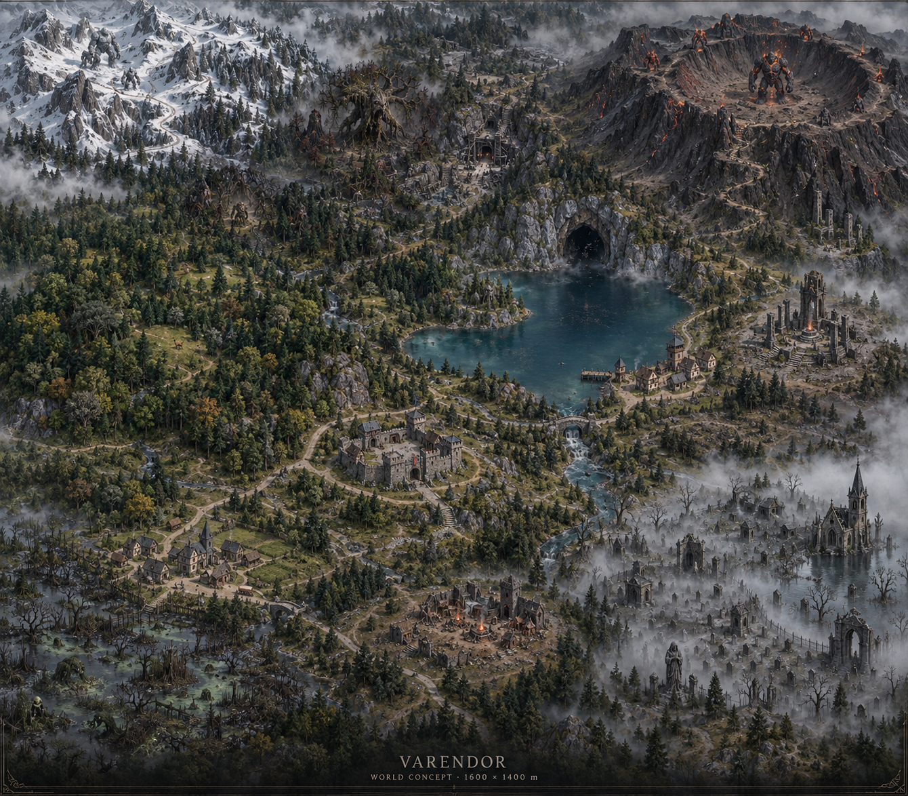
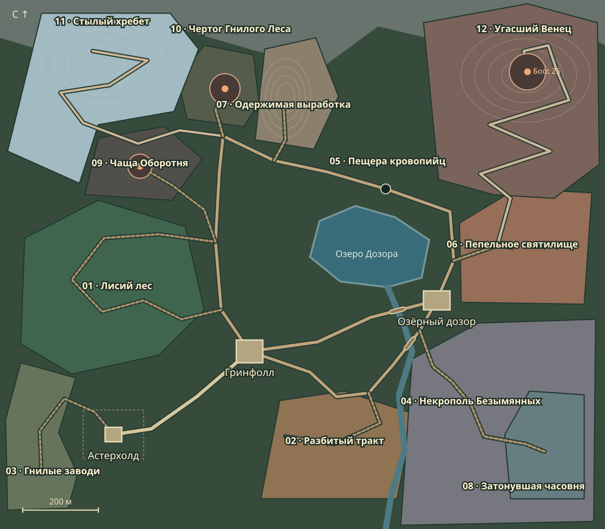

# VARENDOR — расширение мира до 1600×1400 м

**Статус: схема для визуального согласования.** Размер и направление работ заданы пользователем 10 сентября 2026 года. Этот пакет описывает новый мир и содержит проверяемую расстановку в плане; игровая территория ещё не перестроена. Рабочая ветка — `work/character-art-v3`, исходная точка — `96dd25319eab2de99aba226b7ab07e0010214a8d`.

## 1. Дополнение пользователя и граница работ

- Каждая сторона прежних 320×280 м увеличивается в пять раз: **1600×1400 м, 2,24 км², площадь ×25**. Города, двери, дома, деревья, герой и монстры не масштабируются общим множителем.
- Число обычных монстров увеличивается пропорционально площади, как и территория их размещения. Они распределяются по своим локациям, не собираются у одного центра спавна. Уникальные боссы сохраняются по одному на отдельной арене.
- Все существующие виды получают подходящую среду: лес, кладбище, большая пещера у озера, снег, вулкан и отдельные места для остальных групп.
- Качество окружения — современная реалистичная мрачная фэнтези, ориентир Diablo IV периода 2025–2026: авторская композиция, материалы, свет, характер каждого места и проработанный передний план. Это критерий будущей игровой приёмки, а не заявление, что концепт уже обеспечивает такой уровень в Godot.
- **Разрешён самостоятельный поиск и скачивание бесплатных ресурсов**, подходящих стилю и допускающих коммерческое использование и хранение нужных исходников. Это новое разрешение заменяет прежнее требование отдельно согласовывать каждую загрузку. Художественная схема, архитектура и внешний вид по-прежнему оцениваются визуально.
- Сначала согласовываются карта и локации. Затем последовательно создаются геометрия, окружение, спавны, навигация и миникарта. После этого возвращаемся к очереди из [коммерческого анализа](../analysis-v3/R2_COMMERCIAL_GAP_ANALYSIS_RU.md).

Новые размеры заменяют прежнее ограничение 320×280 м в разделе «Утверждённая организация территории» [ТЗ v2](../migration/v2/Varendor_Migration_TZ_v2_0.md). Сохраняются принятый художественный эталон, роли Астерхолда и Гринфолла, человеческий масштаб, дороги и осмысленная композиция. Историческое ТЗ не переписано задним числом.

## 2. Карта и устройство долины

Открываемый локально [обзор карты](WORLD_REVIEW.html) содержит четыре режима: дороги, распределение монстров, художественный образ и интерьер пещеры. Выбор локации меняет описание и макет миникарты; ночь и полнолуние показывают соответствующие популяции. GitHub отображает HTML как исходник; SVG и изображения доступны прямо в документе.

Север — положительное направление `z`. Границы: `x = −800…800`, `z = −700…700`. Высоты ниже — проектные игровые метры, не реальные геодезические данные.

**Юго-запад — освоенная земля.** Астерхолд остаётся столицей, Гринфолл — отдельной пограничной крепостью. Между ними проходит защищённый тракт. Ядро Астерхолда показано текущими 44×38 м; пунктир 160×130 м резервирует будущие кварталы, а не увеличивает существующие дома. Гринфолл сохраняет 70×60 м и двор 35×25 м. Расстановка городских NPC и порталов переносится согласованно с топологией, без изменения персонажа или его прогресса.

**Запад — живой лес, затем чаща и высокогорье.** Начальная охота на лис находится в смешанном лесу. Севернее — логово массивного оборотня; отдельная ветка ведёт к Гнилому Лесу. Снег начинается выше хвойной границы, через каменистые предгорья. До ледяных големов нужно подняться и обследовать несколько снежных чаш.

**Восток — вода и вулканическая гряда.** Озеро около 315×215 м связывает долину и скальный уступ с пещерой. На юго-восточном берегу — Озёрный дозор: пять домов, причал, башня, два постоянных поста стражи и патруль. Проход к пещере идёт по берегу. Далее дорога проходит у святилища к вулканическому серпантину.

**Юго-восток — кладбищенская низина.** Некрополь занимает большую территорию с кварталами могил, стенами, склепами и узкими просветами. Затонувшая часовня с призраками — отдельный восточный район этого кладбища. Переходы через туман остаются физически проходимыми и имеют узнаваемые ориентиры.

Главный маршрут образует связанное кольцо вокруг центральной долины. Охотничьи тропы и входы к боссам ответвляются от него. Обязательного пробегания через арену босса для попадания в другую локацию нет. Защита действует на городах и принятом торговом подходе; обычная дорога не даёт неуязвимость.

## 3. Все виды монстров и численность

Количество ниже относится ко всей локации, **не к одной точке и не к одной одновременно атакующей группе**. Основа взята из настоящего `SPAWN_REGIONS` и восьми ночных пар в `world-simulation.ts`.

| № | Локация и вид | Уровень | Было → план | Размещение |
|---|---|---:|---:|---|
| 01 | Лисий лес — текущая модель Fox | 1 | 10 → 250 | Весь лес: опушки, папоротниковые поляны, ложбины, лесные тропы |
| 02 | Разбитый тракт — Проклятый изгнанник | 2 | 9 → 225 | Разорённые дворы, палатки, руины вдоль старого тракта |
| 03 | Гнилые заводи — Теневой слизень | 3 | 9 → 225 | Разные заводи и сухие островки, без появления под мостками |
| 04 | Некрополь — Безымянный мертвец | 4 | 10 → 250 | Кварталы могил, разрушенные ограды, подходы к склепам |
| 04 | Некрополь — Ночной зомби | 4 | до 8 → 200 | Только ночью, распределение по кладбищу |
| 04 | Некрополь — Лунный скелет | 4 | до 8 → 200 | Только в полнолуние, локальные пары с ночными зомби |
| 05 | Пещера кровопийц — Пещерный кровопийца | 5 | 9 → 225 | Восемь залов, разные ниши и пути между ними |
| 06 | Пепельное святилище — Сектант Пепла | 6 | 9 → 225 | Дворы, колоннады, площадки ритуалов и патрули |
| 07 | Одержимая выработка — Одержимый рудокоп | 7 | 10 → 250 | Просторный карьер, террасы, рабочие площадки и штольни |
| 08 | Затонувшая часовня — Болотный призрак | 8 | 9 → 225 | Затопленные могилы и проходы восточного кладбища |
| 09 | Чаща Оборотня — Кровавый Оборотень | 10 | 1 → 1 | Отдельное логово принятого массивного варианта |
| 10 | Чертог Гнилого Леса — Хозяин Гнилого Леса | 14 | 1 → 1 | Корневая арена в мёртвом лесу |
| 11 | Стылый хребет — Ледяной голем | 22 | 12 → 300 | Снежные чаши, седловины, уступы, рассредоточенные обходы |
| 12 | Угасший Венец — Огненный голем | 20 | 12 → 300 | Только верхние террасы и подходы к кратеру |
| 12 | Центр кратера — Страж раскалённого разлома | 25 | 1 → 1 | Центральная арена радиусом 48 м |

Итог: **2478 днём, 2678 ночью, 2878 в полнолуние**, включая трёх уникальных боссов. У ночных видов прежнее «8» — верхний предел попыток размещения, а не гарантия каждого текущего ночного спавна.

Технические ID `wolf` и `spider` исторические: первый сейчас использует Fox и имя «Пепельный гончий», второй — Slime и имя «Теневой слизень». Здесь они не переименованы и не заменены другими моделями. Лисий лес предназначен именно для видимых пользователем лис. Принятые уровни, здоровье, урон, таблицы дропа и рейт опыта этот проект карты не меняет. Больше доступных монстров увеличивает потенциальную добычу всего мира; после внедрения измеряется добыча в час на игрока, без скрытого урезания дропа.

## 4. Как исключается толпа в одном месте

1. Вместо «центр + общий маленький радиус» используется полигон обитания и отдельный постоянный дом каждого монстра. Предварительные координаты сохранены в [spawn-layout.json](spawn-layout.json).
2. Первичное распределение имеет минимальный разнос: 11 м для обычных наземных существ, 17 м для големов, 10 м для кровопийц. В полнолуние сохраняется прежняя **пара из двух существ**: скелет появляется примерно в 3,5 м от своего зомби; до остальных существ — минимум 8 м. Это локальная пара, не общий агр кладбища.
3. Точки исключают города с запасом, защищённый тракт, воду озера, охранный пояс арен и оси дорог. Ресурсы не собираются в искусственную равномерную сетку. Текущая схема — исходная раскладка: после создания рельефа она проходит маски склонов, проходимости и реквизита, затем художественную правку по микроучасткам.
4. Индивидуальные маршруты обхода, разные стартовые фазы и паузы; поиск обхода не ведёт всех к одному waypoint. Возвращение после боя идёт к собственному дому. Разнос домов сам по себе не доказывает отсутствие скучивания в движении — это отдельный критерий игрового теста.
5. Радиусы агра, возврата и серверная скорость не умножаются на пять. Коридоры агра соседних участков проверяются в движении. Предусматриваются разнесённые точки ожидания у узких проходов и локальное расхождение тел.
6. Респавн не материализуется внутри игрока, стены или занятого прохода. В активном бою отсутствие свободной точки приводит к отложенному появлению, а не к наложению тел. Ночная пара не связывается с существом из другого района кладбища.

При расчёте выяснилось, что исходно намеченные верхние террасы вулкана и карьер слишком тесны для пропорциональной популяции. Их полезная площадь расширена в схеме; минимальные расстояния не снижены ради размещения нужного числа.

## 5. Художественные задания по локациям

**Лисий лес.** Три масштаба растительности: высокие кроны, кусты/подрост, насыщенный травяной покров. Дуб и бук — зрелые участки; берёза — светлые влажные опушки; сосна — сухие склоны; ель — переход к холоду. Для каждой основной породы — несколько разных силуэтов и возрастов, а не только масштаб одной модели. Папоротник, мох, валежник, корни, влажные камни и просветы света связывают грунт с деревьями. Боевая камера должна видеть путь между стволами и ближайшие цели. Трава густая, но не превращается в сплошную стену высотой с героя.

**Некрополь и часовня.** Десятки композиций могил, повторяемые надгробия с вариациями, кривые ограды, семейные склепы, разрушенная часовня и затопленный нижний район. По внешнему кольцу видны башенка и мёртвые деревья; внутри туман сокращает уверенное распознавание до ориентировочно 12–18 м. Проверяется именно внезапное появление угрозы из тумана. Стены ограничивают прямую видимость; противник не раскрывается на миникарте только потому, что его модель загружена. Точные дальности подбираются с текущей камерой и радиусами атак.

**Пещера и озеро.** Вход виден со стороны воды, а не спрятан в случайной стенке. Интерьер около 360×320 м: восемь залов, широкий обход и поперечная связь, галечные площадки, сталактиты, высотные ниши, влажные края. Маршрут не заканчивается у первого зала; есть возвращение к выходу без принудительного телепорта. Геометрия потолка, поддержка пола и навигация отличают интерьер от поверхности. Озёрный посёлок даёт масштаб пейзажу: лодки, сети, сушильные стойки, причал, караульная башня. Стража охраняет подход, не загораживает вход и не вычищает всю пещеру за игрока.

**Снег.** Каменистое предгорье → хвойный пояс → редколесье → снежные котловины. Снег лежит на верхних поверхностях и в подветренных карманах; камень проступает на крутых стенах. Големы прячутся за валунами и складками рельефа, а не стоят одной линией у входа. Снегопад локальный, с плавным переходом на границе; в пещере не идёт дождь или снег. Подъём около 884 м; целевые высоты 55→210 м, максимальный уклон сегментов схемы 13,2°.

**Угасший вулкан.** Главная форма — старый разрушенный конус с сухим кратером, базальтовыми гребнями и верхними террасами. Широкого озера лавы, постоянного извержения и обязательного прыжка через пропасть нет. Големы дают локальное магическое тепло и свет. Серпантин около 1100 м поднимается к кромке и спускается в центр: целевые высоты 25→202→185 м, максимальный уклон сегментов 16,9°. До босса видны этапы пути и сама чаша; площадь арены позволяет двигаться вокруг крупного тела. Обычные големы не спавнятся в боевой арене босса.

**Остальные зоны.** Разбитый тракт читается через остатки торговли и жилья; заводи — через сток и низины; святилище — через разрушенную религиозную архитектуру; выработка — через обнажённые породы, отвалы и рабочие эстакады; логово — через следы охоты; Гнилой Лес — через постепенно умирающую растительность. Ни одна из них не принимается как голая площадка с другим цветом материала.

## 6. Миникарта и навигация

- Миникарта остаётся **справа вверху**, север фиксирован. Персонаж в центре, направление камеры отдельным указателем. Масштабы обзора: 100 / 180 / 300 м; пещера обычно 100 м. Это ширина видимого участка, а не радиус.
- Цвета биомов, берег, реальные дороги, ворота и перекрывающие движение объекты берутся из того же описания мира, что игровая сцена. Большая карта показывает весь регион, миникарта — ближайший участок.
- Пещера автоматически переключает `surface` на свой внутренний слой; выход возвращает поверхность. Персонажи на другом этаже не показываются как стоящие рядом. Для штолен применяется тот же контракт после авторской планировки интерьеров.
- Указатели: города, службы NPC, вход в пещеру, выход из неё, известные ориентиры, выбранная цель. Значки за границей обзора не превращаются в незаметные точки. Босс на общей дизайнерской карте обозначает арену, но не сообщает игроку о текущем респавне без игровой системы разведки.
- Туман кладбища не обходится красными точками миникарты. В макете условный радиус обнаружения демонстрирует принцип; в игре это определяется общей системой обнаружения, дистанцией и препятствиями.
- Бафы сохраняют согласованный ряд **слева от миникарты**. Зелье скорости всегда занимает ближайшее к карте место; остальные располагаются по очереди применения. Книги на панели быстрого доступа не переносятся в миникарту.
- Фон карты запекается/кэшируется по территории и слою, а не пересобирается каждый кадр. Движущиеся маркеры обновляются до 10 раз в секунду. Для новой геометрии требуется новый ключ версии кэша.

## 7. Ресурсы и ориентир качества

Из официального разбора окружения Diablo IV берём принцип цельного мира с разным характером регионов и осмысленными переходами между ними. Из разбора графики — согласованность PBR-материалов, света и атмосферной глубины. В актуальном обзоре Skovos 2026 года отдельно важны насыщенная архитектура и роль столицы как понятного узла служб. Для VARENDOR это собственные художественные решения в принятом стиле, а не копирование чужих карт или извлечение игровых ресурсов. Источники: [окружение Diablo IV](https://news.blizzard.com/en-us/article/23788294/diablo-iv-quarterly-updatemarch-2022), [графика Diablo IV](https://news.blizzard.com/en-us/article/23964183/peeling-back-the-varnish-the-graphics-of-diablo-iv), [Skovos и Temis, 2026](https://news.blizzard.com/en-us/article/24243862/catch-up-on-the-diablo-30th-anniversary-spotlight).

Бесплатные PBR-поверхности и подходящий природный реквизит можно брать из Poly Haven и ambientCG: их лицензии CC0 разрешают коммерческое применение и распространение файлов. У Poly Haven изображения примеров на сайте и сами ассеты имеют разные условия; сохраняем именно разрешённые файлы ресурсов. [Poly Haven — лицензия](https://polyhaven.com/license), [ambientCG — лицензия](https://docs.ambientcg.com/license/).

Перед включением конкретного ресурса фиксируются автор, URL, лицензия, дата загрузки, SHA-256 и наши изменения. Материал выбирается по геологии и влажности локации. Нужны: лесная земля/кора/мох, тёмный базальт, известняк пещеры, снег/лёд, старый камень могил, дерево посёлка. Деревья и архитектурные наборы проходят визуальную сверку с принятым рыцарем и миром. Высокополигональный скан сначала получает пригодные LOD, коллизии и материалы. На этапе схемы новые внешние 3D-ресурсы не понадобились и не скачивались.

**Критерий художественной приёмки:** обычная игровая камера и движение по полному маршруту; выразительный силуэт, передний/средний/дальний планы, естественные переходы, метрический масштаб текстуры, непрерывный контакт с землёй, несколько моделей растительности, отсутствие регулярной сетки, повторяющихся пятен и резкого исчезновения объектов. Туман, снег и трава не служат маскировкой незавершённой геометрии. Концепт — цель, не доказательство выполненного результата.

## 8. Последовательность реализации после схемы

1. **Топология и черновая геометрия.** Мастер-источник Blender, реальные метры, высоты и серпантины; города, вода, проходы, карьер, пещерный слой. Единые границы для сервера и Godot. Версионирование карты и миграция только координат/слоя с резервной копией; уровень, XP, книги, предметы и валюта сохраняются. Проверить старые жёсткие границы в движении и поиске боевой позиции — например `156/136` в `world-simulation.ts` нельзя оставить рядом с новым terrain.
2. **Один законченный маршрут качества.** Гринфолл → лисий лес → озеро/дозор → первый зал пещеры. На нём довести растительность, свет, материалы, снег/туман отдельно по тестовым зонам, столкновения и работу камеры. По этому реальному результату тиражировать качество на остальные биомы.
3. **Все биомы и популяции.** Модульное окружение, индивидуальные дома/патрули, маски полезной площади, ночные пары, боссы. Спавны из схемы проходят реальную проходимость; при нехватке места расширяются пригодные площадки, а не уменьшается разнос до толпы.
4. **Миникарта, производительность и выпуск.** Геометрия всех слоёв, маркеры и обнаружение. Секторы, LOD, пакетная отрисовка травы/деревьев, ограниченная область сетевой видимости. Дальние существа сохраняют состояние, но не получают полный поиск пути каждый тик; находящиеся в бою не исчезают из-за оптимизации. Не создавать тысячи постоянных уникальных AnimationPlayer на невидимых моделях.

Масштаб 2,24 км² и до 2878 существ требует измерений, а не обещания FPS. Сначала проверяются время серверного тика, объём snapshot, p95/p99 кадра и память на указанном оборудовании. Переход между секторами не должен давать новый рывок камеры, скольжение или отбрасывание назад. Не повторяется вся старая миграция; проверяются затронутые риски: длинный бег, остановка и разворот, подъём/спуск, пещера, граница сектора, перенос/релог, сохранность уровня и экипировки, агр/возврат, дневной/ночной переход, крупная популяция.

После игрового блока — настоящие Blender/GLB/материалы и код в Git, целевые проверки, commit/push, Windows ZIP через GitHub Actions с прямой ссылкой GitHub Release. Дизайнерский пакет не запускает сборку неизменённой игры и не выдаётся за новую игровую карту.

## 9. Воспроизводимость этого пакета

`node --experimental-strip-types scripts/design-world-v4.mjs` создаёт JSON схемы, предварительные точки, SVG и автономный HTML. Шаблон обзора — `scripts/world-v4-review-template.html`. При необходимости на этом Windows-хосте используются ранее принятые Node-флаги `--preserve-symlinks --preserve-symlinks-main`.

[design-check.json](design-check.json) фиксирует охват всех 15 видов, численность, границы, минимальные расстояния домов и проектные уклоны. Это **проверка плана в 2D**: она не утверждает наличие рабочего terrain, патрулей, доступность каждого места в Godot или выдержанную нагрузку. [CONCEPT_PROMPT.md](CONCEPT_PROMPT.md) сохраняет промпт встроенного image_gen; [world-concept.png](world-concept.png) — неизменённый результат генерации в репозитории.
